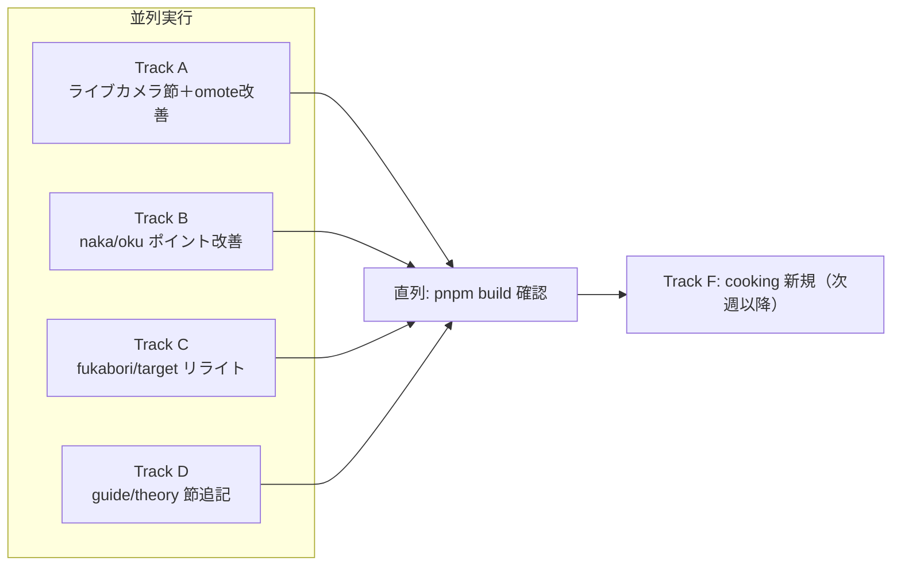

# 釣！浜名湖：統合週間タスク（W29〜）

**作成日**: 2026-07-09
**統合元**: 旧 weekly-task.md（Amazonセール企画）／chousa-file.md（観光KW調査）／task.md（完全装備ガイド企画）
**アクセスデータ格納先**: `.workspace/access-data/`（週次: `2026/w{nn}/`、12ヶ月: `gsc-data/2026-0617/12month-data/`）

---

## 0. 完了アーカイブ（旧3ファイルの消化状況）

| 施策 | 状態 |
|------|------|
| Amazonセール専用記事 `amazon-sale-tackle-strategy` ＋ Top LP 3本への BlogCard 導線 | ✅ 完了 |
| 浜名湖完全装備ガイド `hamanako-complete-tackle-guide` | ✅ 完了 |
| 観光KW: うなぎ×釣り旅／キャンプ×釣り／関所補足／猪鼻湖強化／kanko-hub 追記 | ✅ 完了（2026-07-08） |
| family-car-points SEO 改善 | ✅ 完了（2026-07-03） |
| TackleCard 不足補完（タコ網・LJ） | ✅ 完了 |

**方針として引き継ぐもの**:

- セール訴求は専用記事 `amazon-sale-tackle-strategy` に集約。既存記事に時限コピーを入れない。
- 観光地系KWは、既存ポイント記事タイトルと一致する場合は**新規記事を作らず既存記事に節追記**。
- 内部リンク（BlogCard）・アフィリエイト（TackleCard）は実在 slug/ID を確認してから記載（ハルシネーション厳禁）。

---

## 1. データ分析サマリ（12ヶ月GSC・2026-07-09 深掘り）

「表示回数が多い × CTR が低い（または掲載順位 5位以下）」＝**既存資産の磨き込みで取れる KW** を抽出した。

### 🔴 最大の発見: ライブカメラ需要

| クエリ | 表示 | CTR | 順位 |
|--------|------|-----|------|
| 新居海釣り公園 ライブカメラ | **5,559** | 0.52% | 5.8 |
| 浜名湖 海釣り公園 ライブカメラ（表記ゆれ含む3種） | 約2,000 | 2%前後 | 4〜5 |

→ サイト内で断トツの未回収表示回数。「ライブカメラはないが、リアルタイム状況の調べ方＋現地の混雑・風の読み方」を `araibenten-umiduripark` に節追記すれば、検索意図（＝行く前に状況を知りたい）に正面から応えられる。

### 🟠 改善KW（既存記事の磨き込みで対応）

| クエリ | 表示 | CTR | 順位 | 対応記事 |
|--------|------|-----|------|----------|
| 浜名湖 水深 | 1,014 | 2.5% | 4.0 | `/map/`（「水深図」では1.3位。単語「水深」の title 露出不足） |
| 庄内湖 | 906 | 0.6% | 8.9 | `points/oku/syounaiko` |
| 浜名湖 ハゼ釣り ポイント | 698 | 9.0% | 7.0 | `points/fukabori/haze-fukabori` |
| 浜名湖 アジング（2表記計） | 1,011 | 7% | 6.2 | `points/fukabori/ajing-fukabori` |
| 浜名湖 カワハギ | 426 | 7.0% | 7.2 | `target/kawahagi` |
| 村櫛漁港（単体） | 440 | 9.6% | 3.1 | `points/naka/murakushi-fishing-port` |
| 浜名湖 中之島（2表記計） | 615 | 7% | 5〜7 | `points/omote/nakanoshima` |
| 浜名湖 釣具屋 24時間 | 288 | 3.8% | 6.6 | `guide/logistics/shops` |
| 浜名湖 水温 | 271 | 4.1% | 8.8 | `theory/oceanography` |
| 女河浦海水浴場 | 312 | 2.2% | 8.8 | `points/naka/megaura` |
| 雄踏総合公園 釣り | 248 | 3.2% | 9.4 | `points/naka/yuto-yamazaki` |
| 乙女園 釣り | 204 | 8.3% | 6.5 | `points/omote/otomeen` |
| 松見ヶ浦 | 188 | 2.1% | 5.3 | `points/naka/matsumigaura` |

### 構造面の気づき

- **cooking カテゴリが 6 本のみ**。「釣った魚を食べる」は target 記事（117本）との内部リンク相性が最良で、回遊・滞在を伸ばせる未開拓領域。
- **tactics（1本）・theory（1本）が実質空**。水温・潮汐など「浜名湖 水温」系 KW の受け皿になれる。
- travel の中浜名湖（ガーデンパーク・村櫛）は `omote-area-travel` があるのに naka 版がない。

---

## 2. 並列エージェント設計

**原則: 1エージェント = 1トラック = 触るファイルが他トラックと重複しない**。ビルド確認だけ最後に直列で行う。

### Track A: 表浜名湖ポイント記事（担当ファイル: `points/omote/` 配下のみ）

- [x] 🔥 `araibenten-umiduripark` に「ライブカメラ・リアルタイム情報の調べ方」節を追記
  - 事実確認: 専用記事 `guide/logistics/araibenten-live-camera`（湖西市の津波監視カメラ経由で海況確認可）が既に存在・本文からリンク済みと確認。誇大表現なし
  - title / description: 既存title(34字)は文字数上限のため据え置き。本文冒頭に「新居海釣り公園」の呼称ゆれを追記、tagsに`ライブカメラ`を追加
- [x] `nakanoshima`: 「浜名湖 中之島」単体KW向けに title・summary・冒頭を調整（「表浜名湖」→「浜名湖」表記、アクセス方法・立入可否を明記）
- [x] `otomeen`: summary に釣果魚種（クロダイ・キビレ・ハゼ）と駐車場情報（無料・約20台・徒歩1〜2分）を前出し

### Track B: 中・奥浜名湖ポイント記事（担当ファイル: `points/naka/`・`points/oku/` 配下のみ）

- [x] `syounaiko`: 単体KW「庄内湖」(906表示・0.6%) 向けに title 見直し＋概要節を「庄内湖とは」検索にも応える形へ拡充
- [x] `murakushi-fishing-port`: 「村櫛漁港」単体（釣り以外の意図含む）向けに施設・駐車情報を冒頭へ
- [x] `megaura`: 「女河浦海水浴場」KW → 海水浴場としての基本情報＋釣り可能時期（海水浴期間の住み分け）を追記
- [x] `yuto-yamazaki`: 「雄踏総合公園 釣り」向けに公園名を title/見出しに明示
- [x] `matsumigaura`: 単体KW向け冒頭最適化

### Track C: fukabori・target リライト（担当ファイル: `points/fukabori/`・`target/` 配下のみ）

- [x] `haze-fukabori`: 「浜名湖 ハゼ釣り ポイント」(698表示・順位7.0) — ポイント比較マトリクス強化・新川/都田川ハゼ言及（「浜名湖 ハゼ釣り 新川」436表示が取れていない）
- [x] `ajing-fukabori`: 「浜名湖 アジング」(計1,011表示・順位6.2) — 冬アジング（167表示）・時期別の節を追加して包括性を上げる
- [x] `target/kawahagi`: 「浜名湖 カワハギ」(426表示・順位7.2) — リライトで深度アップ（`cho-hamanako-article-rewrite` SKILL 準拠、2,000字+）

### Track D: guide・theory 節追記（担当ファイル: `guide/logistics/shops`・`theory/oceanography` のみ）

- [x] `shops`: 「浜名湖 釣具屋 24時間」(288表示) — 24時間・早朝営業の釣具店節を追加（要事実確認。営業時間は変動注意の注記付き）
- [x] `theory/oceanography`: 「浜名湖 水温」(271表示) — 月別水温目安と魚種活性の関係節を追加。将来「水温」単独記事に昇格できる粒度でH2を切る

### Track E: サイト構造（コンテンツ外・単独実行）

- [x] `/map/`（`src/pages/map.astro`）: title に「水深」を自然に含める（現状「水深図」で1.3位、「浜名湖 水深」1,014表示で4位・CTR 2.5%）

### Track F: 新規コンテンツ（次週以降・A〜E完了後）

- [ ] cooking 拡充第1弾: 「ハゼの天ぷら/唐揚げ」「キス天ぷら」など、PV上位 target（haze・kisu）と対になるレシピ記事（target 記事と相互 BlogCard）
- [ ] travel 中浜名湖版: 「ガーデンパーク・村櫛エリア観光×釣り」— 需要は W29 以降の GSC で「ガーデンパーク」系表示回数を確認してから着手判断
- [ ] tactics カテゴリ拡充の方向性検討（method-kayaking-intro 1本のみ）

### 定期運用（据え置き）

- [ ] 11月BF前（10月末）: `amazon-sale-tackle-strategy` の `upDate` 更新＋冬版チェックリスト（メバル・シーバス・防寒・照明）差し替え。同一URL運用

---

## 3. 並列実行の運用ルール

1. **ファイル排他**: 各トラックは上記の担当ディレクトリ外を編集しない。kanko-hub 等の共有ハブへの追記が必要になった場合はタスクとして持ち帰り、直列で実施。
2. **BlogCard/TackleCard 検証**: 各エージェントは記載前に `src/content/blog/`・`src/content/affiliates/` の実在確認を必ず行う。
3. **事実確認が必要な項目**（ライブカメラ有無・24時間釣具店・海水浴場期間）は、確認できなければ断定を避けた表現にし、タスクに「要確認」を残す。
4. **ビルド**: 全トラック完了後に `pnpm build` を1回、直列で実行して検証。
5. **完了記録**: 各タスク完了時にこのファイルのチェックボックスを更新し、末尾の進捗ログに日付を残す。

### エージェント起動の目安

| エージェント | トラック | 参照SKILL |
|--------------|----------|-----------|
| Agent 1 | A（omote＋ライブカメラ） | article-rewrite / writing-voice |
| Agent 2 | B（naka・oku） | article-rewrite / point-comparison-matrix |
| Agent 3 | C（fukabori・target） | article-rewrite / base-structure |
| Agent 4 | D＋E（guide・theory・map） | article-rewrite |

---

## 4. 成功指標（W29〜W32）

| KPI | 現状 | 目標 |
|-----|------|------|
| 「新居海釣り公園 ライブカメラ」CTR | 0.52% | 3%+（表示5,559 → 月+15クリック相当） |
| 「庄内湖」CTR | 0.6% | 3%+ |
| 「浜名湖 ハゼ釣り ポイント」順位 | 7.0 | 5以内（秋ハゼシーズン前に間に合わせる） |
| 「浜名湖 アジング」順位 | 6.2 | 5以内 |
| 改善対象13記事の合計クリック | — | +15%（週次GSCで追跡） |
| cooking 経由の内部回遊 | — | 新規レシピ→target 記事への遷移発生 |

---

## 5. リスク・注意

1. **ライブカメラ**: 実際にカメラを提供できるわけではないため、タイトルで釣らず「調べ方・代替手段」として誠実に書く。誇大 title は CTR が上がっても直帰で評価を落とす。
2. **事実の陳腐化**: 営業時間・海水浴場期間・開園情報は年度で変わる。断定せず「訪問前に公式確認」導線を必ず付ける。
3. **秋シーズン逆算**: ハゼ・カワハギ・アジングは秋に検索が跳ねる。W29〜W30 中の改善完了がインデックス反映を考えると期限。
4. **既存の好調KWを壊さない**: 「猪鼻湖 釣り」「浜名湖 釣り禁止」「車横付け」等の上位KWの title は触らない。

---

## 進捗ログ

- 2026-07-09: 3タスクファイルを本ファイルに統合。12ヶ月GSC深掘りにより Track A〜F を設計。
- 2026-07-09: Track B完了。`points/naka/megaura,murakushi-fishing-port,yuto-yamazaki,matsumigaura` と `points/oku/syounaiko` の5記事をリライト（title/概要節/冒頭の最適化、海水浴場の事実確認は断定回避＋公式確認導線）。
- 2026-07-09: Track A完了。araibenten-umiduripark（呼称ゆれ追記・tags追加、ライブカメラ節は既存を確認）／nakanoshima（title・summary・冒頭のアクセス/立入可否明確化）／otomeen（summaryに釣果・駐車場を前出し）を編集。
- 2026-07-09: Track D・E 完了。`shops` に24時間・早朝営業節（営業時間変動注記付き）、`theory/oceanography` に月別水温×魚種活性のH2節を追加。`map.astro` の title に「水深」を追加（「水深図」表記は維持）。
- 2026-07-09: Track C 完了。`haze-fukabori` にポイント比較マトリクス表を追加し新川・都田川のハゼ釣り言及を強化。`ajing-fukabori` に冬アジングのH3節を追加し時期別包括性を向上。`target/kawahagi` にフグとの違い・FAQ・季節節の加筆でリライト（本文約4,080字）。
