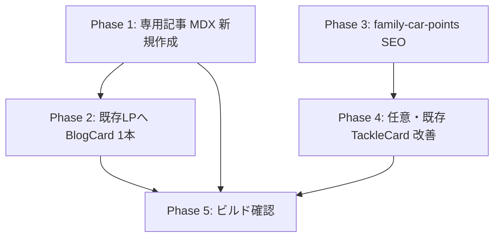

# 釣！浜名湖のWeeklytask

w28

Act（次週のToDo・優先度つき）
- [ ] `/points/wading-points/`（🟢CTR39.1%・順位4.17）へ内部リンクを集中させ、上位表示を維持・強化
- [ ] `/points/amihosiba/`（表示156・CTR3.8%）はリライト/内容刷新を検討
- [ ] `/blog/guide/beginner/hamanako-fishing-rules-and-manners/`（表示279・CTR9.3%・直帰85.1%）は上位化施策（被リンク等）と合わせて直帰率改善のCTA/導線見直しを実施
- [ ] `/map/`のPV回復要因（季節/流入経路）を確認し、再現性があれば横展開

---

# 釣！浜名湖：週間タスク

アクセスデータの格納先[.workspace\access-data]

---

## 方針転換（2026-07-01）：Amazonセール対応は専用ページに集約

**判断**: 既存記事へ「セールだから」訴求を埋め込む案は**採用しない**。

| 区分 | 方針 |
|------|------|
| 既存記事の TackleCard | **維持 or テーマ整合の改善のみ**。「プライムセール」「安いから」等の時限コピーは入れない |
| セール物販 | **専用記事1本**で戦略説明＋高単価・コンフォート系の厳選リスト |
| 既存LPからの導線 | 記事末尾に `BlogCard` で専用ページへ1リンク（セール文言なし） |

---

## 専用記事企画：Amazonセールで「買うべき釣具」の考え方

### 記事の役割（読者に渡す価値）

消耗品のまとめ買い記事ではなく、**「なぜセール期は高単価・コンフォート系を狙うべきか」**を論理的に説明するハブ記事。

読者が持ち帰るべき結論:

1. **消耗品（仕掛け・エサ代わり・リーダー等）**はセールでも得は小さい。普段どおり現地釣具店＋必要分で足りる。
2. **普段は手が出しづらい投資型**（専用ロッド、カヤック、大型クーラー、ポータブル電源など）は、数％の値引きが「試す理由」になる。
3. **コンフォートジャンル**（足場・安全・移動・保冷・夜間視認）は、釣果そのものより**継続して釣りに行けるか**を決める。セールは「快適化の初回コスト」を下げるタイミング。
4. 浜名湖は車移動・長時間堤防・夏の暑さ・潮流リスクがあるため、コンフォート投資の**回収率が高いフィールド**である。

### 配置・メタ

| 項目 | 案 |
|------|-----|
| カテゴリ | `guide` |
| ディレクトリ | `src/content/blog/guide/logistics/amazon-sale-tackle-strategy/` |
| slug | `amazon-sale-tackle-strategy` |
| URL | `/blog/amazon-sale-tackle-strategy/` |
| タグ例 | `浜名湖`, `釣具`, `Amazon`, `プライムセール`, `タックル` |
| 更新運用 | `upDate` をプライムセール（7月）・ブラックフライデー（11月）前に更新。本文の時期表現は「年2回の大型セール」で evergreen 化 |

**shops（釣具店ガイド）との住み分け**: shops＝現地・活きエサ・即日調達。本記事＝通販・大型装備・セール戦略。

### 構成案（2,500字+）

```text
H2 結論：セールで買うのは「消耗品」より「一度買えば釣行が変わる道具」
  - 3分類マトリクス（消耗品 / 投資型 / コンフォート型）を表で提示

H2 なぜ消耗品は優先度が低いのか
  - 単価が低く値引き額が小さい
  - 浜名湖は釣具店・コンビニで足せる（shops へ BlogCard）
  - 例：サビキ仕掛け、ワーム、小物オモリ

H2 セールが効く「投資型」——普段は躊躇する領域
  - 心理的ハードルとセールの関係（1万→8千のインパクト vs 500→400）
  - 浜名湖で回収しやすい投資の例
    - タコ専用ロッド（6〜8月シーズン直前）
    - 足漕ぎカヤック（奥浜名・庄内湖シャロー）
    - 大型クーラー（タコ・遠征の持ち帰り）
  - TackleCard ブロック（各カテゴリ2〜3枚）

H2 コンフォートジャンル——「釣れる」より「また行きたい」を作る
  - ライフジャケット、ヘッドライト、ポータブル電源、タックルボックス、防水ケース
  - 浜名湖特有：夜間堤防・車横付け長時間・夏の保冷
  - TackleCard ブロック

H2 プライムセールとブラックフライデーの使い分け
  - 7月：夏シーズン（タコ・カヤック・保冷）に合わせたチェックリスト
  - 11月：冬支度（メバル・シーバス・防寒・照明）に合わせたチェックリスト
  - ※価格・開催日は変動するため「開催前にカート登録して値下げ通知」の運用 Tip

H2 浜名湖アングラー向け：魚種・スタイル別の参照記事
  - BlogCard で既存攻略へ（セール文言なし、学習導線のみ）
    - june-tako-opening / hamanako-kayak-fishing / family-car-points 等

H2 まとめ＋マナー
  - 衝動買いより「来年も使うか」で選ぶ
  - 安全装備はセール待ちより優先（LJ 等）
```

### TackleCard 候補（実在 ID・セール向け＝高単価・コンフォート）

| 区分 | ID | 選定理由 |
|------|-----|----------|
| 投資・タコ | `tako/abu-tacosfield-762h` | 専用ロッド。消耗のエギとは別レイヤー |
| 投資・カヤック | `common/sunpercy-pedal-kayak` | 代表的高単価。記事 `hamanako-kayak-fishing` と連動 |
| 投資・ボート | `common/aquamarina-fishing-boat` | 上級投資枠（任意） |
| コンフォート・保冷 | `common/daiwa-light-trunk-alpha-gu3200` or `common/sanka-cooler-6bl` | 大型 vs 入門の二段 |
| コンフォート・電源 | `common/jackery-portable-power-station` | 車中泊・長時間釣行 |
| コンフォート・安全 | `common/jesbasaro-lifejacket`, `common/lamicall-waterproof-case` | カヤック記事と整合 |
| コンフォート・夜間 | `common/gentos-headlight-cb-300d` | 夜タコ・夜釣り |
| コンフォート・収納 | `common/meihou-vs-3010ndm` | タックルボックス |

**意図的に載せないもの（本文で「消耗品枠」と説明）**:

- `aji-saba-sappa/sabiki-starter-set` 等の入門セット → 既存記事で十分。セール記事では「買わなくていい例」として言及可
- ルアー単体・ワーム・リーダー小物

### affiliates 追加の要否

- 現状の高単価枠で執筆可能（上表はすべて `src/content/affiliates/` に存在）
- 浮力体入り LJ はコンフォート枠として追加検討（`jesbasaro` は膨張式のため文案注意）

---

## 既存記事タスクの整理（task.md Act との対応）

| 旧タスク | 新方針 |
|----------|--------|
| Top LP にセール CTA | **廃止**。TackleCard はテーマ整合の改善のみ（任意・優先度中） |
| 中盤「セール前に揃える」ブロック | **廃止** |
| june-tako 内部リンク＋物販 | **維持**（BlogCard＋必要なら TackleCard。セール文言なし） |
| family-car-points SEO | **維持**（独立） |
| （新規）専用セール記事 | **最優先**（7/10 前に初版公開） |

### 既存LPからの導線（軽量）

対象: `june-tako-opening`, `hamanako-kayak-fishing`, `hamanako-fishing-rules-and-manners`

まとめ付近に1行＋BlogCard のみ:

```mdx
通販で大型タックルを検討している方は、セール期の買い方の考え方をまとめたこちらも参考にしてください。

<BlogCard slug="amazon-sale-tackle-strategy" />
```

※記事公開後に slug を有効化。

---

## 実装フェーズ



| Phase | 内容 | 優先度 |
|-------|------|--------|
| 1 | `amazon-sale-tackle-strategy` 執筆・公開 | 高 |
| 2 | Top LP 3本に BlogCard 導線（セール文言は専用記事のみ） | 高 |
| 3 | `family-car-points` title/summary | 中 |
| 4 | 既存記事 TackleCard の不足補完（セール非連動） | 低・任意 |
| 5 | 11月 BF 用に `upDate` と冬版チェックリスト差し替え | 定期 |

---

## 成功指標

| KPI | 目標 |
|-----|------|
| 専用記事 PV | 公開2週間で Top LP 合計の 20% 以上 |
| アフィリエイト | セール期間中の TackleCard クリックが専用記事に集中 |
| 既存記事 | 直帰率悪化なし（セール CTA を入れないため維持が期待値） |
| family-car CTR | 2.3% → 5%+（表示50超え後） |

---

## リスク・注意

1. **価格・開催日の陳腐化** — 具体％オフは書かず「大型セール期」＋`upDate` 運用。
2. **信頼** — 「セールだから何でも買え」ではなく、消耗品は買わないと明言してアフィリ信頼を守る。
3. **shops 記事との競合** — エサ・当日調達は必ず現地店舗を推す。
4. **季節更新** — 7月版・11月版のチェックリストは同一 URL で差し替え（新規 URL を増やさない）。
