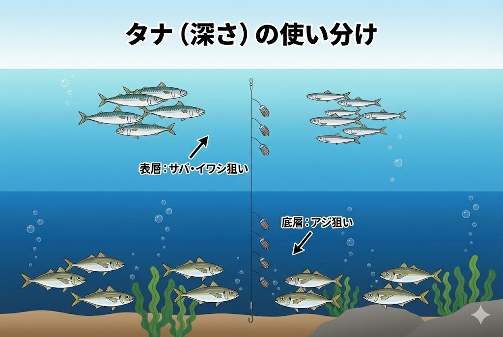

浜名湖には、初心者からベテランまで楽しめる **サビキ釣り** の人気スポットがあります。

アジやイワシ、サバといった魚が豊富で、特に **春** と **秋** には数釣りの釣果が期待できます。

今回は、浜名湖でのサビキ釣りを楽しむためのシーズンや釣り方、釣れる魚種に加え、実際の釣り人からの評価や感想も合わせて解説します！

## 浜名湖でのサビキ釣りの魅力

サビキ釣りとは、複数の小さな針に魚のエサとなる「疑似餌（スキンや魚皮）」がついた仕掛けを使い、撒き餌（コマセ）を使って魚を集めて釣り上げる方法です。

語源としては、「錆（さび）」という言葉が転じたもので、昔は **「釣り針が錆びているほどよく釣れる」** といった意味合いから使われたとも言われています。

### なぜ浜名湖で人気なのか？

浜名湖におけるサビキ釣りは、太平洋から回遊してくる小魚が多く、特に以下の理由で初心者やファミリーに人気です。

- **手軽に数釣りが楽しめる** : 群れに当たれば入れ食い状態になります。
- **子どもが大喜び** : 魚が釣れるたびに子どもたちの歓声が上がります。
- **食べて美味しい** : 釣った魚は唐揚げや南蛮漬け、フライなど料理に使いやすいです。

## サビキ釣りに最適なシーズン

浜名湖でサビキ釣りが盛り上がるのは、**春（4月～6月）** と **秋（9月～11月）** です。

釣り人の評価でも、これらのシーズンは魚の回遊が活発で、「毎年安定した釣果が期待できる」と好評です。

### 🌸 春（4月～6月）
春から初夏にかけて **小アジ** や **小サバ**、**イワシ** が浜名湖に回遊してきます。
特に5月から6月は数釣りが楽しめるため、「1回の釣行で30匹以上釣れた」という報告も多く、ゴールデンウィークのレジャーにも最適です。

### 🍁 秋（9月～11月）
秋は、春に比べて魚のサイズが大きくなり、「手応えが増して釣りの楽しさも倍増する」という声が多くあります。
9月から11月は魚影も濃く、数釣りも楽しめるので、浜名湖のハイシーズンとなっています。

※釣れる魚は回遊魚なので、年によって好不調があります。釣行前には必ず現地の釣果情報を確認しましょう。

## 浜名湖でのサビキ釣りの基本的な釣り方

### 1. 仕掛けの準備

浜名湖でのサビキ釣りには、アミエビを使った **コマセカゴ付きのサビキ仕掛け** が適しています。

- **セット品**: 初心者にも「簡単で扱いやすい」と評価されています。
- **針のサイズ**: 
    - **春（4月～5月）**: 魚が小さいので **3号程度** の小さな針。
    - **秋**: 魚が成長しているので **4号以上** の仕掛け。

### 2. コマセの使い方

コマセには **冷凍アミエビ** や、常温保存可能なチューブタイプを使います。

サビキ仕掛けのカゴにアミエビを詰めて海に沈め、竿を上下に動かすと、少しずつエサが撒かれて魚が集まってきます。カゴを使わずに、ひしゃくで直接撒いてもOKです。

**ポイント**: コマセは「群れを目の前に留まらせる」ために使います。魚が寄ってきている気配がなければ、無駄に撒かないようにしましょう。

### 3. 釣り方のコツ

仕掛けを海中に沈めたら、竿先を軽く上下に動かしてアミエビを拡散させ、アタリを待ちます。

- **連掛けを狙う**: コマセに魚が寄っているなら、1匹掛かってもすぐに上げず、そのまま待つと「連掛け」が狙えます。手返し良く数を伸ばす秘訣です。
- **トリック仕掛け**: 針に直接アミエビをつける「トリック仕掛け」もおすすめ。食いが悪い時に効果抜群です。
- **タナ（深さ）の調整**: 
    - **サバ・イワシ**: 上層～中層にいることが多い。
    - **アジ**: 底近く（下層）にいることが多い。

## 浜名湖でサビキ釣りで狙える魚種

浜名湖のサビキ釣りでは、以下の魚が主に釣れます。どれも調理しやすいサイズで、たくさん釣っても料理のバリエーションが豊富です。

- **小アジ**: 春と秋に回遊。南蛮漬けやフライで人気No.1。
- **小サバ**: 群れで回遊するため、引きが強く数釣りが楽しい。
- **イワシ**: 6月以降に回遊。刺身（新鮮なら）、酢締め、唐揚げで絶品。
- **その他**: サッパ、コノシロ、カマス、小型のカンパチ（ショゴ）などが混じることも。

## 浜名湖のサビキ釣りでおすすめのポイント3選

### 1. 新居弁天海釣公園
海釣公園にある **T字堤防** は、足場が良く手すりもあり、サビキ釣りのメッカです。
太平洋と繋がる今切口に近く、潮通しが抜群。シーズンの開始から終盤まで、安定した釣果が望めます。
足元に落とすだけで釣れるので、短い竿でも楽しめます。

### 2. 網干場（あみほしば）
堤防が広く、駐車スペースからも近いポイントです。
ただし、堤防際から5mほど先まで敷石が入っているため、根掛かりに注意が必要。
**5m以上の磯竿** や **投げサビキ** で、敷石の向こう側を狙うのがコツです。

### 3. 砂揚げ場（すなあげば）
**車を横付けして釣りができる** 貴重なポイント。
回遊の安定感は海釣り公園に劣る場合がありますが、一度群れが入れば爆釣も期待できます。
特に朝マズメや夜間のアジング・サビキで人気があります。

## 釣り人の感想や評価

実際に浜名湖でサビキ釣りをした人からは、次のような声が聞かれます。

> **「子どもでも簡単に釣れた！」**
> 浜名湖でのサビキ釣りは、小さな子どもでも竿を出せば釣れることが多く、家族連れに特に好評です。

> **「短時間で夕飯のおかず確保」**
> 群れに当たれば1時間で数十匹ということも。スーパーでお魚を買う必要がなくなります。

### ※注意点：ゴミとマナー
釣った魚をその場で捌いて内臓や頭を海に捨てる行為は、不法投棄とみなされる場合があり、水質汚染や悪臭の原因になります。必ず持ち帰って処理しましょう。
また、堤防に残ったコマセは悪臭の原因になるので、帰る前に水で洗い流すのがマナーです。

## まとめ：家族みんなで「サビキ釣り」を楽しもう

浜名湖のサビキ釣りは、釣りデビューに最適なアクティビティです。

- **シーズン**: 4月～6月（春）、9月～11月（秋）
- **ターゲット**: アジ、サバ、イワシなど
- **おすすめポイント**: 新居弁天海釣公園、網干場、砂揚場

道具も安価に揃えられ、難しいテクニックも不要。
次の休日は、家族や友人を誘って浜名湖へ出かけてみてはいかがでしょうか？きっと「釣れる楽しみ」にハマるはずです！