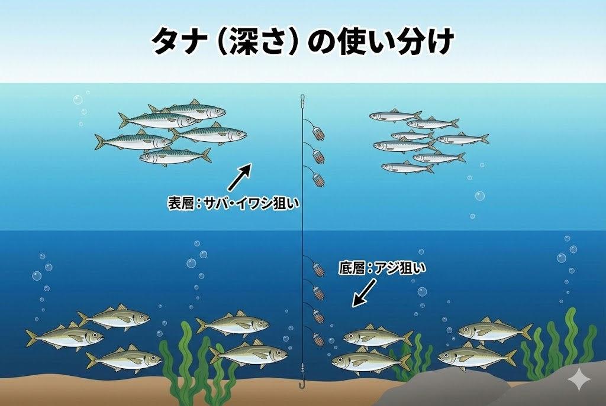

import BlogCard from "@components/BlogCard.astro";

浜名湖には、初心者からベテランまで楽しめる **サビキ釣り** の人気スポットがあります。
アジやイワシ、サバといった魚が豊富で、特に **春** と **秋** には数釣りの釣果が期待できます。

今回は、浜名湖でのサビキ釣りを楽しむためのシーズンや釣り方、釣れる魚種に加え、おすすめのポイントを詳しく解説します。

## 浜名湖でのサビキ釣りの魅力

サビキ釣りとは、複数の小さな針に魚のエサとなる「疑似餌（スキンや魚皮）」がついた仕掛けを使い、撒き餌（コマセ）を使って魚を集めて釣り上げる方法です。

太平洋から回遊してくる小魚が多い浜名湖では、以下の理由で初心者やファミリーに圧倒的な人気を誇ります。

- **手軽に数釣りが楽しめる** ：群れに当たれば入れ食い状態になります。
- **子どもが大喜び** ：魚が釣れるたびに子どもたちの歓声が上がります。
- **食べて美味しい** ：釣った魚は唐揚げや南蛮漬け、フライなど料理に使いやすいです。

## サビキ釣りに最適なシーズン

浜名湖でサビキ釣りが盛り上がるのは、 **春（4月～6月）** と **秋（9月～11月）** です。

### 🌸 春（4月～6月）
春から初夏にかけて **小アジ** や **小サバ** 、 **イワシ** が浜名湖に回遊してきます。
特に5月から6月は数釣りが楽しめるため、ゴールデンウィークのレジャーにも最適です。

### 🍁 秋（9月～11月）
秋は、春に比べて魚のサイズが大きくなり、手応えが増して釣りの楽しさも倍増します。
9月から11月は魚影も濃く、数釣りも楽しめるので、浜名湖のハイシーズンとなっています。

## 浜名湖でのサビキ釣りの基本的な釣り方

### 1. 仕掛けの準備
浜名湖でのサビキ釣りには、アミエビを使った **コマセカゴ付きのサビキ仕掛け** が適しています。

- **針のサイズ** ：
    - **春（4月～5月）** ：魚が小さいので **3号程度** の小さな針。
    - **秋** ：魚が成長しているので **4号以上** の仕掛け。

### 2. コマセの使い方
コマセには **冷凍アミエビ** や、常温保存可能なチューブタイプを使います。
カゴにアミエビを詰めて海に沈め、竿を上下に動かすと、少しずつエサが撒かれて魚が集まってきます。

### 3. 釣り方のコツ
- **連掛けを狙う** ：1匹掛かってもすぐに上げず、そのまま待つと「連掛け」が狙えます。手返し良く数を伸ばす秘訣です。
- **タナ（深さ）の調整** ：
    - **サバ・イワシ** ：上層～中層にいることが多い。
    - **アジ** ：底近く（下層）にいることが多い。

## 浜名湖のサビキ釣りでおすすめのポイント3選

サビキ釣りは潮通しの良い **「表浜名湖（今切口寄り）」** がメインフィールドになります。

### 1. 新居弁天海釣公園
海釣公園にある **T字堤防** は、足場が良く手すりもあり、サビキ釣りのメッカです。

太平洋と繋がる **今切口** に近く、潮通しが抜群。シーズンの開始から終盤まで、安定した釣果が望めます。

<BlogCard slug="points/omote/araibenten-umiduripark" />

### 2. 網干場（あみほしば）
今切口の舞阪側に位置し、堤防が広く、駐車スペースからも近いポイントです。

堤防際から5mほど先まで敷石が入っているため、 **投げサビキ** で敷石の向こう側を狙うのがコツです。

<BlogCard slug="points/omote/amihosiba" />

### 3. 砂揚げ場（すなあげば）
**車を横付けして釣りができる** 非常に貴重なポイントです。

回遊の安定感は海釣り公園に劣る場合がありますが、一度群れが入れば爆釣も期待できます。

<BlogCard slug="points/omote/sunaageba" />

> [!IMPORTANT]
> **堤防を綺麗に保ちましょう**
> カサゴなどの根魚とは違い、サビキ釣りはコマセ（アミエビ）を大量に使用します。堤防に残ったコマセはひどい悪臭や害虫の原因になるため、 **帰る前に必ず水で洗い流す** のが浜名湖の釣り人のマナーです。

## まとめ：家族みんなで「サビキ釣り」を楽しもう

浜名湖のサビキ釣りは、難しいテクニック不要で「釣れる楽しみ」を味わえる最高のアクティビティです。

- **シーズン** ：4月～6月（春）、9月～11月（秋）
- **ターゲット** ：アジ、サバ、イワシなど
- **おすすめポイント** ：新居弁天海釣公園、網干場、砂揚げ場

防寒や熱中症対策を万全にして、次の休日はご家族で浜名湖へ繰り出してみてください！

<BlogCard slug="guide/beginner/family-car-fishing-points" />