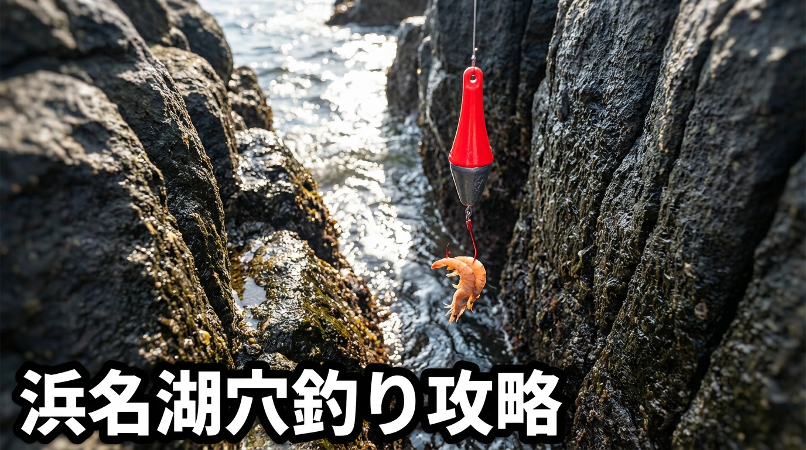

import BlogCard from "@components/BlogCard.astro";

水温が10℃を下回る真冬の浜名湖。多くの魚が深場へ姿を消すなか、岩陰やテトラの隙間にじっと潜んでアングラーを待っているのが **「カサゴ」や「メバル」などの根魚（ロックフィッシュ）** です。

そんな彼らをダイレクトに狙い撃つ「穴釣り」こそ、冬のボウズ逃れ最強の切り札となります。

## 穴釣りとは？：究極のシンプル釣法

穴釣りは、テトラポッドや石積みの隙間（穴）に、短い竿を使って垂直に仕掛けを落とすだけの非常にシンプルな釣りです。複雑なキャスト（投げる動作）が不要なため、初心者や子供でもすぐにコツを掴めます。

*   **三種の神器**：
    1.  **ショートロッド**：1m〜1.5m程度の短い竿。
    2.  **ブラクリ仕掛け**：オモリと針が一体化した赤い仕掛け。100円ショップでも手に入ります。
    3.  **エサ**：青イソメ、サバの切り身、イカの塩辛など、匂いの強いものが効果的。

## 浜名湖の冬：穴釣り一級ポイント

浜名湖の表浜名湖（今切口寄り）には、穴釣りに最適なテトラや石積みのポイントが集中しています。

### 1. 新居弁天海釣公園（大曲・T字堤）
基礎ブロックが積み重なっており、根魚の巨大マンションとなっています。足場が平らで非常に安全です。

*   **狙い目**：T字堤の支柱周りや、西側の石積みエリアの隙間。
*   **メリット**：トイレや駐車場が完備されており、ファミリーでも安心して楽しめます。

<BlogCard slug="points/omote/araibenten-umiduripark" />

### 2. 今切口 舞阪堤周辺
テトラが入り組んでおり、魚探では見えない深くて暗い穴が多数点在します。良型のカサゴが期待できる玄人好みのエリアです。

*   **狙い目**：堤防の先端付近よりも、カーブ（曲がり角）付近の少し乱雑に積まれたテトラの穴。
*   **注意**：潮の流れが速く、波が這い上がってくることもあるため、安全第一で行動しましょう。

<BlogCard slug="points/omote/imagiremaisakatei" />

### 3. 網干場（舞阪漁港付近）
岸壁の継ぎ目や、足元のわずかな段差に魚が居着いています。遠投せずに「足元」を徹底的に探るのが成功の秘訣です。

*   **狙い目**：垂直護岸の継ぎ目や、水中に沈んでいる石積みのエッジ。
*   **コツ**：車が近いため、極寒の日でも暖を取りながらランガンできるのが魅力です。

<BlogCard slug="points/omote/amihosiba" />

## 釣果を伸ばす3つの極意

1.  **「底」を必ず叩く**：
    エサが底に着いた瞬間が最大のチャンスです。中層で止めても食ってきません。トントンとオモリで底を叩き、砂煙を上げるイメージで誘いましょう。
2.  **足で稼ぐ（ランガン）**：
    一つの穴で粘るのは2分まで。反応がなければ即座に次の穴へ移動しましょう。
3.  **アタリがあったら即巻き上げる**：
    根魚はエサを加えた瞬間に穴の奥（根）へ逃げ込もうとします。潜られる前に一気のリールを巻いて引き剥がすのがスリルの醍醐味です。

> [!TIP]
> **冬の穴釣りを快適にするアイテム**
> 指先の開いたフィッシンググローブはもちろん、ミニサイズの「水汲みバケツ」があると、釣った魚を一旦キープして観察したり、手を洗ったりするのに非常に便利です。

## まとめ：冬の穴釣りを極めてボウズと無縁になろう

真冬の寒さを忘れさせてくれる、穴釣りのエキサイティングな「ガツン！」という衝撃。温かいコーヒーを入れた水筒を片手に、浜名湖の穴に眠るお宝を探しに行きましょう！

<BlogCard slug="guide/hamanako-kasago-fishing-winter-guide" />
<BlogCard slug="guide/hamanako-mebaru-fishing-guide-beginner" />
