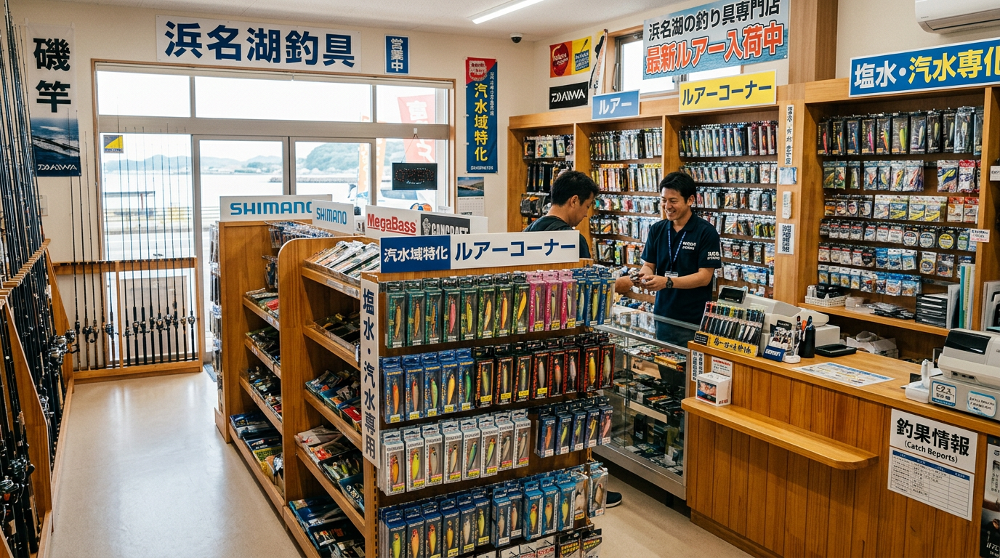

import BlogCard from "@components/BlogCard.astro";

浜名湖で釣りを楽しむ際、現地の釣具店は単なる「買い物場所」以上の価値を持っています。

最新の釣果情報や、そのポイントならではの仕掛け、そして何より新鮮な活きエサを確保するための重要な拠点です。

今はスマホひとつで近隣の店舗を検索できますが、品揃えや営業の実態までは分かりにくいもの。

本記事では、浜名湖全域をカバーする筆者が、実戦で本当に役立つ釣具店・ボートショップを厳選してご紹介します。

---

## 1. エリア別：現地でエサ・道具を揃えるならここ！

釣り場のすぐ近くにある店舗は、急なトラブルやエサの買い足しに欠かせません。

### あけぼの釣具店（舞阪・今切口・サーフ）
今切口の舞阪堤や網干場に最も近い店舗のひとつです。

ここの強みは、激流の今切口を攻略するための「特化したタックル」と、サーフ用ルアーの圧倒的な品揃えにあります。

店主の知識も豊富で、次に何が釣れるかを予測する力は一級品です。

- **得意分野** : 今切口の投げ釣り・ウキ釣り、遠州灘サーフ
- **営業時間** : 8:00〜22:00（土日は5:00から営業）
- **MAP** : [Google マップ](https://maps.app.goo.gl/x196xLwSRE2TpTcWA)
- **HP** : [公式サイト](https://akebono.hamazo.tv/)

### はなぞの釣具店（浜名湖東岸・庄内湖）
東名高速の浜松西インター方面からアクセスする際、最初に立ち寄れる便利な立地です。

エサの自動販売機が設置されており、深夜や早朝の急な釣行でもジャムシなどの活きエサを確保できるのが最大のメリット。

ホームページでの釣果更新も頻繁で、東岸エリアのコンディションを把握するのに最適です。

- **得意分野** : 東岸エリア全域（庄内湖〜舘山寺）
- **営業時間** : 7:00〜17:30（週末は19:00まで営業）
- **MAP** : [Google マップ](https://maps.app.goo.gl/f8m8D7Y24N2E5wyLA)
- **HP** : [公式サイト](https://hanazono14.com/)

### 植むら釣具店（浜名湖北部・都田川）
都田川河口の北側に位置する、奥浜名湖の攻略拠点です。

特にハゼ釣りとキビレのエサ釣りに関しては、地域ナンバーワンの信頼度を誇ります。

季節ごとのターゲットの動きを細かく教えてくれる、アットホームな雰囲気が魅力です。

- **得意分野** : 都田川のハゼ、奥浜名湖のキビレ
- **営業時間** : 6:00〜19:00（曜日により変動あり）
- **MAP** : [Google マップ](https://maps.app.goo.gl/5223a4b9101c44e9)
- **HP** : [公式サイト](https://ueturi.web.fc2.com/)

### 大橋屋つり具センター（新居・海釣公園・サーフ）
新居弁天海釣公園へのアクセスルート上にあり、ファミリーフィッシングの強い味方です。

エサ釣りの道具はもちろん、ルアーも満遍なく揃っており、ここ一箇所で全てが完結します。

夏期の週末にはオールナイト営業を行っており、深夜の場所取り前に立ち寄れるのも嬉しいポイントです。

- **得意分野** : 海釣公園、新居周辺の投げ釣り
- **営業時間** : 夏5:00〜22:00 / 冬6:00〜21:00（夏期週末はオールナイト）
- **MAP** : [Google マップ](https://maps.app.goo.gl/RSgxHsniGN3RBGxB7)
- **HP** : [公式サイト](https://ohashiya.hamazo.tv/)

### 荒川釣具店（今切口・舞阪側）
舞阪港や網干場から徒歩圏内という、現場至近の釣具店です。

サビキ釣りの最中に配合エサが足りなくなった時など、歩いて買いに行ける安心感は他にはありません。

投げ釣りのオモリや仕掛けの種類が非常に多く、キープキャストを支えてくれる頼もしい存在です。

- **得意分野** : サビキ釣り、投げ釣り（キス・カレイ）
- **営業時間** : 6:30〜21:00
- **MAP** : [Google マップ](https://maps.app.goo.gl/EZYMewVNDuN7BeSVA)
- **HP** : [紹介サイト（弁天島遊船組合）](http://www.bentenjima.jp/shop/shop03.html)

### フィッシング ジョイ（浜名湖西岸・湖西市）
湖西市に位置し、豊橋・豊川方面からのアングラーにとって非常に便利な拠点です。

店舗入り口には「ラーメンあります」という看板があり一見驚きますが、店内には釣具とエサがしっかり揃っています。

西岸エリアの貴重な情報源として重宝されており、気さくな店主との会話を楽しみに通うファンも多い店舗です。

- **得意分野** : 浜名湖西岸エリア、エサ釣り全般
- **営業時間** : 土日 8:00〜21:00（平日は14:00〜21:00）
- **MAP** : [Google マップ](https://maps.app.goo.gl/HvqP5kRRknusWtCu5)
- **HP** : [公式サイト](https://fishingjoy.hamazo.tv/)

### 東海つり具
東海つり具は浜松市上島町にある、エリア屈指の大型店舗です。

楽天などの EC 販売でも非常に有名で、ネットショップの品揃えの豊富さで知っている方も多いでしょう。

実店舗も非常に充実しており、浜名湖のルアー・エサ釣りはもちろん、全国レベルの専門的なタックルまでカバーしています。

最新の釣果情報や入荷速報の更新も早く、初心者から上級者まで頼れるショップです。

- **得意分野** : 浜名湖全般、オフショア、遠征釣行
- **営業時間** : 10:00〜20:00（金土は21:00まで営業の場合あり）
- **MAP** : [Google マップ](https://maps.app.goo.gl/2wYmjXhjeDQxfQW96)
- **HP** : [公式サイト](https://toukaiturigu.co.jp/)

---

## 2. ボート釣り・ルアー専門ショップ＆マリーナ

浜名湖の広大な水域を満喫するなら、ボート釣りは外せません。ルアーに強いショップや、レンタルボート・マリーナをご紹介します。

### フィッシング沖（村櫛・キビレ/シーバス）
村櫛町にある、浜名湖のルアーゲームを語る上で外せない名店です。

フィッシングガイドも運営しており、キビレやシーバスの戦略的な釣り方に精通しています。

「なぜ釣れないのか」を理論的に解説してくれるため、レベルアップを目指すアングラーにおすすめです。

- **得意分野** : 湖内のルアーゲーム（キビレ・シーバス）
- **MAP** : [Google マップ](https://maps.app.goo.gl/khqbwrTakdwzWXv18)
- **HP** : [公式サイト](https://www.f-oki.com/)

### Angler’s Hot Station YAMATO（中浜名湖・村櫛）
村櫛漁港のすぐ隣に位置する、レンタルボート＆マリーナです。

ボートでのシーバスやマゴチ狙いにおいて、最も効率よくポイントへアクセスできる絶好の立地にあります。

スタッフもルアー釣りに詳しく、出船前に当日の狙い目をアドバイスしてくれます。

- **得意分野** : 湖内レンタルボート、ルアー攻略
- **MAP** : [Google マップ](https://maps.app.goo.gl/ipYARvsAGXs39eSg6)
- **Instagram** : [公式アカウント](https://www.instagram.com/yamatomarina/)

### スズキマリーナ浜名湖（浜名湖西岸）
免許取得からボートレンタル、船体購入までカバーする大型マリーナです。

鷲津エリアを拠点としており、西岸全域や奥浜名湖へのアクセスが非常にスムーズ。

しっかり整備されたレンタル艇で、安全にボートフィッシングを始めたい方に最適です。

- **営業時間** : 9:00〜17:30（季節により変動あり）
- **MAP** : [Google マップ](https://maps.app.goo.gl/aYeZvj1uZZ3TXrjU7)
- **HP** : [公式サイト](https://suzukimarine.co.jp/marina/hamanako/)

### ヤマハマリーナ浜名湖
ヤマハマリーナ浜名湖は、三ヶ日に近い湖西市入出に位置する本格的なマリーナです。

レンタルボートや免許取得などレジャー面に強く、月額の会員制で全国のヤマハ拠点を利用できる点が大きなメリットです。

松見ヶ浦にあるため、猪鼻湖や奥浜名湖へのアクセスが極めて良く、静かな水域での釣りに最適です。

- **得意分野** : レンタルボート（シースタイル）、ボート免許
- **営業時間** : 9:00〜17:00（水曜定休）
- **MAP** : [Google マップ](https://maps.app.goo.gl/ApVGuM2xPQv19vaM7)
- **HP** : [公式サイト](https://hamanako.yamaha-marina.co.jp/)

### 千成屋（ルアー専門・遠州灘）
浜松市内にある、ルアーに特化したセレクトショップです。

ボートでの湖内キャスティングはもちろん、遠州灘でのジギングやキャスティング用の大型プラグまで扱っています。

マニアックなルアーの品揃えも豊富で、本気でルアーゲームを楽しみたいアングラーには欠かせない存在です。

- **得意分野** : オフショア・ショアのルアー全般
- **MAP** : [Google マップ](https://maps.app.goo.gl/VPqQxQYkfP5C5DcT8)
- **Instagram** : [公式アカウント](https://www.instagram.com/sennariya.1091)

### 古橋屋（弁天島・レンタルボート）
弁天島エリアでのボート釣りの老舗で、船宿としての機能も備えています。

弁天島周辺のミオ筋での流し釣り（ヒラメ・シーバス）をしたいなら、まずここでレンタルするのが近道です。

季節限定の「エビすき漁」や「たきや漁」も運営しており、浜名湖の伝統的な漁法にも触れられます。

- **得意分野** : 湖内レンタルボート、伝統漁法
- **MAP** : [Google マップ](https://maps.app.goo.gl/r8TrbsR5CUgM9VX56)

### ジョナサン
ジョナサンは、浜名湖北部の細江町寸座にあるレンタルボートショップです。

都田川にほど近い「寸座ミオ」周辺に位置し、奥浜名湖全域をカバーするには最高のリッチです。

小型のプレジャーボートを扱っており、釣りはもちろんマリンレジャー全般に対応しています。

- **得意分野** : 奥浜名湖内でのレンタルボート
- **営業時間** : 9:00〜18:00（月曜定休）
- **MAP** : [Google マップ](https://maps.app.goo.gl/Xsq28yPmsA9vC7m36)
- **HP** : [公式サイト](http://www.jona-3.com/)

---

## 3. 準備万端！初心者にも優しい大型チェーン店

釣行当日ではなく、前日までにじっくり道具を揃えたい時に重宝する店舗です。

### イシグロ 浜松高林店
静岡県西部で最大級の品揃えを誇る、まさに釣具のデパートです。

初心者セットからプロ仕様のタックルまで揃い、中古コーナー（タックルオフ）も併設されています。

アプリのポイント還元も大きく、定期的に通うことでお得に装備を充実させられます。

- **営業時間** : 10:00〜21:00（日曜のみ20:00まで）
- **MAP** : [Google マップ](https://maps.app.goo.gl/Kn2sYT65D5r2QT8R9)
- **HP** : [公式サイト](https://www.ishiguro-gr.com/shop/detail.php?id=12)

### つり具上州屋 浜松店
全国展開の安心感に加え、この店舗の最大の特徴は **「24時間営業」** であることです。

「明日急に釣りに行くことになった」「深夜にしか時間が取れない」という時、いつでも開いている安心感は絶大です。

- **営業時間** : 24時間営業
- **MAP** : [Google マップ](https://maps.app.goo.gl/5hpFQui5iG3ToxW77)
- **HP** : [公式サイト](http://www.johshuya.co.jp/shop/top.php?s=86)

---

## 4. 目的別：賢い釣具店の使い分け術

浜名湖の釣具店を120%活用するためのヒントです。

### 深夜・早朝に活きエサが欲しいなら
- **自販機活用** : 「はなぞの釣具店」「大橋屋つり具センター」の24時間自販機へ。
- **24時間営業** : 「上州屋 浜松店」なら、エサだけでなく小物の買い忘れもカバーできます。

### その日の「アタリ」を知りたいなら
- 地元の小規模店舗（植むら釣具店、あけぼの釣具店など）の暖簾をくぐってみましょう。
- 常連客からの最新情報や、店主しか知らない「今朝の気配」を教えてもらえることがあります。

---

## まとめ：信頼できる「マイ釣具店」を見つけよう！

浜名湖周辺には多くの釣具店がありますが、それぞれに得意とするエリアや釣り方があります。

自分のメインフィールドに近い店舗を「マイショップ」として通うことで、より深く、より楽しい浜名湖釣行が実現します。

まずはこの記事を参考に、次の釣行計画に合わせて気になる店舗を覗いてみてください。

> [!NOTE]
>  **管理者より：** 
> ※一部の店舗は閉業されている場合があります。最新の営業状況は、各店舗の公式サイトや電話で事前に確認することをおすすめします。
