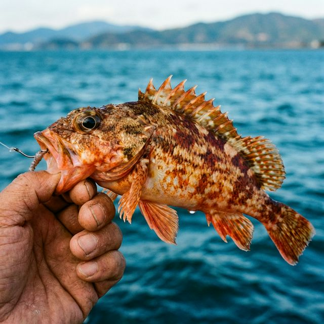

import BlogCard from "@components/BlogCard.astro";

12月、浜名湖の海水温が下がり始めると、シーバスやキビレは深場へと移動し、岸からの釣果は厳しくなります。しかし、そんな厳寒期に本番を迎えるのが **「カサゴ」** です。カサゴは冬から春にかけて産卵期を迎え、浅場の岩陰や堤防の際に集まってくるため、実は初心者でも最も確実に魚を手にできるチャンスタイムなのです。

## 🎯 12月のカサゴ釣り：シーズンの特徴

カサゴは一年中釣れる魚ですが、12月から5月にかけてが最高の釣期です。
*   **密集地帯**：低水温期は堤防の陰やテトラの奥、温排水が絡むストラクチャー（障害物）に密集します。
*   **リアクション**：目の前にエサが来れば、寒さに関わらず猛烈にアタックしてくるため、ポイントさえ合っていれば裏切りません。

## 📍 12月の厳選カサゴポイント 3選

### 1. 新居弁天海釣公園
T字堤防の足元や、海中に沈んでいる捨石周りが狙い目。
*   **メリット**：駐車場、トイレが完備されており、ファミリーでも安心して楽しめます。

### 2. 今切口 舞阪堤
小型のテトラが密集しているエリア。穴釣りの聖地です。
*   **メリット**：潮通しが抜群に良く、常に新鮮な海水が供給されるため、魚影が非常に濃いです。

### 3. 砂揚げ場（舞阪）
堤防の継ぎ目や岸壁の際を狙うヘチ釣りが有効。
*   **メリット**：車を横付けできるエリアがあり、極寒の夜でも車内で暖を取りながら釣りができます。

## 🎣 超簡単！ブラクリ仕掛けで攻略

カサゴを釣るのに高価な道具は不要です。
*   **仕掛け**：オモリと針が一体化した「ブラクリ仕掛け」（3〜4号）が最強です。根掛かりしにくく、狭い隙間にもスルスル入ります。
*   **エサ**：アオイソメ（青ジャムシ）が万能ですが、エサ持ちを重視するならサバの切り身やイカの塩辛もおすすめです。

## 💡 釣果アップのコツ
反応がなければすぐに隣の穴へ移動する **「足で稼ぐ釣り」** を徹底しましょう。カサゴがいれば、落として1分以内に答えが返ってきます。

## まとめ
冬の浜名湖で「どうしても一匹釣りたい！」なら、迷わずカサゴを狙ってみてください。温かい防寒着に身を包み、足元の小さな宇宙（穴）を探索する楽しみは、一度味わうと病みつきになります。

<BlogCard slug="guide/hamanako-anazuri-winter-complete-guide" />
