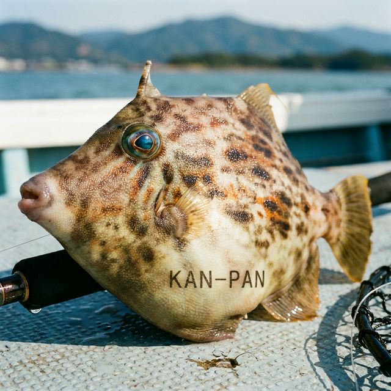

import BlogCard from "@components/BlogCard.astro";

11月、浜名湖のカワハギ釣りは最終戦にして最高の盛り上がりを見せます。この時期のターゲットは、通称 **「肝パン」** 。冬を前にエネルギーを蓄え、肝が大きく膨らんだカワハギです。

おちょぼ口でエサだけを上手にかすめ取ることから「エサ取り名人」と呼ばれ、釣り人を熱くさせるゲーム性の高さが魅力。白身で特に「肝」が絶品なカワハギを、ボートで効率よく攻略する方法を解説します。

## 浜名湖のカワハギ釣りの魅力とベストシーズン

カワハギ釣りは、その高いゲーム性から多くの釣り人を虜にします。アタリを察知して針に掛けるまでの駆け引きは、一度体験すると病みつきになります。

浜名湖でのカワハギ釣りは **7月から11月** がベストシーズンです。
*   **夏（7月〜9月）**：数釣りが楽しめる時期です。
*   **秋（10月〜11月）**：サイズが良くなり、肝がパンパンに入ります。食味を重視するならこの時期が最高です。

## ボートで狙う「肝パン」カワハギのポイント

カワハギは岩礁帯やその周辺の砂泥地を好みます。ボートなら群れが固まっている場所をダイレクトに叩けるため、爆釣の可能性が飛躍的に高まります。

### 1. 鷲津水路
カワハギが狙える代表的なポイントです。
*   **特徴**：水深の変化があり、魚が溜まりやすい場所です。
*   **注意**：中央航路と交差するため、航行する船の邪魔にならないよう十分な注意が必要です。

### 2. 今切口周辺〜海釣公園
潮流が速いエリアですが、その分新鮮な海水が供給され、良型が期待できます。
*   **狙い目**：消波ブロックや石積みのキワ付近。
*   **ターゲット**：カワハギのほか、浜名湖名物の「ギマ」も多く混じります。

> [!TIP]
> **ポイント探しのコツ**
> カワハギは魚群探知機で見つけるのが難しいため、カケアガリや根の周りなど、いかにも魚がいそうなストラクチャーを丹念に探るのが基本です。

## 確実に釣果を伸ばす！ボートカワハギの極意

ボート釣りでは、船のコントロールが釣果を分ける重要なポイントになります。

### アンカー固定とボート速度
カワハギはボートが速く動くとエサを追い切れません。
*   **停止が基本**：アンカーを下ろしてボートを完全に停止させます。
*   **船速の維持**：流し釣りをする場合でも、船速を **0.5ノット以下** に抑えることが重要です。アタリがなければアンカーロープを少し伸ばして位置をずらすなど、微調整を行いましょう。

### 3つの誘い方：タタキ・たるませ・聞きアワセ
状況に合わせて以下の誘いを組み合わせます。

1.  **タタキ釣り**：オモリを底につけたまま竿先を小刻みに激しく揺らします。エサを踊らせて魚の興味を引き、停止させた瞬間に食わせます。
2.  **たるませ釣り**：竿先を下げて糸をわざとたるませます。エサを自然に漂わせ、カワハギが吸い込みやすい状態を作ります。
3.  **聞きアワセ**：竿をゆっくり持ち上げ、違和感がないか探ります。「カンカンッ」と明確なアタリがあっても **強く合わせず** 、そのまま頭上までゆっくり持ち上げると上手く掛かります。

## エサの付け方と仕掛けの重要ポイント

カワハギ釣りは「エサの質」と「針先の鋭さ」で勝負が決まると言っても過言ではありません。

### エサ：アサリのむき身
定番にして最強のエサは **アサリ** です。
*   **刺し方**：水管 → ベロ（足） → ワタ（内臓）の順に縫うように刺します。
*   **コツ**：最後に針先を「ワタ」の中にしっかり隠すのが最も重要です。カワハギはまずワタを狙ってくるため、ここに針先があることでヒット率が劇的に上がります。

### 仕掛け：針の鮮度を保つ
オモリを一番下につけた **胴突き仕掛け** を使用します。
*   **針の交換**：カワハギの口は非常に硬いため、針先が少しでも鈍ると掛かりが悪くなります。少しでも違和感を感じたら、迷わず新しい針に交換しましょう。「ハリス付きの替え針」を多めに用意しておくのが鉄則です。

## 浜名湖周辺のレンタルボート情報

免許を持っていない家族連れから本格派まで、浜名湖には多くのボートレンタル施設があります。

*   **古橋屋**：新居町にある老舗の釣り船。船外機付きレンタルボートがあり、4人乗り10,000円〜、8人乗り19,800円などで利用可能です（船舶免許必要）。
*   **ヤマハマリーナ浜名湖**：シースタイルのレンタルボートが利用可能です。釣り竿のレンタル（1,650円）もあるため、手ぶらで楽しみたい方にも最適です。

## まとめ：肝パンのカワハギはボートで狙い撃ち！

11月のカワハギは、釣って楽しく食べて絶品の、まさに浜名湖の秋の王様。ボートという武器を活かし、丁寧なエサ付けと鋭い針先を維持すれば、初心者でも二桁釣果が十分に狙えます。

ぜひこの記事のテクニックを参考に、パンパンに膨らんだ肝を求めて浜名湖の大海原へ繰り出してみてください！

<BlogCard slug="guide/hamanako-boat-fishing-guide-autumn" />
