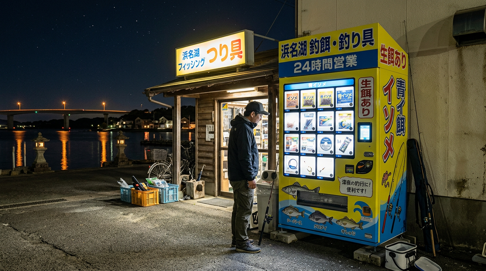

import Map from "@components/Map.astro";
import GMapButton from "@components/GMapButton.astro";
import BlogCard from "@components/BlogCard.astro";

「釣！浜名湖」をご覧いただきありがとうございます！

夜中の急な思い立ちや、まだお店が開いていない早朝の釣行。

そんな時に「活きエサ」を確保できる自動販売機は、アングラーにとって砂漠のオアシスのような存在です。

本記事では、浜名湖周辺で実際に稼働しているエサの自販機情報をまとめました。

## 深夜・早朝でも買える！エサ自販機の設置場所

浜名湖周辺で有名な自販機設置ポイントを紹介します。

### 1. はなぞの釣具店（庄内湖・東岸エリア）
浜松西インター方面からアクセスする際、最も立ち寄りやすい場所にあります。

*   **買えるエサ** : ジャムシ、青イソメ、ゴールドなどの活きエサ。
*   **特徴** : 駐車スペースが自販機の目の前にあるため、サッと買って出発できます。
*   **MAP** : [Google マップ](https://maps.app.goo.gl/f8m8D7Y24N2E5wyLA)

### 2. 大橋屋つり具センター（新居・西岸エリア）
新居弁天海釣公園へ向かうルート上にあり、ファミリーフィッシングの強い味方です。

*   **買えるエサ** : 活きエサ（青イソメ等）のほか、簡単な仕掛けが買えることもあります。
*   **特徴** : 夏場の週末などは店舗自体がオールナイト営業を行っている場合もあります。
*   **MAP** : [Google マップ](https://maps.app.goo.gl/RSgxHsniGN3RBGxB7)

### 3. 上州屋 浜松店（24時間営業）
自販機ではありませんが、**「24時間営業」** の大型釣具店として外せません。

*   ** メリット ** : エサだけでなく、予備の針やオモリ、さらには氷まで全て揃います。
*   ** MAP ** : [Google マップ](https://maps.app.goo.gl/5hpFQui5iG3ToxW77)

## エサ自販機を利用する際の 3 つの注意点

トラブルを防ぎ、新鮮なエサを手に入れるためのポイントです。

### 小銭（100円玉）を多めに用意する
最近は新 500 円玉に対応していない旧型の機械も多いため、100 円玉を数枚持っておくと安心です。

また、お札（1000円札）が使えない場合もあるので、事前の準備が欠かせません。

### 売り切れの可能性を考慮する
週末や大型連休の深夜は、利用者が多くて売り切れてしまうことがあります。

「自販機があるから大丈夫」と過信せず、予備のエサ（パワーイソメなどの疑似餌）を持っておくのも一つの戦略です。

### 明かりの下で中身を確認する
自販機の周辺は暗いことが多いです。

購入後、車内やヘッドライトの明かりで、エサの状態や量が間違いないか軽く確認しておきましょう。

## まとめ：自販機を味方につけてフットワークを軽くしよう！

エサの自販機は、私たちの「今すぐ釣りたい！」という情熱を支えてくれる素晴らしいインフラです。

場所を把握しておくだけで、釣行プランの幅がグッと広がります。

ルールを守って利用し、新鮮なエサで爆釣（ばくちょう）を狙いましょう！

** 管理者より： **
自販機の稼働状況は時期によって異なる場合があります。
深夜・早朝は静かに利用し、ゴミは必ず持ち帰るようお願いします。

