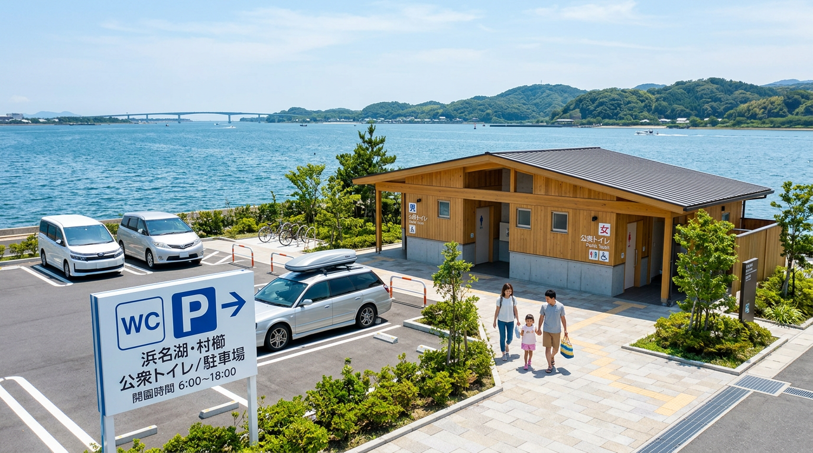

import Map from "@components/Map.astro";
import GMapButton from "@components/GMapButton.astro";
import BlogCard from "@components/BlogCard.astro";

「釣！浜名湖」をご覧いただきありがとうございます！

浜名湖は広大ですが、いざ現地に行ってみると「車をどこに停めていいか分からない」「トイレが遠すぎる」といった問題に直面しがちですよね。

せっかくの休日、釣り場探しで時間を無駄にするのはもったいないです。

本記事では、著者が実際に足を運んで確認した、駐車場とトイレが完備された ** 「これなら安心」 ** というポイントを厳選して紹介します。

## 浜名湖の「インフラ完璧」釣り場 5 選

まずは、ここに行けば間違いないという高規格な釣り場をピックアップしました。

### 1. 新居弁天海釣公園（表浜名湖）
浜名湖で最も整備された、ファミリーフィッシングの聖地です。

*   **駐車場** : 有料（1回400円）。非常に広く、満車の心配が少ないです。
*   **トイレ** : 園内に複数あります。清掃が行き届いており、女性や子供でも安心です。
*   **コンビニ** : 園内に売店があり、近くにコンビニもあります。

<BlogCard slug="points/omote/araibenten-umiduripark" />

### 2. 弁天島海浜公園（中浜名湖）
観光地としても有名な、潮通しの良い絶景ポイントです。

*   **駐車場** : 有料（1回410円）。JR 弁天島駅から徒歩圏内です。
*   **トイレ** : 公園内に公衆トイレがあります。
*   **コンビニ** : ファミリーマートがすぐ隣にあります。

<BlogCard slug="points/omote/bentenjimakaihinkouen" />

### 3. 渚園（表浜名湖）
キャンプ場に隣接した、芝生が心地よいレジャー拠点です。

*   **駐車場** : 渚園の駐車場（1回400円）を利用します。
*   **トイレ** : 駐車場および施設内に完備されています。
*   **特徴** : 釣りだけでなくキャンプも一緒に楽しめます。

<BlogCard slug="points/omote/nagisaen" />

### 4. 網干場 / 今切口舞阪堤（表浜名湖）
今切口の舞阪側に位置する、本格派アングラーにも人気のエリアです。

*   **駐車場** : 有料（1回410円）。
*   **トイレ** : 駐車場の入り口付近に公衆トイレがあります。
*   **注意点** : 漁業関係者の作業場でもあるため、作業優先がルールです。

<BlogCard slug="points/omote/amihosiba" />

### 5. 気賀・プリンス岬（奥浜名湖）
奥浜名湖でハゼ釣りを楽しむならここが一番安心です。

*   **駐車場** : 向山駐車スペースなど、数カ所に駐車可能です。
*   **トイレ** : 公園内に公衆トイレがあります。
*   **特徴** : 波が穏やかで、小さなお子様連れでも安心して竿を出せます。

<BlogCard slug="points/oku/kiga" />

## 【実踏データ】駐車場選びの裏技と注意点

現地で困らないための、ちょっとしたアドバイスをまとめました。

### 衛星写真の罠に注意
Google マップなどで「空き地」に見えても、鎖で閉鎖されていたり私有地だったりすることが多いです。

トラブルを避けるため、必ず本サイトや看板で確認した公認スペースに停めましょう。

### 夜間のトイレ利用
公園のトイレは、夜間に照明が消える場所や、センサー式の場所があります。

深夜の釣行では、ヘッドライトはトイレに行く際も必携です。

### 路上駐車は絶対に厳禁
浜名湖周辺はパトロールが頻繁に行われており、何より近隣住民の方への迷惑になります。

「少しの間だけなら」という甘い考えが、釣り場閉鎖を招く原因になりかねません。

## まとめ：施設を賢く使って快適な釣行を！

駐車場やトイレが整っている場所は、それだけで釣りの集中力が持続します。

特に家族連れの場合は、インフラの充実が「また行きたい」と思ってもらえる鍵になります。

この記事を参考に、ストレスフリーな浜名湖フィッシングを楽しんでくださいね！

** 管理者より： **
最新の施設状況や料金は変更される場合があります。
現地の看板や案内を必ず確認し、ルールを守って利用しましょう。

