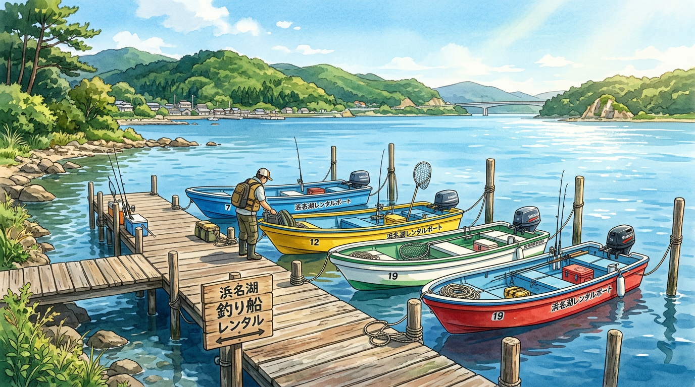

import Map from "@components/Map.astro";
import GMapButton from "@components/GMapButton.astro";
import BlogCard from "@components/BlogCard.astro";

「釣！浜名湖」をご覧いただきありがとうございます！

浜名湖の魅力を 120% 楽しむなら、陸っぱり（岸釣り）だけでなくボートフィッシングは外せません。

広大な水域に広がるシャロー（浅瀬）や、陸からは届かないポイントを自由に攻められるのはボートならではの特権です。

本記事では、初心者でも安心して利用できる浜名湖のレンタルボートショップを厳選してご紹介します。

## 浜名湖でおすすめのレンタルボートショップ

エリアや狙いたい魚種に合わせて最適なショップを選びましょう。

### 1. Angler's Hot Station YAMATO（村櫛）
中浜名湖の村櫛漁港すぐ隣にあり、ルアーアングラーに絶大な支持を受けるマリーナです。

*   **特徴** : シーバスやチヌのトップゲーム、ボトムワインドに非常に強いです。
*   **アドバイス** : スタッフがその日の狙い目を親切に教えてくれます。
*   **MAP** : [Google マップ](https://maps.app.goo.gl/ipYARvsAGXs39eSg6)

### 2. スズキマリーナ浜名湖（湖西・鷲津）
鷲津エリアを拠点とする、国内最大級のマリーナです。

*   **特徴** : 船体が非常に綺麗で、整備もバッチリです。
*   **ターゲット** : 西岸や奥浜名湖のキビレ、シーバス狙いに最適です。
*   **MAP** : [Google マップ](https://maps.app.goo.gl/aYeZvj1uZZ3TXrjU7)

### 3. ジョナサン（細江・寸座）
奥浜名湖の寸座に位置する、アットホームなショップです。

*   **特徴** : 都田川河口や寸座ミオなど、奥浜名湖の好ポイントがすぐそこです。
*   **ターゲット** : 夏のチヌトップや秋のハゼ釣りに最適です。
*   **MAP** : [Google マップ](https://maps.app.goo.gl/Xsq28yPmsA9vC7m36)

### 4. ヤマハマリーナ浜名湖（三ヶ日・入出）
三ヶ日エリアの入出に位置する、ヤマハ直営のマリーナです。

*   **特徴** : 「シースタイル」の会員であれば、非常にリーズナブルに高性能な船を借りられます。
*   **ターゲット** : 猪鼻湖や松見ヶ浦、瀬戸水道周辺の攻略に便利です。
*   **MAP** : [Google マップ](https://maps.app.goo.gl/ApVGuM2xPQv19vaM7)

### 5. 古橋屋（弁天島）
弁天島エリアで古くから親しまれている老舗の船宿です。

*   **特徴** : 弁天島周辺のミオ筋（水路）での流し釣りに強く、伝統漁法も体験できます。
*   **ターゲット** : シーバス、ヒラメ、マゴチなど。
*   **MAP** : [Google マップ](https://maps.app.goo.gl/r8TrbsR5CUgM9VX56)

## ボート選びのチェックポイント

初めてボートを借りる際に確認しておくべき 3 つの項目です。

### 船外機の馬力と免許
2馬力以下のボート（ミニボート）であれば免許不要で乗れるものもあります。

しかし、浜名湖は流れが速い場所があるため、基本的には船舶免許を取得して 20〜30 馬力以上の船を借りることをおすすめします。

### 魚探（ぎょたん）の有無
浜名湖は水深が刻々と変化します。

地形やベイト（エサとなる小魚）の群れを探せる魚群探知機が搭載されているかどうかは、釣果を大きく左右します。

### 出船・帰着の時間
ショップによって営業時間が異なります。

特に朝マズメを狙いたい場合は、何時から出船できるかを事前にウェブサイトや電話で確認しておきましょう。

## まとめ：ボートでしか会えない魚がいる！

ボートフィッシングを始めると、浜名湖の広さと奥深さを改めて実感します。

陸からはノーチャンスだったポイントで、爆釣（ばくちょう）を経験できるかもしれません。

まずは気になるショップに問い合わせて、ボートフィッシングの第一歩を踏み出してみましょう！

** 管理者より： **
ボートの運転には十分な注意が必要です。
湖上のルールを守り、必ずライフジャケットを着用して安全に楽しみましょう。

