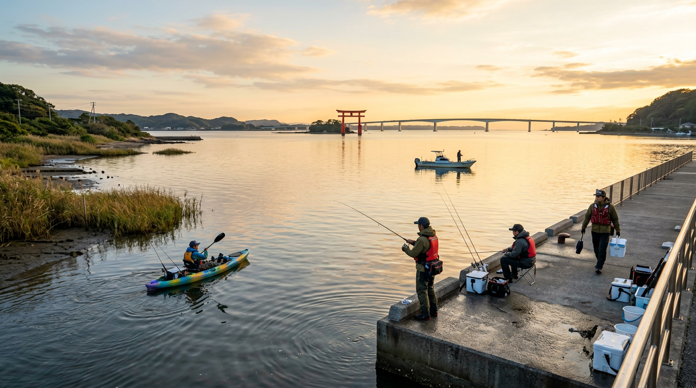

import BlogCard from "@components/BlogCard.astro";

浜名湖は、淡水と海水が混ざり合う広大な汽水湖です。

その複雑な地形と潮流、そして多種多様な魚種に対応するため、浜名湖では古くから独自の釣法が発展してきました。

「どの魚を狙うか」が決まれば、自ずと最適な「釣り方」が見えてきます。

本記事では、浜名湖で代表的な釣法をカテゴリー別にまとめました。

---

## 1. 堤防・岸からの定番釣法（初心者・ファミリー向け）

浜名湖の堤防や海浜公園で、まず挑戦したいのがこれらの釣り方です。手軽に楽しめるものから、奥の深いエサ釣りまで幅広いです。

### サビキ釣り・五目釣り
アジ、イワシ、サッパなどを狙う定番の釣りです。夏から秋にかけてはファミリーフィッシングの主役になります。

  <BlogCard slug="guide/beginner/hamanako-sabiki-best-season" />
  <BlogCard slug="guide/method/casting-gomoku" />

### 穴釣り
テトラの隙間や石畳の間に仕掛けを落とし、カサゴやソイを狙います。冬場でもボウズを避けやすい頼もしい釣法です。

<BlogCard slug="guide/method/anazuri" />

### ちょい投げ（ハゼ釣り）
浜名湖の風物詩とも言えるハゼ釣り。特に奥浜名湖エリアでのちょい投げは、秋の定番です。

<BlogCard slug="guide/method/okuhamanako-haze-fishing" />

---

## 2. 浜名湖独自の伝統・特殊釣法

潮流の激しい今切口付近や、広大なシャロー（浅瀬）を持つ浜名湖ならではのユニークな釣り方です。

### 弁天流し釣り
弁天島周辺や今切口など、潮の流れが速いミオ筋（船の通り道）で、船から仕掛けを潮に乗せて流していく釣り方です。

オモリで固定できないほどの強い流れを逆手に取り、生き餌（アジやヒイラギ）を自然に泳がせてシーバスやヒラメを狙います。

<BlogCard slug="guide/method/benten-nagashi-fishing" />

### たきや漁・エビすき漁
これらは「釣り」ではありませんが、浜名湖を象徴する伝統漁法（観光漁）です。

*   **たきや漁** : 夜間に水中をライトで照らし、突き棒（モリ）で魚を突く伝統漁法。
*   **エビすき漁** : 潮に乗って流れてくるクルマエビなどをネットで掬う、夏の夜の風物詩。

<BlogCard slug="travel/hamanako-traditional-fishing-guide" />

---

## 3. ソルトルアーゲーム（チニング・シーバス）

近年、浜名湖は「チニング（クロダイ・キビレをルアーで狙う）」の聖地として全国的に知られています。

### 夜のルアーゲーム
夜間の浜名湖はシーバスやクロダイの活性が上がります。トップウォーターからボトム攻略まで、戦略性の高い釣りが楽しめます。

  <BlogCard slug="guide/method/night-chining" />
  <BlogCard slug="guide/method/night-seabass" />

---

## 4. 船・ボート・フローターの釣り

陸っぱりからは届かない広大なポイントを攻略するためのスタイルです。

### ボート釣り
浜名湖のボート釣りは、季節によってポイントが大きく変わるのが特徴です。

<BlogCard slug="guide/method/boat-autumn" />

### カヤック・SUPフィッシング
浅瀬が多い浜名湖は、喫水の浅いカヤックやSUPと非常に相性が良いです。静かに魚へ近づけるメリットがあります。

<BlogCard slug="guide/method/hamanako-kayak-fishing" />

---

## まとめ：ターゲットとエリアに合わせた釣法を選ぼう

浜名湖での釣りは、季節と潮、そして魚の動きを読み解くパズルです。

まずは得意な釣法からスタートし、徐々に浜名湖ならではの特殊な釣り方にも挑戦してみてください。

<BlogCard slug="guide/theory" />
