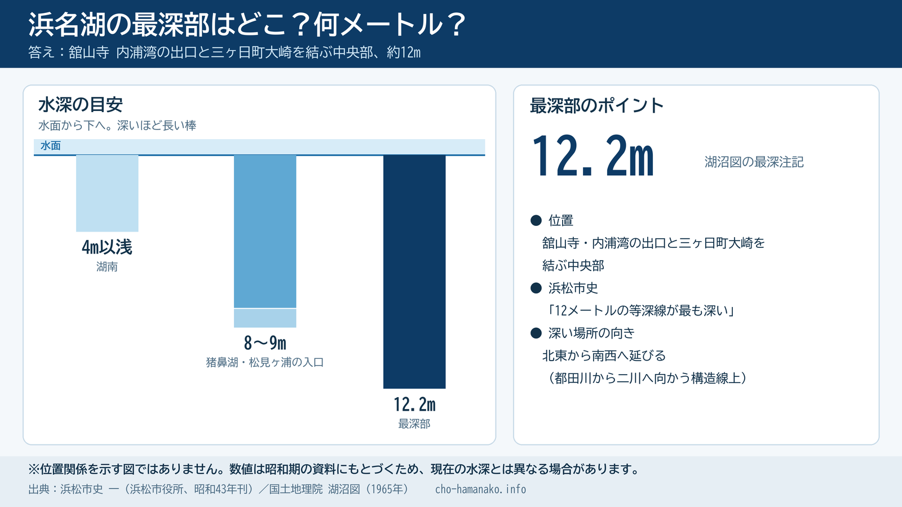
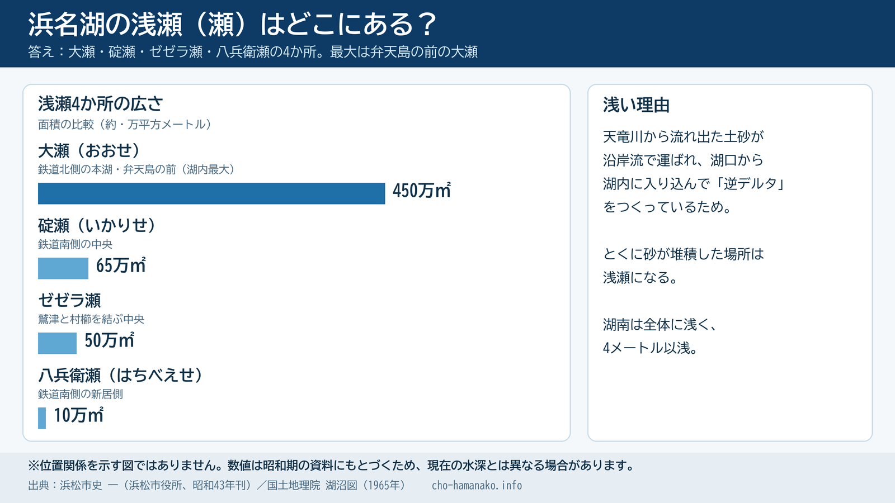
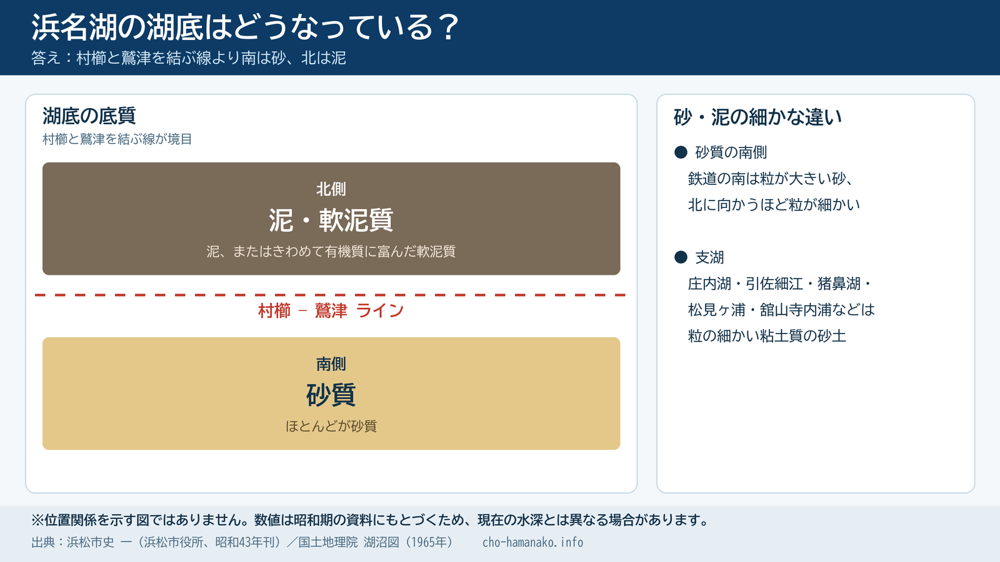
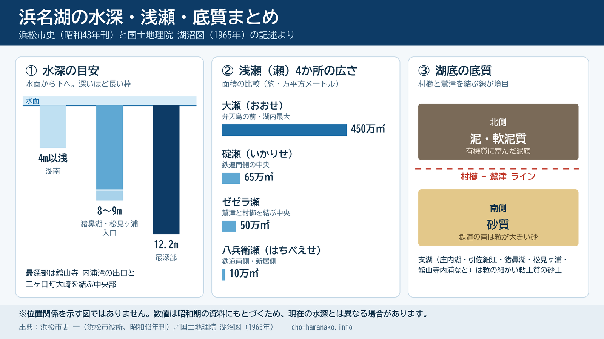

import BlogCard from "@components/BlogCard.astro";
import Callout from "@components/Callout.astro";

「浜名湖の水深マップが見たい」「最深部はどこ？」「湖底はどうなっているの？」

そんな疑問に、先に答えをまとめます。

- <strong>水深マップ</strong>：国土地理院の「湖沼図」で見られる（昭和40年＝1965年の測量）
- <strong>最深部</strong>：舘山寺・内浦湾の出口と、三ヶ日町大崎を結ぶ中央部。約12メートル
- <strong>湖底</strong>：村櫛と鷲津を結ぶ線より南は砂、北は泥

この記事では、湖沼図の入口と、浜松市史に書かれた<strong>最深部・浅瀬・底質</strong>の記述を、疑問ごとに整理します。

水深の特徴を頭に入れておくと、釣り場を選ぶときの判断材料になります。

## 浜名湖の水深マップはどこで見られる？

浜名湖の水深を等深線で示した地図は、国土地理院が「湖沼図」として公開しています。

<a href="https://www.gsi.go.jp/kankyochiri/chubu-hamanako.html" target="_blank" rel="noopener noreferrer">国土地理院「浜名湖」湖沼図のページ</a>には、浜名湖を4つの図に分けたリンクが並んでいます。

当サイトでは、この図を転載したり、推測で描き直したりはしません。

水深を確認したい方は、国土地理院のページで原図を見てください。

<Callout type="WARNING">

現在公開されている浜名湖の湖沼図は、1965年（昭和40年）の測量にもとづく古い資料です。

澪筋（みおすじ）や砂の堆積は年月とともに変わるため、現在の水深と一致するとは限りません。

釣行の安全判断（ウェーディングの立ち込みなど）には使わず、あくまで地形の傾向をつかむ資料として使ってください。

</Callout>

<strong>湖沼図は、60年ぶりに更新される予定です。</strong>

国土地理院の資料によると、令和5年度から7年度までの3か年計画で、浜名湖・猪鼻湖の湖沼図の更新作業が進められています。

令和8年の今、近い将来に最新の湖沼図が公開される可能性があります。

公開時期は、国土地理院の発表を確認してください。

新しい図が公開されたら、この記事も更新します。

それでも、湖沼図は現地を知っている人ほど役に立ちます。

「あの辺りに仕掛けを投げたら、やけに深かった」という体験が、図を見ると納得できることがあります。

## 浜名湖の最深部はどこ？何メートル？

浜名湖で最も深いのは、舘山寺の内浦湾の出口と、三ヶ日町大崎を結ぶ中央部です。

水深は約12メートルです。

この節から底質の節までは、浜松市史の記述をもとにしています。

<strong>出典</strong>：「浜松市史 一」（浜松市役所、昭和43年刊）。

本文は、同書の「自然環境編／第二章 地形とその生い立ち／第六節 浜名湖の生い立ちと特質／現在の浜名湖」にある「水深と湖底」の記述を参考にしています。

この資料は、浜松市立中央図書館の「浜松市文化遺産デジタルアーカイブ（ADEAC）」で公開されています。浜松市の図書館でも探せるので、原文が気になる方は確認してみてください。

<a href="https://adeac.jp/hamamatsu-city/text-list/d100010/ht000610" target="_blank" rel="noopener noreferrer">浜松市史「水深と湖底」（ADEAC）</a>

刊行は昭和43年で、湖沼図と同じ時代の記述です。現在の水深とは違う場所もある点に注意してください。

水深について、同書には次のように書かれています。

- <strong>最深部</strong>：舘山寺と大崎を結ぶ湖の中央部。12メートルの等深線が最も深い
- <strong>やや深い場所</strong>：猪鼻湖と松見ヶ浦の入口。8〜9メートルに及ぶ
- <strong>湖南（南部）</strong>：全体に浅く、4メートル以浅
- <strong>深い場所の向き</strong>：北東から南西へ延びている。都田川から二川へ向かう構造線の上にあたるため

1965年の湖沼図でこの場所を見ると、12メートルの等深線に囲まれた細長い範囲の中に、水深の注記「12.2」があります。

浜松市史の記述と、湖沼図の最深部は一致しています。

<a href="https://maps.gsi.go.jp/#14/34.769538/137.589855/&base=std&ls=std%7Clake1&blend=0&disp=11&vs=c1g1j0h0k0l0u0t0z0r0s0m0f0" target="_blank" rel="noopener noreferrer">地理院地図で最深部を湖沼図レイヤーで表示する</a>

最深部は沖の中央部で、舘山寺の内浦湾は支湖にあたります。

舘山寺エリアの釣り場は、こちらの記事で紹介しています。

<BlogCard slug="kanzanji" />

## 浜名湖の浅瀬（瀬）はどこにある？

浜名湖には、大瀬・碇瀬・ゼゼラ瀬・八兵衛瀬の4か所の浅瀬があります。

最大は、弁天島の前に広がる大瀬です。

浜松市史には、湖内の主な浅瀬の名前と位置、面積が載っています。

| 浅瀬の名前 | 位置（同書の記述） | 面積（約） |
| :--- | :--- | :--- |
| 大瀬（おおせ） | 鉄道北側の本湖、弁天島の前 | 450万平方メートル（湖内最大） |
| 碇瀬（いかりせ） | 鉄道南側の中央 | 65万平方メートル |
| ゼゼラ瀬 | 鷲津と村櫛を結ぶ中央 | 50万平方メートル |
| 八兵衛瀬（はちべえせ） | 鉄道南側の新居側 | 10万平方メートル |

今切口に近い南側が全体に浅いのは、天竜川から流れ出た土砂が沿岸流で運ばれ、湖口から湖内に入り込んで「逆デルタ」をつくっているためです。

とくに砂が堆積した場所は、浅瀬になります。

弁天島周辺の釣り場を選ぶときは、沖に広い浅場があることを頭に入れておくと役立ちます。

<BlogCard slug="bentenjimakaihinkouen" />

## 浜名湖の湖底はどうなっている？

湖底の底質は、村櫛と鷲津を結ぶ線を境に分かれます。

線より南は砂、北は泥です。

浜松市史によると、底質は次のとおりです。

- <strong>線より南</strong>：ほとんどが砂質。鉄道の南側は粒の大きい砂が多く、北側に向かうほど粒が細かくなる
- <strong>線より北</strong>：泥、またはきわめて有機質に富んだ軟泥質
- <strong>支湖</strong>（庄内湖・引佐細江・猪鼻湖・松見ヶ浦・舘山寺内浦など）：粒の細かい粘土質の砂土

つまり、浜名湖は「南は砂、北は泥」と大まかに覚えておけば大きく外れません。

<BlogCard slug="murakushi-fishing-port" />

<BlogCard slug="washidukou" />

## 水深と底質を、釣り場選びにどう活かすか

ここからは、上記の事実を踏まえた当サイトの考え方です。

- <strong>浅場が広い南側（今切口〜弁天島周辺）</strong>は、砂地の浅いフラットが続きます。シャローを好む魚を狙う釣りと相性がよく、春の乗っ込みや夏のチニングの舞台になります。
- <strong>最深部の舘山寺〜大崎を結ぶ中央部</strong>は、湖の中でも深い水域です。岸から狙える場所では、深場を意識した釣りを考えるきっかけになります。
- <strong>泥底の北側や支湖</strong>は、底の感触が南とは異なります。根掛かりの質も変わるため、仕掛けを調整するきっかけになります。

浅瀬と深場の境目は、魚が移動する通り道になりやすい場所です。

湖沼図で境目を確認し、現地で水深と底の感触を確かめる、という使い方が実用的です。

春の乗っ込みと浅場の関係は、こちらの記事で整理しています。

<BlogCard slug="guide/theory/nokkomi-season" />

水中の地形変化を探す考え方は、ストラクチャー理論の記事にまとめています。

<BlogCard slug="guide/theory/structure-theory" />

浅い砂地のシャローを歩いて狙うウェーディングポイントは、こちらです。

<BlogCard slug="wading-points" />

## まとめ：水深は「昔の図」と「今の現場」を重ねて読む

浜名湖の水深・浅瀬・底質を、1枚にまとめました。位置関係を示す地図ではありません。

- 浜名湖の水深マップ（等深線）は、国土地理院の湖沼図で確認できる
- 湖沼図は昭和時代のもので、現在の水深とは異なる場合がある
- 最深部は舘山寺と大崎を結ぶ中央部で、12メートルの等深線が最も深い
- 猪鼻湖と松見ヶ浦の入口は8〜9メートル、湖南は4メートル以浅
- 浅瀬は大瀬・碇瀬・ゼゼラ瀬・八兵衛瀬の4か所で、最大は弁天島前の大瀬
- 底質は村櫛と鷲津を結ぶ線の南が砂質、北が泥・軟泥質

地図で全体像をつかみ、現地で自分の足と道具で確かめる。

この順番が、浜名湖の水深を釣りに活かす近道です。

浜名湖のポイントを地図から探したい方は、釣り場マップも使ってください。

<a href="/map/">浜名湖の釣り場マップ（エリア・季節別ポイント検索）</a>

> [!IMPORTANT]
> <strong>安全とマナーについて</strong>
>
> 水深が分からない場所への立ち込みは、転落や流される危険があります。ライフジャケットを着用し、足場の確認できない場所には入らないでください。
>
> ゴミは必ず持ち帰り、立入禁止の表示がある場所には入らないなど、釣り場を守るマナーを徹底しましょう。
