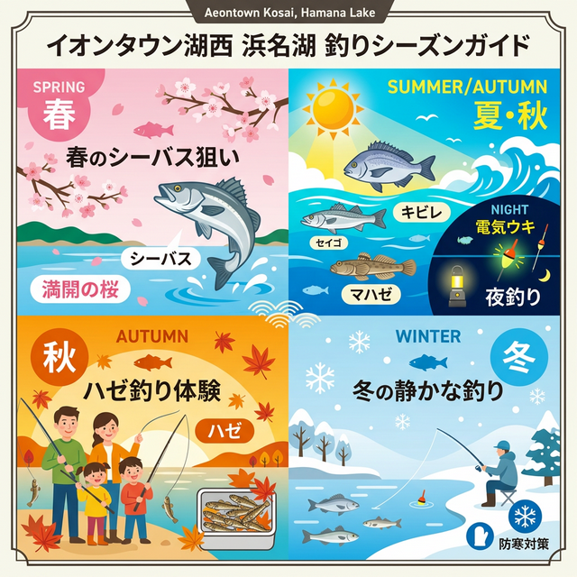

import Map from "@components/Map.astro";
import GMapButton from "@components/GMapButton.astro";
import TackleCard from "@components/TackleCard.astro";

『釣！浜名湖』をご覧いただきありがとうございます！

今回は、中浜名湖の西岸に位置する **「イオンタウン湖西周辺」** のポイントをご紹介します！

大型ショッピングモールの裏手に広がるこのエリアは、遊歩道が整備された海浜公園となっており、とにかく「利便性」が抜群。お買い物ついでにサクッとルアーを投げたり、家族が買い物をしている間に短時間釣行を楽しんだりできる、非常に使い勝手の良いスポットです。

## イオンタウン湖西周辺の基本情報

<Map lat={34.713708} lng={137.557069} name="イオンタウン湖西周辺" />

<GMapButton url="https://maps.app.goo.gl/DD9AecMrewjAT5f28" />

*   **ポイント名**：イオンタウン湖西周辺
*   **所在地**：静岡県湖西市鷲津
*   **アクセス方法**：JR鷲津駅から車で約5分。イオンタウン湖西（マックスバリュ側）の裏手。
*   **駐車場**：公園内に数台の無料駐車スペースあり。
*   **トイレ**：園内およびイオンタウン内に完備。
*   **近くのコンビニ**：ファミリーマート湖西鷲津東店

> [!IMPORTANT]
> **駐車マナーとルール厳守！**
> 夜釣りの際、イオンタウンの駐車場を目的外で長時間占有するのは控えましょう。園内の無料駐車スペースを利用するのがマナーです。また、遊歩道は一般の歩行者も多いため、キャストの際は周囲の安全を十分に確認してください。

### ポイントの特徴
イオンタウン裏手は、護岸がしっかり整備されており、非常に釣りやすいエリアです。

*   **夜の電気ウキ釣りの定番**
    広範囲を探れる電気ウキ釣りは、夜のキビレやセイゴ（シーバス）狙いに最適。潮の流れに乗せて、ゆっくりと仕掛けを漂わせるのがコツです。
*   **夏のトップウォーターゲーム**
    日中はトップウォータープラグを使ったキビレ狙いも有望。広大なシャローですが、所々に沈んでいる地形の変化を意識してランガン（歩いて移動）しましょう。
*   **ボートフィッシングの通り道**
    実は岸から届かない沖のエリアはボートアングラーにも人気の場所。岸釣りが不調なときは、ボートをチャーターして沖を狙うのも一つの手です。

### 🐟️狙い目のシーズン
*   **夏・秋**：**【メインシーズン】** 高水温期は魚影が濃く、トップやウキ釣りで数釣りが楽しめます。
*   **春**：バチ抜けパターンのシーバスが狙い目。
*   **冬**：風を遮るものが少なく、水深も浅いため、基本的にはオフシーズン。

## シーズンごとに釣れやすい魚

**夏・秋：キビレ、セイゴ、ハゼ、クロダイ**
もっとも活性が高い季節。夕マヅメから夜にかけては、電気ウキが海面に沈む興奮を味わえるチャンス大です。

**秋：ハゼ、大型キビレ**
落ちのシーズンには良型のハゼも混ざります。家族でのんびりハゼ釣りを楽しむのも良いでしょう。

## ルアー・エサ釣り攻略とおすすめタックル

イオンタウン周辺でキビレ・セイゴを狙うための、編集部おすすめセッティングをご紹介します。

### ルアー釣り（チニング・シーバス）
8ft前後のライトなタックルが扱いやすいです。

<TackleCard id="seabass/daiwa-silverwolf-76ml-s-w" />
<TackleCard id="common/shimano-sedona-c3000" />

日中はトップウォーター、夜間はボトム周辺をワームやシンキングペンシルで探るのが定石です。

### 夜の電気ウキ釣り
安定した釣果を求めるなら、夜の電気ウキ釣りがもっとも確実です。青イソメを房掛けにして、ゆっくり流しましょう。

<TackleCard id="seabass/fuji-tokki-ff-n30lg-float" />
<TackleCard id="kibire/gamakatsu-ken-tsuki-maru-seigo" />

### 夜釣りの必須アイテム
イオンタウン裏は街灯がありますが、手元を照らすライトや、魚を安全に掴むグリップは必須です。

<TackleCard id="common/gentos-headlight-cb-300d" />
<TackleCard id="kibire/dress-fish-grip-twin-gold" />

## 周辺情報
イオンタウン湖西がすぐ隣にあるため、お弁当や飲み物の調達、急なトイレ休憩にも困りません。小さなお子様連れの釣行でも安心感がありますね。

## まとめ：買い物ついでに「サクッと」楽しめる都会の釣りポイント

イオンタウン湖西周辺は、本格的な釣りというよりは、生活圏内で気軽に楽しめる「身近なフィールド」です。
1. 圧倒的な利便性と安全な足場。
2. ショッピングや家族サービスと両立が可能。
3. 夜のウキ釣りで安定した釣果が期待できる。

マナーを守って、お買い物ついでに中浜名湖の景色と釣りを楽しんでみてください！