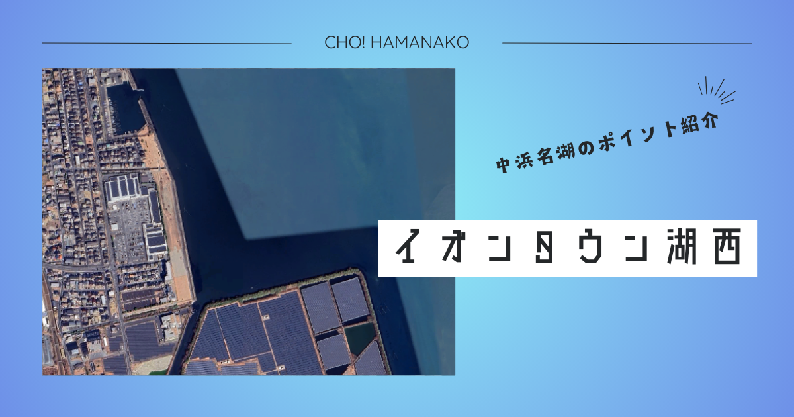

import Map from "@components/Map.astro";
import GMapButton from "@components/GMapButton.astro";
import BlogCard from "@components/BlogCard.astro";
import Callout from "@components/Callout.astro";

「釣！浜名湖」へようこそ！

今回ご紹介するのは、中浜名湖の西岸に位置し、圧倒的な利便性と安全性を誇る都会のオアシス的ポイント、 <strong>「イオンタウン湖西周辺（海浜公園）」</strong> です。

大型ショッピングモールの裏手に広がるこのエリアは、美しく整備された遊歩道、転落防止の安全柵、そして清潔なトイレが完備されており、小さなお子様連れのファミリーや「今日から釣りを始めたい」という初心者の方にとって、これ以上ないほど恵まれた環境です。

「お買い物や食事のついでに、サクッと1時間だけ竿を出す」
そんな現代的なアーバン・フィッシングを体現したようなこのポイントには、実は見た目以上に多彩な魚たちが回遊してきます。

本記事では、この超便利ポイントを200%活用するための攻略タクティクスと、釣り場を守るためのマナーを、3000文字超の圧倒的ボリュームで徹底解説します。

<Map lat={34.713708} lng={137.557069} name="イオンタウン湖西周辺" />
<GMapButton url="https://maps.app.goo.gl/DD9AecMrewjAT5f28" />

---

## 🔍 ポイント概要：ショッピング×フィッシングの黄金比

イオンタウン湖西周辺は、JR鷲津駅から車で約5分。ショッピングセンターの「裏庭」とも言える位置にある <strong>「海浜公園」</strong> と、それに続く遊歩道が主な釣り座となります。

### 釣り場としての圧倒的スペック

- <strong>駐車場</strong>：公園内に無料の駐車スペースが数台分用意されています。釣り場に最も近く、重いタックルの運搬も容易です。
- <strong>トイレ</strong>：公園内、またはイオンタウン内の清潔な多目的トイレが利用可能。女性や小さなお子様が一緒でも、衛生面の心配は無用です。
- <strong>買い出しの聖地</strong>： <strong>マックスバリュ</strong> や <strong>ダイソー</strong> が目の前！お弁当や飲み物、さらには急な雨対策のレインウェアや消耗品まで、何でも揃います。
- <strong>最強のバックアップ「イシグロ湖西店」</strong>：車で5分圏内に <strong>つり具のイシグロ湖西店</strong> をはじめとする大型釣具店が点在しており、活きエサの調達や最新ルアーの補充も自由自在です。

> [!IMPORTANT]
> <strong>【超重要】駐車マナーの遵守</strong>
> イオンタウン側の駐車場は、あくまで「お買い物客専用」です。釣りのための数時間に及ぶ長時間駐車は店舗への大きな迷惑となり、過去には全国で同様のケースから釣り場閉鎖に追い込まれた例も少なくありません。 <strong>必ず「公園内駐車場」を利用するか、お買い物を済ませた上で常識の範囲内での利用</strong> を心がけてください。

---

## 🌊 水中地形と「シャローフラット」の攻略法則

このエリアの最大の特徴は、岸からかなり先まで水深が変わらない <strong>「ドシャロー（激浅）」</strong> なフラットエリアであることです。

### ① 石積みの護岸と敷石
足元は石積みで保護されており、その先約2〜3mは敷石が入っています。
- <strong>水中状況</strong>：敷石の隙間には、クロダイやキビレの大好物である <strong>カニやエビ</strong> が無数に潜んでいます。
- <strong>攻略</strong>：足元ギリギリを狙う「穴釣り」的なアプローチも有効ですが、根掛かりも多いため、仕掛けを回収する際は竿を立てて早めに巻き上げるのが鉄則です。

### ② 新居川河口の「汽水」成分
少し北側に位置する「新居川（あらいがわ）」の河口から常に真水が流入しています。
- <strong>水中状況</strong>：真水と海水が混じり合う「汽水域」を好む魚、特に <strong>シーバス（セイゴ・マダカ）</strong> や <strong>キビレ</strong> の密度が非常に高いのが特徴です。
- <strong>攻略</strong>：川の流れの影響を受ける「下げ潮」のタイミングでは、汽水の恩恵を受ける魚たちが活性化し、爆釣のチャンスが訪れます。

---

## 🐟️ ターゲット別・必勝攻略タクティクス

### 【☀️ 夏 〜 🍂 秋】キビレの「ドシャロー攻略」
このポイントが最もエキサイティングになるのが、夏のトップウォーターゲームです。
- <strong>水中・戦略</strong>：膝下ほどの水深しかない場所に、大きなキビレが驚くほどの勢いで差してきます。朝夕のマヅメ時にポッパーやペンシルベイトを通し、 <strong>「水面を爆発させる」</strong> ような強烈なバイトを誘います。リトリーブ速度よりも、一定の「ポップ音」で魚を寄せるイメージが大切です。
- <strong>関連記事</strong>： <BlogCard slug="kibire" />

### 【🍂 秋】ハゼのチョイ投げ＆ハゼクラ
お子様が一番笑顔になるのが、このハゼ釣りです。
- <strong>水中・戦略</strong>：敷石の先の砂地を狙います。小さな天秤仕掛けに青イソメや石ゴカイを短く刺して投げるだけ。また、近年大流行の <strong>「ハゼクラ（クランクベイト）」</strong> も、ここほどエントリーしやすい場所はありません。ルアーを砂地にコンコンと当てながら巻いてくる「ボトムノック」を意識してください。
- <strong>関連記事</strong>： <BlogCard slug="haze" />

### 【🌙 通年】夜の電気ウキ＆ライトゲーム
仕事帰りにサクッと楽しめる夜釣りも魅力です。
- <strong>水中・戦略</strong>：遊歩道沿いの街灯が水面に落とす「明暗のライン」を狙い撃ち。 <strong>セイゴ</strong> や <strong>チンタ</strong> （クロダイの幼魚）が、電気ウキを引き込む瞬間は、日中の釣りとまた違った静かな興奮があります。

---

## ⚠️ 都会の釣り場ならではの「鉄の掟」

1. <strong>歩行者・近隣住民への最大級の配慮</strong>：ここは、地域の皆さんが散歩やジョギング、犬の散歩を楽しむ公共の場です。 <strong>キャストの際は、必ず後方と左右を目視で確認</strong> してください。魚を釣ることよりも、周囲の安全を確保することの方が100倍重要です。
2. <strong>アカエイへの厳戒態勢（必須）</strong>：このエリアのような砂泥底のシャローには、 <strong>アカエイ</strong> が非常に多く潜んでいます。
   - <strong>【対策】</strong>：安全柵より前に出ることは基本ありませんが、万が一水辺に降りる際は必ず靴を履き、 <strong>「すり足」</strong> で歩くこと。また、釣れてしまった場合は絶対に素手で触れず、プライヤー等で安全に処理してください。
3. <strong>ゴミの「完全持ち帰り」</strong>：コンビニやスーパーに近い分、飲食物のゴミが目立ちやすいです。「自分のゴミは自分で持ち帰る」という当たり前のことを、より高い意識で行いましょう。

---

## 🚀 まとめ：利便性NO.1！現代のアングラーに贈る「最適解」

イオンタウン湖西周辺は、本格的な「磯」や「船」の釣りとは180度違う、 <strong>「生活の一部としての釣り」</strong> が楽しめる稀有な場所です。

- <strong>安全・清潔・便利</strong>。ファミリーフィッシングのハードルを極限まで下げてくれる。
- <strong>シャローエリア独特の魚影</strong>。意外な大物（年無しクロダイやランカーシーバス）との遭遇も少なくない。
- <strong>ショッピングとの融合</strong>。家族サービスと趣味を同時に満たせる「Win-Win」の構図。

中浜名湖の穏やかな潮風を感じながら、イオンでの買い出しついでにゆったりと竿を出してみる。そんな「心の贅沢」を、ぜひこの場所で見つけてみてください。

---

<BlogCard slug="family-car-points" />
浜名湖で家族と行ける、さらに多くの「安心・安全・便利」なポイントを厳選して紹介。

<BlogCard slug="seabass-tactics" />
汽水域の攻略に欠かせない、シーバス（セイゴ）釣りの基本。
