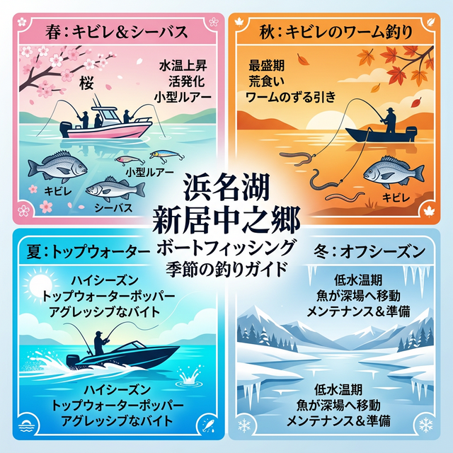

import Map from "@components/Map.astro";
import GMapButton from "@components/GMapButton.astro";
import TackleCard from "@components/TackleCard.astro";

「釣！浜名湖」をご覧いただきありがとうございます！

今回は、中浜名湖の西側に位置する **「新居町中之郷（あらいちょうなかのごう）エリア」** をご紹介します！

ここは陸からのアプローチが非常に厳しく、釣り座がほとんどないエリア。しかし、その分ボートアングラーにとっては「手付かずの魚が残るパラダイス」となっているのをご存知でしょうか？

特に夏場のトップウォーターゲーム（水面炸裂）や、広大なシャローでのサイトフィッシングを楽しみたいなら、絶対に外せない穴場スポットなんです！

## 新居町中之郷周辺の基本情報

<Map lat={34.70912} lng={137.56630} name="新居町中之郷付近" />

<GMapButton url="https://maps.app.goo.gl/kjy17ow5RBPj3dd58" />

*   **ポイント名**：新居町中之郷（あらいちょうなかのごう）
*   **所在地**：静岡県湖西市新居町中之郷
*   **アクセス方法**：レンタルボートまたはマイボートでアプローチ。付近のマリーナ（新居マリーナなど）からほど近い場所に位置します。
*   **駐車場**：なし（マリーナ施設等を利用）
*   **トイレ**：なし（船上の設備を利用）
*   **近くの釣具店**：浜名湖つりセンター、大橋屋つり具センター

> [!CAUTION]
> **超低水深エリアへの注意**
> 中之郷沿岸は岸から200m以上にわたって水深1.5m前後の「激浅シャロー」が続いています。干潮時はさらに水位が下がるため、船外機のペラを底に擦ったり、砂に埋まってしまうリスクがあります。チルトアップの準備と、潮位の確認は絶対に行ってください。

### ポイントの特徴
新居町中之郷は、浜名湖の中でも特に「ボートゲームの戦略性」が試されるエリアです。

*   **ソーラーパネル下のストラクチャー**
    沿岸に設置されたソーラーパネルや、それに付随する杭などは、キビレやクロダイにとって絶好の隠れ家。陸からは絶対に届かないこの「ピンポイント」をボートで撃っていく釣りが最高にエキサイティングです。
*   **広大なシャローフラット**
    どこまでも続く砂地のフラットエリアは、夏場にキビレが群れで回遊してきます。水が澄んでいる日は、泳いでいる魚を直接見つけて狙い撃つ「サイトフィッシング」も可能です。
*   **競争率の低さ**
    足場が悪く陸っぱりがほぼ不可能な場所が多いため、メジャーポイントのようなプレッシャーがありません。フレッシュな個体と出会える確率が非常に高いのが最大のメリットです。

### 🐟️狙い目のシーズン
*   **春**：ブレイク沿いでシーバスの活性が上昇。
*   **夏**：**【ベストシーズン】** 夏の朝マヅメ、トップで水面が割れる体験を！
*   **秋**：ボトムワインドやズル引きで、大型のキビレを狙い撃ち。
*   **冬**：水温低下が激しく、魚が抜けるためオフシーズン。

## シーズンごとに釣れやすい魚

**春：キビレ、シーバス**
3月下旬頃から、産卵から回復した個体がシャローへ差してきます。マイクロベイトパターンになることが多く、小さめのミノーやシンキングペンシルが有効です。

**夏：キビレ、クロダイ、シーバス**
中之郷といえば夏のトップゲーム！ソーラーパネルの影や杭の周囲にポッパーを正確にキャストし、「ボコン！」と水面を割るバイトを誘い出しましょう。この時期のキビレは非常にアグレッシブです。

**秋：キビレ、マゴチ、シーバス**
ベイトフィッシュがハゼやカニに移り変わる時期。ワームでのズル引きや、ボトム付近を跳ねさせるリアクションの釣りが効果を発揮します。

## ボートルアー攻略法とおすすめタックル

中之郷の広大なエリアをランガン（効率よく移動）しながら、ベイトの気配や水面の変化を探っていきましょう。水深が極めて浅いため、ルアーは「底を叩きすぎない」ものを選ぶのがコツです。

### ボートチニング・シーバスタックル
ボート上での取り回しやすさを重視したレングスがおすすめ。

<TackleCard id="seabass/daiwa-silverwolf-76ml-s-w" />
<TackleCard id="common/shimano-vanford" />

### 必須アイテム
中浜名湖のチヌはヒレが非常に鋭いです。キャッチ＆リリースをスムーズにするためにもグリップは必須。

<TackleCard id="kibire/dress-fish-grip-twin-gold" />

## 周辺観光・グルメ情報

ボートをマリーナに返した後は、湖西エリアの美味しいお店へ。
*   **和食処 磯駒**：地元の魚料理が楽しめるお店。
*   **イオンタウン湖西**：帰りに必要なものを買い揃えるのに便利です。

## まとめ：ボートアングラーだけが知る、静かなる楽園

新居町中之郷は、不便さ（陸っぱり不可）が「魚の宝庫」へと繋がっている稀有なポイントです。

1. ソーラーパネル周辺のストラクチャーが抜群に効く。
2. 他のポイントが混雑していても、ここは貸し切り状態が多い。
3. シャローで「目視の釣り」が楽しめる。

> [!IMPORTANT]
> **安全のために**
> 非常に浅いエリアですので、潮位の動きには細心の注意を払ってください。また、ソーラーパネルなどの施設には過度に接近しすぎず、安全な距離を保ってキャスティングを楽しみましょう。
