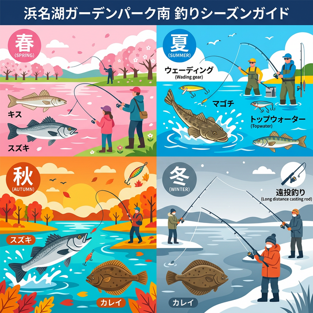

import Map from "@components/Map.astro";
import GMapButton from "@components/GMapButton.astro";

「釣！浜名湖」をご覧いただきありがとうございます！

今回は、浜松の超有名観光スポット **「浜名湖ガーデンパーク」** の周囲に広がる広大な釣りエリアをご紹介します！

ここは中浜名湖の中でも特に「広大なシャローフラット」が特徴で、ウェーダーを装備して水中に立ち込む「ウェーディングゲーム」を楽しむアングラーにとっての聖地とも言える場所です。

## 浜名湖ガーデンパーク南側の基本情報

<Map lat={34.712682} lng={137.604061} name="浜名湖ガーデンパーク" />

<GMapButton url="https://maps.app.goo.gl/gzaSLF6xh48Vu48G8" />

*   **ポイント名**：浜名湖ガーデンパーク
*   **所在地**：静岡県浜松市中央区村櫛町
*   **開園時間**：8:30～17:00（7・8月は18:00まで）
*   **アクセス方法**：浜松市内から浜名湖周遊道路を経由。
*   **駐車場**：巨大無料駐車場あり（約1800台）。閉園時間はゲートが閉まるため、夜釣りには不向きです。
*   **トイレ**：園内および駐車場に完備。

> [!WARNING]
> **閉園時間と満潮時の水没に注意！**
> ガーデンパークの駐車場は夜間閉鎖されます。車を停めたまま夜釣りをすることはできません。また、南側の砂浜は満潮時に完全に水没することがあるため、潮見表を確認し、浸水しても大丈夫なウェーダーを着用して立ち回るのが基本です。

### ポイントの特徴
ガーデンパークはウェーディングスポットに最適で、どこまでも続く砂地のサーフが最大の特徴です。

*   **ウェーディングの天国**
    広大なシャローが続いており、ウェーダーを装備して沖の航路（ミオ筋）のカケアガリを狙い撃つスタイルが主流。マゴチやシーバスの魚影が濃いです。
*   **航路への遠投投げ釣り**
    海に入らずとも遠投（100m以上）すれば、航路沿いに潜む良型のキスやマゴチ、キビレ、秋からはカレイも狙えます。
*   **ファミリーとの両立**
    昼間は家族が公園で遊び、パパは短時間だけサーフへ、といった行楽との両立がしやすいのもポイントです。

### 🐟️狙い目のシーズン
*   **春**：3月頃からキビレ・シーバスに期待。
*   **夏**：**【ハイシーズン】** ウェーディングでのマゴチ狙いが激熱。
*   **秋**：シーバス・キビレ・マゴチの荒食いシーズン。サイズ・数ともに期待大。
*   **冬**：遠投投げ釣りで「座布団カレイ」を狙うストイックな季節。

## シーズンごとに釣れやすい魚

**春：キス、シーバス、キビレ**
水温上昇とともにキスが砂浜近くまで寄ってきます。それをベイトにマゴチやシーバスも集まってくる感じ。ルアーではバチ抜けパターンのシーバスに注目。

**夏：マゴチ、キビレ、シーバス、ハゼ**
日中のシャローはトップウォーターゲーム。ボトムワインドはマゴチの宝庫。バイブレーションやワームでカケアガリを丁寧に探りましょう。

**秋：シーバス、クロダイ、キビレ、マゴチ、カレイ**
「落ち」の好シーズン。ベイトの気配が濃くなり、ウェーディングゲームが一気に盛り上がります。

**冬：カレイ、シーバス**
航路の深い場所を狙い撃ち。投げ釣り師たちが大型のカレイを求めて集まります。

## ルアー攻略法とおすすめタックル

*   **対象魚**：マゴチ、シーバス、チヌ（キビレ）
*   **おすすめルアー**：底を攻めるワーム（ジグヘッド）、鉄板バイブ、シンキングペンシル
*   **おすすめタックル**：9.6ft〜10ft前後のシーバスロッド（Mクラス）

広大なエリアを効率よく探るため、飛距離を重視したタックルセッティングがおすすめです。波打ち際から少し立ち込み、沖の「ミオ筋（航路）」を意識してキャストするのが釣果への近道です。

ウェーディングは必ずしも必須じゃありません。砂浜からでも100m投げれるタックル構成なら十分狙えます。

## 周辺観光・グルメ情報

### 浜名湖ガーデンパーク（園内）
展望塔からの景色は絶景。季節ごとの広大な花畑は圧巻の美しさです。入場無料なのが信じられないほど充実した施設です。

週末はイベントもやっていたりするので、レジャー目的なら、公式ページのアナウンスを確認しておきましょう。

https://www.hamanako-gardenpark.jp/

### 雄踏・村櫛エリアの飲食店
車で少し走れば、浜名湖名物のウナギや、地元の定食屋さんが点在しています。

## まとめ：ウェーディングと遠投の魅力を満喫できる広大フィールド

浜名湖ガーデンパーク南側は、中浜名湖を象徴する広大な釣り場です。

1. 開放感抜群のサーフ。
2. ウェーディングによる戦略的な釣りが楽しめる。
3. 家族連れでも楽しめる最高のロケーション。

サーフルアーを始めたいと考えている方は、ガーデンパークで練習しましょう。ウェーダーを履いて1km近く歩くのは日常になりますし、けっこう良い運動にもなります。

> [!IMPORTANT]
> **安全とマナーのために**
> 航路付近は急に深くなっており、流れも速いです。ライフジャケットとウェーダーの着用は必須です。ゴミは必ず持ち帰り、公園のルールを守って釣りを楽しみましょう。
