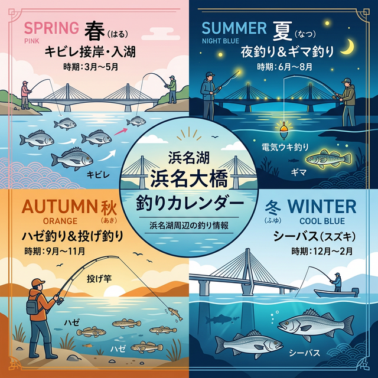

import Map from "@components/Map.astro";
import GMapButton from "@components/GMapButton.astro";
import TackleCard from "@components/TackleCard.astro";

『釣！浜名湖』をご覧いただきありがとうございます！

今回は、中浜名湖にある **「はまゆう大橋」** の周辺ポイントをご紹介します！

はまゆう大橋は、庄内半島と古人見（こひとみ）を繋ぐ有料道路です。見渡す限りの遠浅の砂地が続いており、キビレやクロダイが回遊する最高のシャロー（浅場）ポイントです。

あまり混雑することもないので、秋の夜長に自分のペースでまったりとキビレを狙うには最適の場所。料金所にある休憩所からは湖面が綺麗に見渡せ、隠れたビューポイントでもあります。

## はまゆう大橋の基本情報

<Map lat={34.727453} lng={137.627953} name="はまゆう大橋" />

<GMapButton url="https://maps.app.goo.gl/1PRiZsMsJ5UtvBRz5" />

*   **ポイント名**：はまゆう大橋周辺
*   **所在地**：静岡県浜松市中央区白洲町⇔古人見町
*   **アクセス方法**：東名「浜松西IC」から車で約15分。
*   **駐車場**：料金所の無料休憩スペースに駐車可能。
*   **トイレ**：伊佐見公共マリーナの東側に公衆トイレあり。
*   **近くの釣具店**：はなぞの釣具店
*   **近くのコンビニ**：ローソン浜松雄踏山崎店、セブンイレブン浜松佐浜町店

今回紹介するエリアは、「古人見～大人見」にかけての沿岸部です。夏から秋にかけて、ルアーマンや投げ釣りファンで賑わいます。

> [!NOTE]
> はまゆう大橋は、日中（7:00～19:00）は有料ですが、それ以外の時間帯は無料で渡ることができます。料金所は交通系ICカードでの支払いにも対応しています。

### ポイントの特徴
橋の付近で陸釣りをするなら、キビレがメインのターゲットです。

**古人見～佐浜側**
陸から50mくらいまで遠浅の砂場が広がっています。春から秋にかけては、魚の姿さえ見えればトップウォーターのルアーゲームが成立する熱いエリアです。水温が上がると濁りが入りますが、逆に人間から魚の存在を隠すメリットにもなります。

**白洲～協和側**
橋の真下あたりや、少し離れた場所をランガンするのが定番。下げ潮の時は古人見側のほうに向かって潮が流れるため、回遊してくるシーバスを狙うなら下げのタイミングがおすすめです。

ボートに乗る場合は、さらに広大なシャロー帯を自由に探り歩くことができ、最高に気持ちの良い釣りが楽しめます。

### 🐟️狙い目のシーズン
*   **春**：3月頃からシーズンイン。フレッシュな個体が庄内湖へ入ってきます。
*   **夏**：日中はトップウォーターや前打ち、夜は電気ウキ釣りがおすすめ。
*   **秋**：投げ釣りで良型キビレ。ハゼ釣りのファミリーフィッシングにも最適。

## シーズンごとに釣れやすい魚

**春：キビレ、シーバス（セイゴ）**
庄内湖の奥へ向かって入ってくる個体を、ルアーやエサで狙い撃ちましょう。

**夏：キビレ、シーバス、クロダイ、ギマ**
夜は電気ウキや投げ釣りでじっくり待つ釣りが最高。足を使って魚を探すランガンのほうが釣果に恵まれます。

**秋：キビレ、クロダイ、シーバス、サヨリ、ハゼ、コウイカ**
ハゼはチョイ投げで探り歩きましょう。サイズと数を出したいなら夜釣りが圧倒的に有利です。

**冬：シーバス**
庄内湖から越冬のために海へ戻る個体を、朝夕のマヅメ時にルアーで狙います。

### ✨️ポイントの補足
サイズ狙いなら春と秋。アタリの多さを楽しみたいなら夏がおすすめ。特に夏の夜に、電気ウキで手の平サイズのチヌやシーバスと遊ぶのは非常に楽しいですよ！

## おすすめタックルと装備

はまゆう大橋周辺で釣果を伸ばすためのおすすめセットです。

### 夜の電気ウキ釣りセット
最も手堅くキビレを狙えるセッティング。

<TackleCard id="common/daiwa-liberty-club-isokaze" />
<TackleCard id="seabass/fuji-tokki-ff-n30lg-float" />

### ルアー釣り（チニング）
夏から秋は、飛距離の出る60mm前後のポッパーで水面を攻めるのが主役。

<TackleCard id="seabass/daiwa-silverwolf-76ml-s-w" />
<TackleCard id="common/shimano-sedona-c3000" />

### 夜歩きの必須アイテム
街灯のない場所も多いため、明るいヘッドライトは命綱です。

<TackleCard id="common/gentos-headlight-cb-300d" />

## はまゆう大橋の周辺観光情報

はまゆう大橋の東側を通る県道49号線沿いは、飲食店が並ぶ激戦区です。イタリアン、定食屋、おしゃれなカフェが充実。テイクアウトのうなぎ屋や窯焼きパン屋もあります。

特におすすめなのは、沖縄カフェの **「果報（かふう）」** さん。真夏の釣りの合間に食べるかき氷は最高のご褒美です！

## まとめ：知る人ぞ知るシャローポイント

はまゆう大橋の周辺は、初心者から上級者まで楽しめる懐の深いフィールドです。夏の夜釣りは涼しく、小さな魚と数釣りが楽しめるので、お友達を誘っての釣行にもバッチリ。投げ釣りに慣れてきたら遠投して大物を狙うなど、ステップアップしながら楽しんでみてください！

> [!IMPORTANT]
> **最後にお願い！**
> 釣り場を綺麗に保つために、出したゴミは必ず持ち帰りましょう。周囲への配慮とマナーを忘れずに、楽しい釣り体験をしてくださいね！
