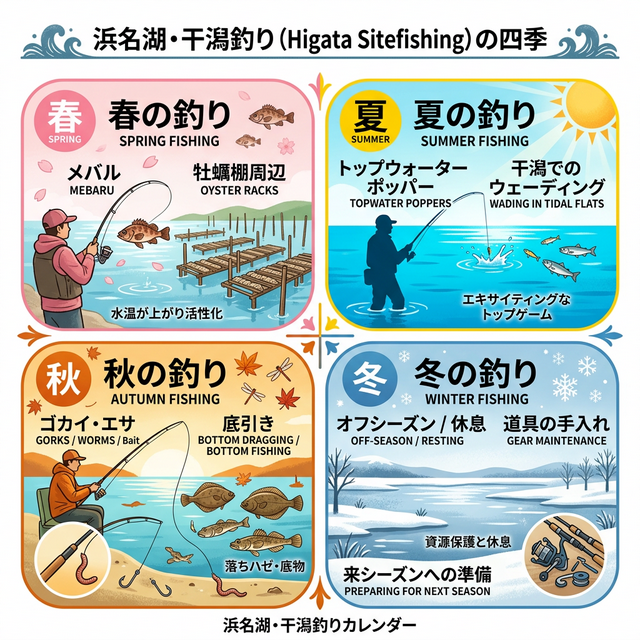

import Map from "@components/Map.astro";
import GMapButton from "@components/GMapButton.astro";

『釣！浜名湖』をご覧いただきありがとうございます！

今回は、ちょっぴり特別感のある **「浜名湖の干潟サイトフィッシング」** をご紹介します！

近年、浜名湖の干潟でのルアーゲームは「めちゃくちゃ面白い！」と人気が急上昇中なんです。

陸っぱりの釣りだと、どうしても人が多くて場所取りに気疲れしちゃうことってありますよね。でも、わざわざボートや渡船で干潟へ渡るアングラーの皆さんは、ゆったり自分のペースで釣りを楽しむのが大好きな方ばかり！

広大なシャロー帯（浅場）にポツンと立ち、水面を割って出るクロダイやキビレのトップウォーターゲーム。日常を忘れるような、あの圧倒的な解放感と興奮をぜひ味わってみてください！

## 浜名湖の干潟エリアの基本情報

<Map lat={34.703316} lng={137.592332} name="浜名湖（干潟エリア）" />

<GMapButton url="https://maps.app.goo.gl/8FCRwFj9WRg4zESQ6" />

*   **ポイント名**：浜名湖（干潟エリア全般）
*   **所在地**：浜名湖の湖上！（※ボートや渡船でのアクセスになります）
*   **アクセス方法**：レンタルボート、フィッシングガイド、またはJR弁天島駅南側の観光渡船を利用します。
*   **駐車場**：利用するマリーナや渡船場の駐車場を利用。
*   **トイレ**：マリーナや船の設備を利用。
*   **近くの釣具店**：フィッシングガイドに相談、または周辺の大型釣具店。
*   **近くのコンビニ**：出船前に周辺店舗（セブンイレブン、ローソン等）で購入。

干潟エリアは、表浜名湖から中浜名湖にかけて点在しています。

> [!NOTE]
> もともと潮干狩りで賑わっていた場所ですが、近年はクロダイやキビレがアサリを食べてしまう被害も出ています。釣りを楽しむことが、個体数を適正に保ち、浜名湖のアサリを守ることにも繋がっています！

### ポイントの特徴
干潟のサイトフィッシングが特に熱いのは、弁天島から村櫛漁港にかけての範囲です。

満潮時でも水深1m前後の広大なシャローが広がり、まさにルアーフィッシングのパラダイス。周囲は航路に囲まれているため、アクセスには船が必須です。

**自力（レンタルボート）で行く**
小型船舶免許をお持ちなら、レンタルボートが最も自由度が高いです。ただし、養殖エリア（海苔・アサリ）には絶対に入らないようルールを遵守してください。表浜名湖は潮流が非常に速いため、手漕ぎボートでの横断は大変危険です。

**渡船・ガイドを利用する**
地元の観光協会が「干潟アクティビティ」として紹介している渡船サービスが便利です。JR弁天島駅南側の船着き場から「いかり瀬」などの有名ポイントへ案内してくれます。初めての方は、プロのフィッシングガイドに依頼すると、釣り方やポイントのレクチャーを受けられるため上達が早いです。

### 🐟️狙い目のシーズン
*   **春**：4月頃からシーズンイン。メバルやシーバス、キビレが浅場へ。
*   **夏**：**【ハイシーズン】** トップウォーターポッパーが炸裂。
*   **秋**：底を狙うズル引きパターンが有効。

## シーズンごとに釣れやすい魚

**春：キビレ、シーバス、メバル**
牡蠣棚周辺や、干潟から航路への駆け上がり（ブレイク）が狙い目です。

**夏：シーバス、キビレ、クロダイ**
湖上は遮るものがなく照り返しが強烈なため、熱中症対策は必須。下げ5分から干潮にかけてのタイミングが最も魚との距離が近くなります。

**秋：シーバス、キビレ、クロダイ**
ベイトがハゼなどの底生生物に変わるため、ボトム攻略が重要。ルアーをローテーションして、その日の正解を探る楽しみがあります。

**冬：オフシーズン**
浅場は水温低下が激しいため、魚が深場へ移動してしまい、基本的にはお休みです。

### ✨️ポイントの補足
超シャローの魚は非常に警戒心が強いです。ハードルアーで反応がない時は、ソフトルアーやフライフィッシングでのアプローチが劇的な効果を生むことがあります。

## ルアーで釣れる魚とおすすめタックル

*   **対象魚**：クロダイ、キビレ、シーバス
*   **おすすめルアー**：ポッパー、クランクベイト、シンキングペンシル
*   **おすすめタックル**：7～8ftのシーバスロッド

夏の王道はポッパーでの広域サーチ。反応が渋い時はクランクベイトをボトムに当ててリアクションバイトを誘うか、チヌ専用ワームでのズル引きが有効です。

## フライで釣れる魚とおすすめタックル

*   **対象魚**：クロダイ、キビレ
*   **おすすめフライ**：エビ・カニを模したイミテーション
*   **おすすめタックル**：#6～8番クラス、8～9ftロッド（フローティング/シンキング）

極小のエビやカニを演出できるフライは、スレた魚に絶大な威力を発揮します。ラインでプレッシャーを与えないよう、リーダーとティペットは長めに設定するのがコツです。

## 浜名湖の干潟周辺の観光情報

「湖のど真ん中に人が立っている」ロケーションはSNS映え抜群。浜名湖ならではの非日常体験として、JTBなどの旅行代理店でも専用ツアープランが用意されるほどのリゾートアクティビティとなっています。

## まとめ：映えとテクニックと釣果

干潟の釣りは、釣果以上の開放感と感動があります。目の前でヒレを出しながらルアーを追うクロダイの姿に、誰もが興奮するはず。サイトフィッシングは誤魔化しが効かない分、通うほどにテクニックが磨かれる最高にエキサイティングなステージです！

> [!IMPORTANT]
> **資源保護と安全のために**
> クロダイやキビレはアサリ保護の観点から、美味しくいただくことも推奨されています。ただし、生食は避け、火を通した料理（塩焼き、ホイル焼き等）で楽しみましょう。
> 出したゴミは必ず持ち帰り、湖上のルールを守って安全な釣行を心がけてください。
