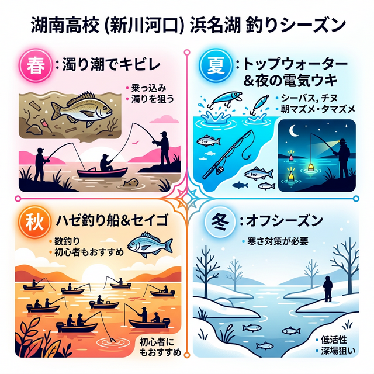

import Map from "@components/Map.astro";
import GMapButton from "@components/GMapButton.astro";
import TackleCard from "@components/TackleCard.astro";

『釣！浜名湖』をご覧いただきありがとうございます！

今回は、中浜名湖エリアにある **「湖南高校周辺」** をご紹介します！

佐鳴湖（さなるこ）から浜名湖へと続く新川の河口付近にあたるポイントです。春から夏にかけてはチヌ（キビレ・クロダイ）の白熱するトップゲーム、秋になればファミリーでのんびりハゼ釣りも楽しめる、知る人ぞ知る魅力的なエリアです。

週末のちょっとした空き時間にフラッと竿を出せる「手軽さ」がこの場所の魅力ですね。

## 湖南高校周辺の基本情報

<Map lat={34.691865} lng={137.629522} name="湖南高校周辺（新川河口）" />

<GMapButton url="https://maps.app.goo.gl/zU7NXQ7dykyRKEUm9" />

*   **ポイント名**：湖南高校周辺（こなんこうこう）
*   **所在地**：静岡県浜松市中央区馬郡～志都呂
*   **アクセス方法**：東名「浜松西IC」から車で約15分。浜名バイパスからは「馬郡IC（下りのみ）」または「坪井IC」から5～10分程度。
*   **駐車場**：周辺に専用駐車場はほぼありません。
*   **トイレ**：雄踏グラウンドに公衆トイレあり。
*   **近くの釣具店**：あけぼの釣具店
*   **近くのコンビニ**：セブンイレブン浜松馬郡店

夏から秋のハゼシーズンが最も賑わうエリアですが、釣座が草木に覆われていたり、護岸が高かったりと、地図で見るよりポイント選びが重要になります。

> [!NOTE]
> このエリアは駐車スペースが非常に限られています。バイクや自転車でのランガン、またはボートでのアプローチが最も効率よく広範囲を攻略できる方法です。湖南高校至近は高い護岸と茂みがあり、釣り座を確保する際は場所を慎重に選びましょう。

### ポイントの特徴
新川河口部は「汽水（淡水と海水の混ざり具合）」が強く、市街地からの流入水による「砂泥」の底質が広がっています。

**ターゲット別の狙い目**
*   **夏：クロダイ・キビレ**
    水面近くを回遊するチヌを狙ったトップウォーターゲームが非常にエキサイティングです。
*   **秋：ハゼ**
    イオン志都呂前の護岸河川敷がメイン。有名な都田川に比べて人が少なく、のんびり数釣りが楽しめます。

**ボートフィッシングのススメ**
マリーナ沿いの航路（ブレイク）は魚が最も居着きやすい一級ポイントですが、岸から狙うのは困難です。マリーナ内への立ち入りは禁止されているため、これらの地形変化を自由に攻略するならボート釣りが最強の選択肢となります。

### 🐟️狙い目のシーズン
*   **春**：3月頃から。濁りが入るとキビレの活性がアップ。
*   **夏**：チヌのトップゲームと、涼しい夜釣りがおすすめ。
*   **秋**：ハゼ釣りの最盛期。回遊シーバスも期待できます。

## シーズンごとに釣れやすい魚

**春：キビレ、シーバス**
3月頃からシーズンイン。春の濁りが魚の警戒心を解いてくれます。

**夏：キビレ、クロダイ、シーバス**
雨後の濁りは大チャンス。夜風にあたりながらの電気ウキ釣りは地元アングラーに大人気です。

**秋：ハゼ、キビレ、クロダイ、シーバス**
新川一帯にハゼ釣りの船が浮かび始めます。岸からもチョイ投げで十分狙えます。

**冬：オフシーズン**
浅場のため水温低下が早く、冬場は活性が極端に下がるため、お休みです。

### ✨️ポイントの補足
佐鳴湖からの流れ込みがある生命感豊かなエリア。川と海が複雑に混ざり合う環境が、多様な魚種を育んでいます。

## おすすめタックルと装備

湖南高校周辺でライトに楽しむためのおすすめセットです。

### ハゼ釣り（チョイ投げ）
お子様や初心者の方でも扱いやすいスタンダードなセット。

<TackleCard id="haze/sasame-choi-haze-set-5go" />
<TackleCard id="common/shimano-sedona-c3000" />

### チニング・シーバス（ルアー）
基本はポッパーでのトップゲーム。スレている場合は小型シンペンで表層を静かにリトリーブするのがコツです。

<TackleCard id="seabass/daiwa-silverwolf-76ml-s-w" />

### 夜釣りの必須アイテム
足場が比較的高い場所が多いため、足元を照らすライトは必須です。

<TackleCard id="common/gentos-headlight-cb-300d" />

## 湖南高校周辺の観光情報

このエリアはうなぎ養殖の盛んな地域で、絶品の鰻料理店が密集しています。「浜松カワショウ 康川直売所」などの直売所では、新鮮な白焼や蒲焼をお値打ち価格で購入でき、釣りのお土産に最適です。

## まとめ：ランガンか、のんびりハゼ釣りか

湖南高校周辺は、機動力を活かしてチヌを狙うランガン、またはイオン志都呂での買い物ついでに家族でハゼ釣りを楽しむといった、多様なスタイルが受け入れられるロケーションです。ボートがあればさらに深い楽しみ方ができますが、岸からでも十分に「穴場」の魅力を堪能できるフィールドです。

> [!IMPORTANT]
> **最後にお願い！**
> 釣り場を綺麗に保つために、出したゴミは必ず持ち帰りましょう。周囲への配慮とマナーを忘れずに、楽しい釣り体験をしてくださいね！
