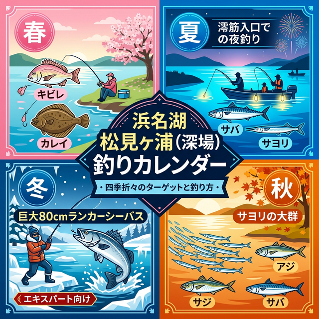

import Map from "@components/Map.astro";
import GMapButton from "@components/GMapButton.astro";

『釣！浜名湖』をご覧いただきありがとうございます！

今回は、中浜名湖エリアの奥深くに位置する **「松見ヶ浦」** をご紹介します！

松見ヶ浦は、猪鼻湖（いのはなこ）の手前にある小さな湾です。地図で見るとこぢんまりしていますが、実は浜名湖屈指の水深を誇る「ディープ（深場）エリア」。水深があるおかげで、冬場でも越冬のために集まってくる大型個体を狙い撃ちできる、玄好みのポイントです。

## 松見ヶ浦の基本情報

<Map lat={34.758643} lng={137.524157} name="松見ヶ浦" />

<GMapButton url="https://maps.app.goo.gl/W8uyjq6tc6gmrJ5JA" />

*   **ポイント名**：松見ヶ浦（まつみがうら）
*   **所在地**：静岡県湖西市大知波・入出
*   **アクセス方法**：東名「三ヶ日IC」から車で約20分。
*   **駐車場**：知波田（ちばた）駅の公共駐車場が便利。
*   **トイレ**：知波田駅駐車場に併設。
*   **近くの釣具店**：フィッシングジョイ
*   **近くのコンビニ**：セブンイレブン湖西太田店

湾の西側一帯は知波田地区と呼ばれ、アクセスに少し時間はかかりますが、その分プレッシャーが低く、手付かずの大物が期待できるエリアです。

> [!NOTE]
> 松見ヶ浦は浜名湖内でも数少ないドロップオフポイントです。湾の入口付近は水深12mから一気に6mまで駆け上がる急斜面になっており、潮流も非常に速いため、ボトム攻略の難易度は高いですが、それに見合うロマンがあります。

### ポイントの特徴
湾の中心部は水深4m前後ですが、入口付近は最大13m近くに達することもあります。

**戦略的アプローチ**
*   **深場攻略（湾入口）**
    急激なカケアガリは魚が最も居着きやすい場所ですが、根掛かりも多いため、丁寧なレンジコントロールが求められます。
*   **シャロー攻略（湾西側）**
    西側は比較的浅く、夏場はマリンスポーツも盛んです。釣りを楽しむなら、マリンレジャーの邪魔にならないエリアを選びましょう。

**ボート釣りの注意点**
アンカーロープの長さに注意してください。水深が7m〜13mと深いため、ロープが短いとボートが流されて釣りになりません。

### 🐟️狙い目のシーズン
*   **春**：深場で越冬していた大型個体が動き出すチャンス。
*   **夏**：夜の涼しい時間帯に湾入口のカケアガリで時合狙い。
*   **秋**：ベイト（サヨリ等）を追う魚の数釣りに最適なシーズン。
*   **冬**：**【特A級】** 80cm超えのランカーシーバスが狙える貴重なエリア。

## シーズンごとに釣れやすい魚

**春：キビレ、シーバス、カレイ**
水温が安定しにくい時期は、ボトムをネチネチと探る釣りが有効です。

**夏：キビレ、シーバス、クロダイ、サバ、サヨリ**
日中はマリンスポーツを避け、夜間の湾入口周辺に陣取るのが最も確実な戦略です。

**秋：キビレ、シーバス、サヨリ、アジ、サバ、クロダイ**
魚群探知機を活用してベイトの群れ（特にサヨリ）を探せば、ボートゲームで圧勝できる季節です。

**冬：シーバス、キビレ**
厳しい寒さの中、深場で越冬するモンスター級を仕留めるロマン。短い時合に全集中しましょう。

### ✨️ポイントの補足
春と冬は「一発大物のサイズ狙い」、夏と秋は「数釣り」とプランを分けるのがコツ。特に冬のランカーシーバス実績は、浜名湖全体を見てもトップクラスの信頼度を誇ります。

## エサで釣れる魚とおすすめタックル

*   **対象魚**：キビレ、マダカ（シーバス）
*   **おすすめエサ**：青ジャムシ
*   **おすすめタックル**：投げ竿（オモリ負荷20〜30号）、ブッコミ仕掛け

水深が深く潮流も速いため、重めのオモリが必要です。根掛かり回避のため、少し底からエサを浮かせる胴付き仕掛けやウキを併用したブッコミも効果的です。

## ルアーで釣れる魚とおすすめタックル

*   **対象魚**：シーバス（ランカー狙い）
*   **おすすめルアー**：重量級シンキングペンシル、ロングビルミノー
*   **おすすめタックル**：9〜10ftの強靭なシーバスロッド

晩秋から春先に。向かい風（北西風）に負けない飛距離と、ディープレンジをきっちりトレースできるヘビーなルアーが必須条件です。

## 松見ヶ浦周辺の観光情報

夏場は「ヤマハ・マリーナ浜名湖」を中心にマリンスポーツが非常に盛んです。ウェイクボードやバナナボートなどのアイテムレンタルもあり、釣りをお休みしてアクティブに遊ぶ一日を作るのも浜名湖の楽しみ方の一つです。

## まとめ：巨大なカケアガリにロマンを求めて

松見ヶ浦は、アクセスの不便さを補って余りあるポテンシャルを秘めたポイントです。知波田駅からのランガンには折りたたみ自転車などがあると非常に効率的。あなたの釣り人生の最大記録を更新するモンスターが、この深い湾の底に潜んでいるかもしれません！

> [!IMPORTANT]
> **最後にお願い！**
> 釣り場を綺麗に保つために、出したゴミは必ず持ち帰りましょう。周囲への配慮とマナーを忘れずに、楽しい釣り体験をしてくださいね！
