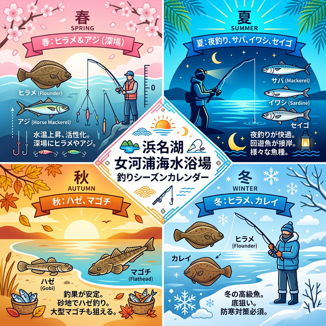

import Map from "@components/Map.astro";
import GMapButton from "@components/GMapButton.astro";

『釣！浜名湖』をご覧いただきありがとうございます！

今回は、中浜名湖エリアの西岸にある **「女河浦海水浴場（めがうらかいすいよくじょう）」** をご紹介します！

知る人ぞ知るキビレの好ポイント。岸からはハゼやキビレ、ボートで沖に出ればサビキで回遊魚の数釣りが楽しめる、隠れた名スポットです。

> [!CAUTION]
> **現在、海水浴場としての営業はしておらず、以前利用できた駐車場は私有地となっています。** 周辺への無断駐車は厳禁です。近隣の方々の迷惑にならないよう、マナーを厳守してください。

## 女河浦海水浴場の基本情報

<Map lat={34.74517} lng={137.53757} name="女河浦海水浴場" />

<GMapButton url="https://maps.app.goo.gl/DqufG4GVxN8apwph7" />

*   **ポイント名**：女河浦海水浴場（めがうらかいすいよくじょう）
*   **所在地**：静岡県湖西市新所
*   **アクセス方法**：東名「三ヶ日IC」から車で約20分。国道1号浜名バイパスからは約30分。
*   **駐車場**：なし（※近隣への無断駐車厳禁）
*   **トイレ**：なし
*   **近くの釣具店**：フィッシングジョイ
*   **近くのコンビニ**：セブンイレブン湖西太田店

### ポイントの特徴
ハイシーズンは夏から秋。特に夜釣りがおすすめで、石畳エリア周辺でのキビレ・シーバス狙いが定番です。

> [!NOTE]
> **ボートフィッシングの魅力**
> このエリアは浜名湖内でも水深のある地域（5m以上）が多く、冬場は魚の快適な隠れ家に、夏場は涼しい避難場所になります。ボートであれば、魚群探知機を駆使してアジ・サバの回遊をダイレクトに狙えます。

### 🐟️狙い目のシーズン
*   **春**：岸からはブッコミ。ボートなら深場でサバやアジを狙うのが定石。
*   **夏**：五目釣りのパラダイス。夜間の電気ウキでキビレが楽しめます。
*   **秋**：ハゼ釣りの最盛期。夜はサイズアップしたキビレ・シーバス。
*   **冬**：ボートで水温の安定する深場をピンポイントで狙う玄人スタイル。

## シーズンごとに釣れやすい魚

**春：キビレ、ヒラメ、サバ、アジ**
水温が上がり切る前は、深場に溜まっている個体をボートから狙うのが堅実です。

**夏：サバ、アジ、イワシ、サヨリ、キビレ、クロダイ、シーバス、マゴチ**
魚種が非常に豊富。夜釣りの電気ウキはアタリが多く、初心者でも存分に楽しめます！

**秋：キビレ、シーバス、ハゼ、マゴチ**
ハゼ釣りのトップシーズン。浅場ならどこでも狙えるほど魚影が濃くなります。

**冬：ヒラメ、シーバス、キビレ、カレイ、アジ**
レア枠のヒラメも潜みますが、基本は深場のピンポイント攻略になります。

### ✨️ポイントの補足
「キビレ」と「ハゼ」が主役のポイント。特に秋口からは数もサイズも期待でき、ファミリー層や初心者でも楽しみやすいフィールドです。

## エサで釣れる魚とおすすめタックル

*   **対象魚**：ハゼ、キビレ
*   **おすすめエサ**：青ジャムシ
*   **おすすめタックル**：4.5〜5.4mののべ竿、または1号前後の磯竿

ハゼは活性が高ければ丸呑みしてくるため、仕掛けはシビアになる必要はありません。底をわずかに叩くように誘いを入れるのがコツ。ドングリウキを使った少し遠くのポイント攻略も面白いですよ。

## ルアーで釣れる魚とおすすめタックル

*   **対象魚**：キビレ、シーバス
*   **おすすめルアー**：小型ポッパー（夏）、小型シンキングミノー、レンジバイブ
*   **おすすめタックル**：7〜8ftのシーバスロッド

デイゲームなら北側の石畳、ナイトゲームなら南側の海水浴場跡地がメイン。平均サイズが20〜30cmと控えめなことが多いため、マッチ・ザ・ベイトを意識して5〜7cm程度の小型ルアーを用意すると釣果が安定します。

## 女河浦の周辺観光情報

**嵩山（すせ）展望台**
女河浦から車で西の山を登ると、浜名湖を一望できる絶景スポットがあります。晴れた日には浜松市街のアクトタワーまで見渡せ、リフレッシュに最適です。

## まとめ：マナーを守って楽しむ地元・二輪車乗りの穴場

駐車場問題があるため、地元の方や二輪車で来られる方にアドバンテージがあるポイント。それだけにプレッシャーは控えめで、特に秋のハゼと夜のキビレは期待大。ボートを活用すれば通年勝負できるポテシャルを持っています。

> [!IMPORTANT]
> **最後にお願い！**
> 釣り場を綺麗に保つために、ゴミは必ず持ち帰りましょう。特に関係者以外立ち入り禁止区域への侵入や、駐車マナーには細心の注意を払ってください。
