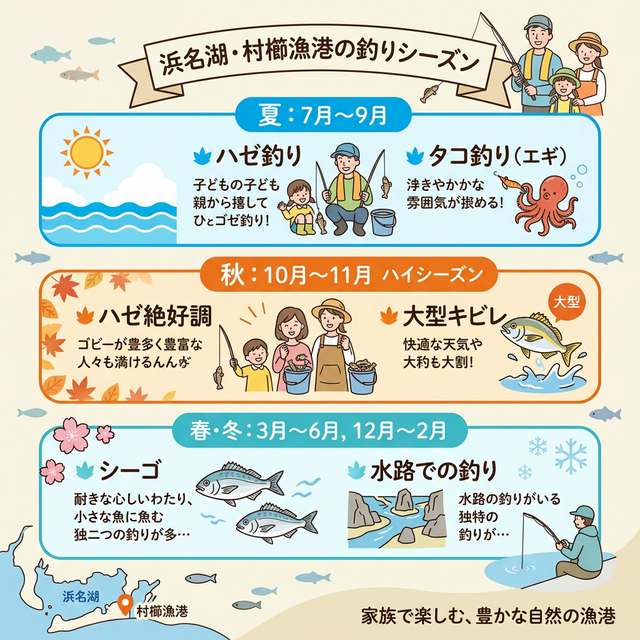

import Map from "@components/Map.astro";
import GMapButton from "@components/GMapButton.astro";
import TackleCard from "@components/TackleCard.astro";

「釣！浜名湖」をご覧いただきありがとうございます！

今回は、中浜名湖エリアの南端に位置する **「村櫛（むらくし）漁港」** をご紹介します！

ここは非常にのんびりした雰囲気の漁港で、足場が良く、特にお子様連れのファミリーや初心者のハゼ釣りに最適な場所です。漁業の邪魔にならないようマナーを守りながら、浜名湖の穏やかな時間を楽しみましょう。

## 村櫛漁港の基本情報

<Map lat={34.710851} lng={137.588051} name="村櫛漁港" />

<GMapButton url="https://maps.app.goo.gl/ALZeoSTHqyDJ1dkEA" />

*   **ポイント名**：村櫛漁港（むらくしぎょこう）
*   **所在地**：静岡県浜松市中央区村櫛町
*   **アクセス方法**：浜松市内から中和通りを経由して約30分。
*   **駐車場**：**漁港内への駐車は厳禁です！** 隣接する「村櫛海水浴場」の広大な無料駐車場を利用してください。
*   **トイレ**：村櫛海水浴場に完備。

> [!CAUTION]
> **迷惑駐車は絶対にダメ！**
> 漁港は漁業者の方々が毎日仕事をされている大切な場所です。漁港内に無断で駐車をすると、作業の妨げになり、最悪の場合は釣り禁止になる恐れもあります。必ず指定の駐車場を利用しましょう。

### ポイントの特徴
村櫛漁港は、港内とそれに続く水路がメインの釣り場になります。

*   **水路のハゼ釣り**
    村櫛漁港から続く水路はハゼ釣りの穴場。水辺に降りるのは難しいですが、ちょい投げ仕掛けで探ることができます。
*   **港内の電気ウキ釣り**
    漁港内と水路の境目がおすすめ。水深はないけれど、夏から秋にかけては小物釣りがやりやすい。夜に電気ウキを使って、魚の反応を楽しみましょう。
*   **秋から冬の投げ釣り**
    堤防から外側は投げ釣りが有名。カレイ狙いではそこそこ実績もありますが、潮が動いているタイミングは流されやすくシビア。

### 🐟️狙い目のシーズン
*   **夏**：**【ベストシーズン】** ハゼ釣りが開幕。夜の涼しい時間帯もおすすめ。岸壁沿いをエギで探り歩いてタコも釣れます。
*   **秋**：ハゼのサイズがアップし、数・型ともに楽しめる時期. カレイ釣りも始まる頃。
*   **春・冬**：魚影は薄くなりますが、水路で居付きのシーバスが狙えます。

## シーズンごとに釣れやすい魚

**夏：ハゼ、キビレ、セイゴ、タコ**
浜名湖の夏の風物詩、ハゼ釣りがメイン。水深が浅いので、偏光サングラスがあれば泳いでいるハゼが見えることも。また、岸壁沿いをエギで探り歩いてタコも釣れます。

**秋：ハゼ、キビレ、クロダイ**
ハゼ釣りのハイシーズン。また、落ちのシーズンに合わせて大型のキビレが港周辺の深場でヒットすることもあります。

## 手軽な釣り方とおすすめタックル

お子様連れでも安心、村櫛漁港でハゼやキビレを楽しむためのセレクト。

### ハゼ釣り（チョイ投げ）
足元から少し沖まで、ハゼの「プルプル」を楽しみましょう。

<TackleCard id="haze/sasame-choi-haze-set-5go" />
<TackleCard id="common/shimano-sedona-c3000" />

### 夜の電気ウキ
港内の穏やかな場所で、光るウキが沈む瞬間を待つ癒やしの釣り。

<TackleCard id="common/daiwa-liberty-club-isokaze" />
<TackleCard id="common/gentos-headlight-cb-300d" />

## 周辺観光・グルメ情報

### 浜名湖ガーデンパーク
入園・駐車無料がなによりも大きい。四季折々の花々があって、広大な公園でもあるから、家族連れやウォーキングがてらに最適です。

https://www.hamanako-gardenpark.jp/

### 旬彩 一徳
村櫛町内にある隠れ家的な和食店。地元・県内で水揚げされた新鮮な魚介類を使った料理が楽しめます。おすすめはランチタイム。

https://www.at-s.com/gourmet/article/127265

## まとめ：マナーを守って「癒やしのハゼ釣り」を

村櫛漁港は、激しいアクションを求める釣りよりも、のんびりと椅子に座って楽しむスタイルが似合う場所です。

1. 足場が良く、非常に安全。
2. ハゼの魚影が濃く、ボウズ（釣果ゼロ）が少ない。
3. 指定駐車場（海水浴場）が広く、アクセスしやすい。

> [!IMPORTANT]
> **最後にお願い**
> 漁具（網や浮き）の近くには投げないようにしましょう。ゴミや残ったエサは必ず持ち帰り、次に訪れる人も気持ちよく利用できるように心がけましょう！
