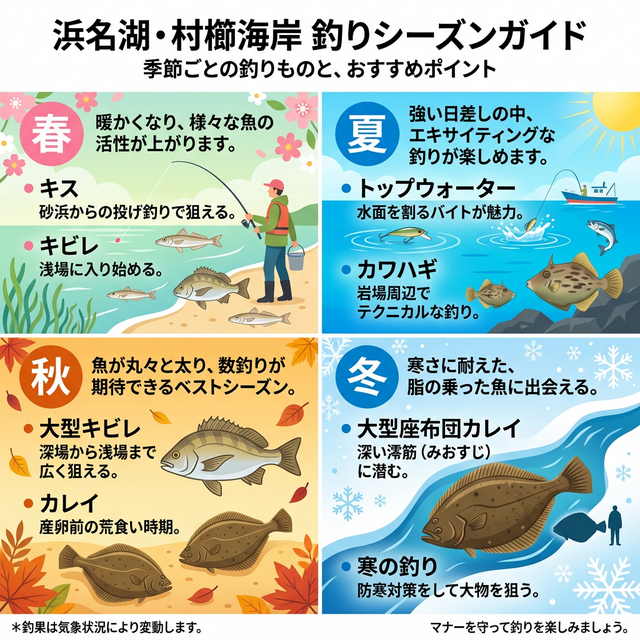

import Map from "@components/Map.astro";
import GMapButton from "@components/GMapButton.astro";

『釣！浜名湖』をご覧いただきありがとうございます！

今回は、中浜名湖エリアの広大なポイント **「村櫛（むらくし）海水浴場」** をご紹介します！

どこまでも歩いていけそうな広大な「浅瀬（シャロー）」と、大型船も通る深い「航路（ミオ筋）」が隣接する、メリハリの効いた釣り場です。無料駐車場とトイレが完備されており、初心者からベテランまで安心して楽しめる超優良スポットです。

## 村櫛海水浴場の基本情報

<Map lat={34.711447} lng={137.583165} name="村櫛海水浴場" />

<GMapButton url="https://maps.app.goo.gl/rXuNsg5dEHBrAk6f7" />

*   **ポイント名**：村櫛海水浴場（むらくしかいすいよくじょう）
*   **所在地**：静岡県浜松市中央区村櫛町
*   **アクセス方法**：東名「舘山寺スマートIC」から約15分。「浜松西IC」から約20分。
*   **駐車場**：あり（無料、広くて停めやすい）
*   **トイレ**：あり（駐車場内に公衆トイレあり）
*   **近くの釣具店**：フィッシング沖
*   **近くのコンビニ**：ファミリーマート浜松庄和町店

> [!WARNING]
> **夏季（7月〜8月末）の海水浴シーズンについて**
> この時期は海水浴客で非常に賑わいます。釣りをする場合は遊泳エリアを避け、海水浴客から十分な距離を保つなど、安全とマナーに細心の注意を払ってください。

### ポイントの特徴
村櫛から北の内山海岸にかけて、広大なシャローエリアが続きます。

*   **航路沿いのカケアガリ**
    沖側は船が通るために深く掘られており、潮通しが抜群です。投げ釣りでカケアガリの斜面を狙うと、キビル・シーバス、冬場は肉厚なカレイやキスが期待できます。
*   **広大なシャロー**
    夏から秋はウェーディングでのトップウォーターゲームが激熱。遠浅なので広範囲をランガンしながら探るスタイルが楽しめます。

### 🐟️狙い目のシーズン
*   **春**：キビレ・シーバスの活性が上がり、4月からはシロギスも接岸。
*   **夏**：マヅメのトップゲームが独壇場。日中は投げ釣りでカワハギも。
*   **秋**：魚たちの荒食いシーズン。キビレ・シーバスに加え、五目釣りが最も充実。
*   **冬**：極寒の中、航路の深場に潜む「座布団カレイ」を遠投で狙い撃ち。

## シーズンごとに釣れやすい魚

**春：キビレ、シーバス、キス**
越冬明けの個体が浅瀬に戻る時期。特に4月以降は産卵を控えたキスが接岸し、投げ釣りが賑やかになります。

**夏：キビレ、シーバス、カワハギ**
朝夕のゴールデンタイムはトップウォータープラグでの水面炸裂に期待！日中はカワハギ釣りが楽しめます。

**秋：キビレ、シーバス、カレイ**
「落ちのシーズン」。大型キビレやランカーシーバス、そして冬の主役カレイも顔を見せ始め、五目釣りの最盛期を迎えます。

**冬：カレイ**
産卵のために接岸する「座布団カレイ」を、航路沿いの深場でピンポイントに狙い撃つのが冬の醍醐味です。

## エサで釣れる魚とおすすめタックル

*   **対象魚**：キス、カレイ、キビレ
*   **おすすめエサ**：青ジャムシ
*   **おすすめタックル**：4.2m前後の投げ竿（25〜30号）、4000〜5000番のスピニングリール

手前が浅いため、深い航路（ミオ筋）までしっかり届かせる遠投性能が必須です。潮の流れが速い時はオモリを30号まで上げ、仕掛けを安定させることが釣果につながります。下げ潮のタイミングで仕掛けが落ち着く場所を探しましょう。

## ルアーで釣れる魚とおすすめタックル

*   **対象魚**：シーバス、キビレ
*   **おすすめルアー**：シンキングペンシル（50〜90mm）、バイブレーション、ポッパー（夏）
*   **おすすめタックル**：9ft前後のシーバスロッド（ML〜M）

広大なエリアを探るため、遠投の効く9ftロッドが基準。シンキングペンシルを流れに乗せて漂わせる「ドリフト釣法」が航路沿いで非常に有効です。夏場のシャローではトップウォータープラグで水面を割るエキサイティングな釣りが楽しめます。

## 周辺観光情報：ガーデンパークと温泉

**浜名湖ガーデンパーク**
車ですぐの距離にあります。展望塔からの絶景や季節の花々が楽しめ、家族連れにも最適です。

**舘山寺（かんざんじ）温泉**
車で約10分。釣りの帰りに日帰り温泉で冷えた体を癒やすのは至福のひととき。遊園地「パルパル」もあり、一日中楽しめます。

## まとめ：浜名湖の魅力が詰まったファミリー・ガチ勢両対応スポット

村櫛海水浴場は、充実した設備とメリハリのある地形で、あらゆる釣り人を満足させるポイントです。
1. 初心者から上級者まで楽しめる豊富な魚種。
2. 遠浅シャローと深場航路、両極端な地形が隣接。
3. 駐車場・トイレ完備で快適な釣行が可能。

> [!IMPORTANT]
> **最後にお願い！**
> 釣り場をいつまでも綺麗に保つために、ゴミは必ず持ち帰りましょう。周囲が捨てたゴミも少しだけ拾って帰る、そんなスマートなアングラーを目指しましょう。
