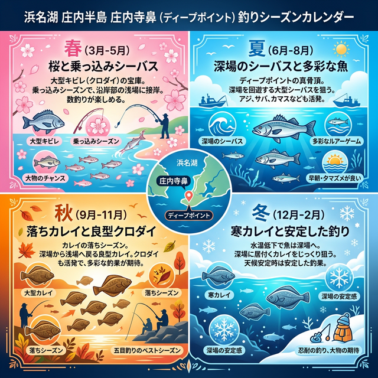

import Map from "@components/Map.astro";
import GMapButton from "@components/GMapButton.astro";

『釣！浜名湖』をご覧いただきありがとうございます！

今回は、中浜名湖の北西エリアから、岬状の先端が特徴的な **「正太寺鼻（しょうたいじ）」** をご紹介します！

ここは浜名湖内でも指折りの「急深（きゅうぶか）」な人里離れた本格ポイント。100m先は水深10m近くに達する場所もあり、大型個体が集まる名所として多くのアングラーに愛されています。

## 正太寺鼻の基本情報

<Map lat={34.75735} lng={137.53817} name="正太寺鼻" />

<GMapButton url="https://maps.app.goo.gl/7isVDD74gCbb2mKP7" />

*   **ポイント名**：正太寺鼻（しょうたいじ）
*   **所在地**：静岡県湖西市入出
*   **アクセス方法**：マリーナ側、または正太寺前の海岸線を数分歩いて岬の先端へ。岬までの道のりは足場が悪いため、装備に注意。
*   **駐車場**：なし（付近の寺院スペース等への無断駐車は厳禁です）

> [!CAUTION]
> **満潮時の帰路に注意！**
> 岬へ続く海岸線（砂利浜）は、大潮の満潮時などに水没することがあります。「帰り道がなくなった！」という事態にならないよう、必ず潮見表を確認し、余裕を持って行動しましょう。

### ポイントの特徴
正太寺鼻は、その独特な「岬」の形状から、非常に複雑な流れと地形を形成しています。

*   **浜名湖屈指のディープエリア**
    松見ヶ浦と瀬戸水道を結ぶこの場所は潮通しが抜群に良く、特に秋から初冬にかけて大型のキビレ、カレイが集まります。
*   **投げ釣りの難所**
    底には意外と石が多く点在しており、根掛かりが発生しやすいエリアでもあります。市販の細い仕掛けよりも、ワンランク上の強度を持ったタックルが推奨されます。

### 🐟️狙い目のシーズン
*   **春・秋**：キビレ、シーバスの大型個体が狙えるハイシーズン。
*   **秋・冬**：本格的な投げ釣りでカレイを狙う時期。冬の低水温時でも水深があるため安定感があります。

## シーズンごとに釣れやすい魚

**春・秋：キビレ、シーバス、クロダイ**
産卵前の「乗っ込み」や、冬に備えて荒食いする「落ち」の時期は圧巻の釣果が期待できます。岬の先端から潮流を意識してキャストするのがコツ。

**秋・冬：カレイ、大型シーバス**
冬場の低水温による活性低下が少ないのも急深ポイントならでは。特に北側（松見ヶ浦側）への遠投は、本格派投げ釣り師たちが大型カレイを求めて集まる激戦区です。

## ルアー・投げ釣り攻略とおすすめタックル

*   **対象魚**：大型キビレ、シーバス
*   **おすすめルアー**：重量級のメタルバイブ、シンキングペンシル
*   **おすすめタックル**：10ft前後のロングロッド。根掛かり回避と遠投性能を両立したパワーのあるタックルが理想。

地元のベテランが足繁く通うこの場所は、一発大物の夢があるポイントです。コンビニ（ローソン湖西大知波店）などは車で10分ほど離れているため、事前の準備をしっかり整えてから挑みましょう！

## まとめ：熟練者が集う、静かなる岬の名所

正太寺鼻は、アクセスの不便さが逆に「圧倒的なポテンシャル」を維持している貴重な釣り場です。
1. 浜名湖屈指の水深を誇る急深ポイント。
2. 投げ釣りでのカレイ・大型キビレの実績が高い。
3. 手付かずの自然の中でストイックな釣りが楽しめる。

静かに、そして熱く、大物を追い求めるアングラーにぜひ訪れてほしい聖地です。