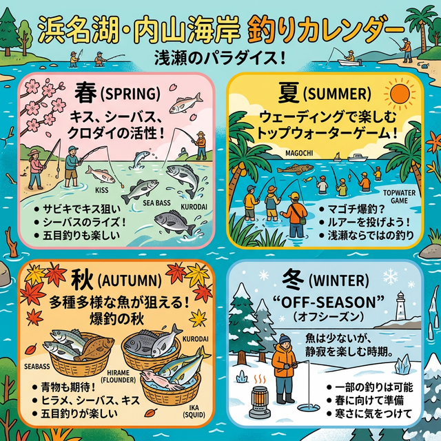

import Map from "@components/Map.astro";
import GMapButton from "@components/GMapButton.astro";

『釣！浜名湖』をご覧いただきありがとうございます！

今回は、中浜名湖エリアの隠れた良ポイント **「内山（うちやま）海岸」** をご紹介します！

村櫛の北側に位置するこの海岸は、広大なシャロー（浅瀬）が広がり、ウェーディングゲームを楽しむアングラーにとって理想的なフィールドです。また、投げ釣りでも良型のキスやカレイが狙える、非常にポテンシャルの高いスポットなんですよ。

## 内山海岸の基本情報

<Map lat={34.748536} lng={137.597745} name="内山海岸" />

<GMapButton url="https://maps.app.goo.gl/3h9U9ybJxJnQECcB9" />

*   **ポイント名**：内山海岸（うちやまかいがん）
*   **所在地**：静岡県浜松市中央区内山
*   **アクセス方法**：東名「舘山寺スマートIC」から約15分。
*   **駐車場**：あり（数台程度、路肩の広いスペースなど）
*   **トイレ**：なし（事前に済ませておきましょう）
*   **近くの釣具店**：フィッシング沖
*   **近くのコンビニ**：ファミリーマート浜松庄和町店

> [!WARNING]
> **駐車マナーと立入禁止について**
> 周辺は閑静な地域です。迷惑駐車は絶対に避け、ゴミの持ち帰りなどのマナーを徹底してください。また、工事や施設の状況により立入が制限される場合があるため、現地の看板に従ってください。

### ポイントの特徴
内山海岸は、浜名湖の中でも特に「遠浅な地形」が長く続いているのが特徴です。

*   **広大なシャローフラット**
    岸からかなり先まで膝下程度の水深が続くため、ウェーディングに最適です。夏から秋にかけて、水面を意識したシーバスやキビレの活性が非常に高くなります。
*   **沖合をSUPフィッシングもアリ**
    岸から100m前後の遠浅な地形のため、もし深場のカケアガリ狙いなら、競技キス並の遠投力が求められます。なのでSUPやカヤックで行く選択もアリです。

釣り対象のメインは「キビレとシーバス」の2大看板です。

夏から秋にかけて、沿岸部をキビレが泳いていでるので、ウェーディングでルアーを使ったエキサイティングな「水面ドッカン系のトップゲーム」が圧倒的に向いています。

逆にのんびり楽しむなら、広範囲を探れる「投げ釣り」一択と言っても過言ではありません。

### 🐟️狙い目のシーズン
*   **春**：キビレ、シーバス。4月過ぎからキスも期待。
*   **夏**：朝夕のトップゲームが激熱！日中はマゴチ狙い。
*   **秋**：最盛期。投げ釣りでヘダイを含めた五目釣りがおすすめ。
*   **冬**：オフシーズン

## シーズンごとに釣れやすい魚

*   **春（4月〜6月）**：キビレ、シーバス、シロギス
*   **夏（7月〜9月）**：キビレ（トップゲーム）、シーバス、マゴチ、ヘダイ
*   **秋（10月〜11月）**：ヘダイ（数釣り）、キビレ、シーバス、ハゼ、シロギス
*   **冬（12月〜3月）**：厳しいオフシーズン（北西風が強く水温が下がるため）

## エサで釣れる魚とおすすめタックル

*   **対象魚**：キビレ、ヘダイ（数釣り）
*   **おすすめエサ**：青ジャムシ（匂いで寄せる）
*   **おすすめタックル**：10～20号のオモリを使った「ちょい投げ」セット

夏から秋は、水温上昇とともにキビレやヘダイの群れが接岸するベストシーズン。市販のキス・カレイ用仕掛けで十分に楽しめるお手軽さが魅力です。

内山海岸は地形の変化が少ないため、特定の「神スポット」を絞り込むのが難しい反面、**「どこに投げてもチャンスがある」** 平等なフィールド。仕掛けを遠投し、ゆっくりと底を引きずりながら煙を立てて魚を誘う「引き釣り」が、大漁への一番の近道です。

## ルアーで釣れる魚とおすすめタックル

*   **対象魚**：シーバス、キビレ
*   **おすすめルアー**：ポッパー、ペンシルベイト（夏のトップゲーム）
*   **おすすめタックル**：操作性の良い8ft前後のシーバスロッド

夏の日中、自転車道から海を見下ろすとキビレの群れが目視できるほど魚影は濃いエリア。しかし、障害物（ストラクチャー）が皆無のため、魚も釣り人も狙い所を絞り込みにくいのが特徴です。

攻略の鍵は、一箇所で粘らずに **「自分の足で魚を探す」** こと。広大なシャローを歩き回り、活性の高い個体を見つけ出すアクティブなランガンスタイルが、最も釣果に直結します。

## 内山海岸周辺の観光情報（BBQとグランピング）

内山海岸の目の前には、絶好のロケーションを誇るキャンプ場「Asoviva」が併設されています。

*   **釣った魚でBBQ**：昼間に釣った新鮮な魚をその場で焼いて食べるのは、釣り人だけの特権。
*   **多彩な宿泊スタイル**：エアコン完備のコンテナ、オシャレなグランピングテント、広いフリーサイトなど、初心者から上級者まで楽しめます。

[浜名湖の絶景キャンプ場 Asoviva](https://www.asoviva-camp.com/)

夏から秋の夜、満天の星空の下で冷たいビールを飲みながら、自分で釣った魚を味わう……そんな贅沢な週末の拠点（ベースキャンプ）としても最高のスポットです。

## まとめ：広大なシャローを「攻めの釣り」で攻略！

内山海岸はマイナーながらも魚のストック量は抜群。プレッシャーが低く、魚がスレにくいのが最大の強みです。

攻略の秘訣は、**「一箇所に留まらないこと」**。広大なシャローを自らの足で切り拓き、活性の高い魚を探し出すアクティブなスタイルが、爆釣への一番の近道となります。

> [!WARNING]
> **マナーを守って楽しい釣行を！**
> 
> キャンプ場併設の美しいフィールドです。ゴミの持ち帰りはもちろん、駐車マナーも徹底しましょう。皆さんの手で、いつまでも釣りが楽しめる素晴らしい環境を守っていきましょう。
