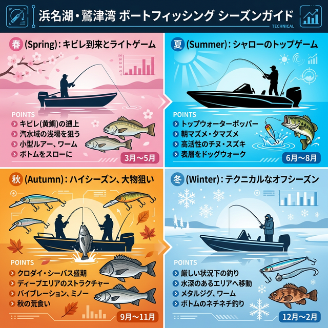

import Map from "@components/Map.astro";
import GMapButton from "@components/GMapButton.astro";
import TackleCard from "@components/TackleCard.astro";

『釣！浜名湖』をご覧いただきありがとうございます！

今回は、中浜名湖エリアの西側に位置する **「鷲津（わしづ）湾周辺」** をご紹介します！

ここは陸（岸）からのアプローチが地形的に制限されているため、ボートフィッシングが主体となるエリアです。ストラクチャー（障害物）周りを狙い撃つ、戦略的でテクニカルなゲームを楽しみたいアングラーに絶大な人気を誇るフィールドなんですよ。

## 鷲津湾周辺の基本情報

<Map lat={34.728509} lng={137.538175} name="鷲津湾" />

<GMapButton url="https://maps.app.goo.gl/85TQH2wzP2cAnZdh7" />

*   **ポイント名**：鷲津湾（わしづわん）
*   **所在地**：静岡県湖西市鷲津
*   **アクセス方法**：国道1号線「新居弁天IC」から車で約20分。
*   **駐車場**：一般アングラー用の無料駐車場はほぼありません（周辺マリーナなどを利用）。
*   **トイレ**：なし（事前に済ませておきましょう）
*   **近くの釣具店**：フィッシングジョイ、浜名湖つりセンター
*   **近くのコンビニ**：ファミリーマート鷲津駅前店

### ポイントの特徴
鷲津湾は、入り組んだ地形と豊富なストラクチャーが特徴のテクニカルフィールドです。

*   **ボートフィッシングの聖地**
    岸壁、杭、カケアガリなどが点在し、それらをボートから精度高く撃っていく釣りが主体です。プレッシャーが分散されやすいため、居着きの大型個体が狙えます。
*   **多彩なストラクチャー**
    マリーナ周辺や航路沿いには魚が着きやすい変化が多く、キャスティング精度が釣果を分ける「ゲーム性」の高い釣りが展開されます。

### 🐟️狙い目のシーズン
*   **春**：キビレ、シーバスが接岸開始。
*   **夏**：シャロー狙いのトップゲームが最盛期！
*   **秋**：クロダイ、シーバスの荒食いシーズン。
*   **冬**：水温低下とともに深場へ移動するため、厳しい時期。

## シーズンごとに釣れやすい魚

**春：キビレ、シーバス**
水温上昇とともに魚の活性が上がります。特に3月〜4月は、マイクロベイトを意識したシーバスや、ボトムを意識したキビレが顔を見せ始めます。

**夏：キビレ、クロダイ、シーバス**
早朝から日中にかけて、水深1m前後のシャロー帯でのトップウォーターゲームが激アツ！ポッパーやペンシルに「ドカン！」と出る瞬間は中毒性抜群です。

**秋：クロダイ、シーバス、キビレ**
一年で最も魚影が濃く、力強い引きを楽しめるシーズン。レンジが下がりやすいため、ルアーの泳層を意識した使い分けが重要になります。

## ルアーで釣れる魚とおすすめタックル

ボートからの接近戦になることが多いため、ピンポイントキャストが求められるテクニカルな釣りが展開されます。

### ボートシーバス・チニングタックル
取り回しの良いロッドと、ドラグ性能に信頼の置けるリールのセット。

<TackleCard id="seabass/daiwa-silverwolf-76ml-s-w" />
<TackleCard id="common/shimano-vanford" />

### 必須アイテム
大型チヌの鋭いヒレやパワーから手を守るため、フィッシュグリップは必須です。

<TackleCard id="kibire/dress-fish-grip-twin-gold" />

## 周辺観光・グルメ情報：さわやか＆五味八珍

鷲津エリアに来たなら、静岡県民のソウルフードは外せません！
*   **さわやか 湖西店**：言わずと知れた「げんこつハンバーグ」の名店。
*   **五味八珍 鷲津店**：浜松餃子とラーメンのセットが絶品。

どちらも釣り場から近く、遠征アングラーにはたまらない贅沢な立地となっています。

## まとめ：腕を磨けるテクニカルな「道場」

鷲津湾は、魚との知恵比べを存分に楽しめるエリアです。
1. ボートからのストラクチャー撃ちがメイン。
2. キャスティング精度とレンジ操作が試される。
3. アフターフィッシングのグルメ環境も最高！

> [!IMPORTANT]
> **最後にお願い！**
> マリーナ周辺や航路では、他の船舶の迷惑にならないよう操船に注意してください。ゴミの持ち帰りやマナーを守り、気持ちよく釣りを楽しみましょう！
