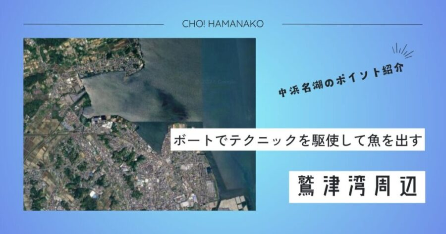

import Map from "@components/Map.astro";
import GMapButton from "@components/GMapButton.astro";
import BlogCard from "@components/BlogCard.astro";
import Callout from "@components/Callout.astro";

「釣！浜名湖」へようこそ！

今回、満を持して解説するのは、中浜名湖の西岸に広がり、ボートアングラーにとっての「最終目的地」とも称される <strong>「鷲津港・鷲津湾（わしづこう・わしづわん）」</strong> エリアです。

ここは、地形やマリーナ・私有地の関係により、陸（オカッパリ）からのエントリーポイントが極めて限定されています。その不自由さと引き換えに、湖内に踏み出したボートアングラーには <strong>「浜名湖随一の魚影」</strong> という最高のギフトを用意してくれているフィールドです。

林立する養殖杭、整然と並ぶカキ棚、そして複雑に入り組んだ「澪（みお）」の筋。鷲津は、キャスティングの精度、潮読みの力、そして障害物に対する観察眼。そのすべてが試される <strong>「中浜名湖の道場」</strong> です。

本記では、この難攻不落のポイントを完全攻略するためのタクティクスと、この地で永く釣りを楽しむための「鉄の掟」を、3000文字超の圧倒的熱量で徹底解説します。

<Map lat={34.728509} lng={137.538175} name="鷲津港・鷲津湾" />
<GMapButton url="https://maps.app.goo.gl/85TQH2wzP2cAnZdh7" />

---

## 🔍 ポイント概要：ボートフィッシングの「牙城」

鷲津エリアは、湖西市の中心部であるJR鷲津駅の東側に広がる大きな湾状のフィールドです。

### なぜ「鷲津」はボート主体なのか？

1. <strong>広大なドシャロー（浅瀬）</strong>：岸から数百メートル先まで、大人の膝下ほどの水深が続くエリアが多く、オカッパリからは魚が着く「ブレイク（段差）」まで物理的に手が届きません。
2. <strong>閉ざされた岸壁</strong>：湾の大部分がマリーナ、造船所、工場、私有地に囲まれており、一般アングラーが法的に正しく立ち入れる護岸は、鷲津駅周辺や四ッ池など、極めてごく一部に限られています。
3. <strong>拠点となる銘マリーナの存在</strong>： <strong>「ボートクラブカナル」</strong> や <strong>「丸善マリーナ」</strong> など、日本有数の設備と歴史を持つマリーナがこの地に集中しています。ここから出船してわずか数分で一級ポイントに到達できる利便性が、鷲津を聖地たらしめています。

---

## 🌊 水中地形と「2大ストラクチャー」の攻略

鷲津の攻略は、目に映る障害物（ストラクチャー）をいかに精度高く撃てるかに集約されます。

### ① 【カキ棚・養殖杭】チヌたちのマンション
浜名湖名産のカキ養殖に使われる棚や、それを支える杭は、魚たちの格好の隠れ家であり、餌場です。
- <strong>特徴</strong>：杭にはカキやフジツボがびっしりと付着しており、それをついばむ <strong>クロダイ・キビレ</strong> の密度は言葉を失うほど。
- <strong>攻略</strong>：ボートを風や潮に乗せて「ドテラ流し」しながら、杭の際、まさに数センチの範囲にルアーを送り込みます。ヒット直後、魚は即座に棚の中に逃げ込もうとするため、強引に引き剥がす「パワフルなファイト」が絶対条件。中途半端なドラグ設定は、一瞬でラインブレイクに繋がります。

### ② 【澪（みお）とカケアガリ】シーバスの迎撃ポイント
湾内を縦横に縫走する深み（澪筋）と、それに隣接するシャローフラット。この高低差がドラマを生みます。
- <strong>特徴</strong>：潮の干満により、ベイトフィッシュ（ボラの子、エビ、カニ）がこの澪を「通路」として移動します。
- <strong>攻略</strong>：水深3〜4mの少し深いラインにボートを浮かせ、段差の肩（ブレイク）にルアーを通すと、待ち伏せていた <strong>シーバス（マダカ）</strong> や <strong>大型マゴチ</strong> が猛然とアタックしてきます。

---

## 🐟️ 季節別・鷲津「必勝」パターン

### 【☀️ 夏：6月〜9月】夢のトップウォーターゲーム
鷲津のドシャローで展開されるチヌの「トップゲーム」は、浜名湖の夏の風物詩です。
- <strong>タクティクス</strong>：水深わずか50cm程度の浅瀬で、ポッパーやペンシルベイトを高速トゥイッチ。静寂を切り裂いて魚の引き波（V字波）がルアーを追ってくる瞬間、心臓が跳ね上がるような興奮を味わえます。ミスバイトを恐れず、一定のリズムでアクションし続けるのがコツです。

### 【🍂 秋：10月〜12月】バイブレーションの数釣り
水温が下がり、魚が越冬を意識して深場に集まり始める時期。
- <strong>タクティクス</strong>：鉄板バイブレーションやテールスピンジグを遠投し、ボトム付近をスローに、しかし力強くリトリーブ。80cmクラスのランカーシーバスが混ざる可能性が最も高まる、緊張感あふれるシーズンです。

---

## ⚠️ ボートアングラーが遵守すべき「鉄の掟」

鷲津エリアは非常に多くの利害関係者が存在する、極めてセンシティブなエリアです。以下のルールは <strong>「絶対」</strong> です。

1. <strong>マリーナ施設へのキャスティング禁止</strong>：係留されているボートや桟橋は、他人の大切な財産です。針を掛けたり傷をつけたりすることは、高額な賠償問題に発展し、さらにはボートフィッシング全体の首を絞めることになります。
2. <strong>引き波への配慮（デッドスロー）</strong>：マリーナ周辺、公共桟橋、他船の近くを通る際は、必ず <strong>デッドスロー（徐行）</strong> で航行してください。あなたの引き波が、係留船を傷つけたり、他船のアングラーを転倒させたりする可能性があります。
3. <strong>漁業優先の徹底</strong>：漁船の進路を遮らない、定置網や刺し網には近寄らない。これは海・湖を共有する者としての当然の義務です。
4. <strong>アカエイへの最大級の警戒</strong>：鷲津のシャローフラットは <strong>アカエイ</strong> の超密集地帯です。
   - <strong>【対策】</strong>：ボートから降りてウェーディングをする際は、必ずエイガードを着用し、 <strong>「すり足」</strong> で極めて慎重に歩くこと。刺されれば激痛と壊死を伴い、即入院という最悪の結果を招きます。

---

## 🚀 まとめ：鷲津を制する者は、浜名湖を制す

鷲津港・鷲津湾は、一筋縄ではいかないフィールドです。しかし、ここで正確なキャストを身につけ、ストラクチャーに潜む魚の気配を察知する力を養えば、他のどのポイントへ行っても通用する「本物のスキル」が手に入ります。

まさに中浜名湖のプライドをかけた戦い。

釣行の帰りは、湖西の名店 <strong>「さわやか 湖西店」</strong> で拳骨ハンバーグを頬張りながら、その日のファイトを振り返る。これこそが、鷲津アングラーが愛してやまない至福のルーティーンです。

ルールを守り、マナーを重んじ、最高峰のゲームフィッシングに挑戦してみてください！

---

<Callout type="warning" title="陸っぱり（オカッパリ）を検討中の方へ">
鷲津周辺での陸釣りは、釣り公園として開放された場所や、一部の許可されたエリアを除き、厳しく制限されています。特に工事中の防潮堤やマリーナ内への無断侵入は、法的措置を取られる可能性があるため、絶対に避けてください。
</Callout>

<BlogCard slug="kibire" />
鷲津の主役、キビレ・クロダイの習性を知れば、キャスティングの狙いどころが変わります。
