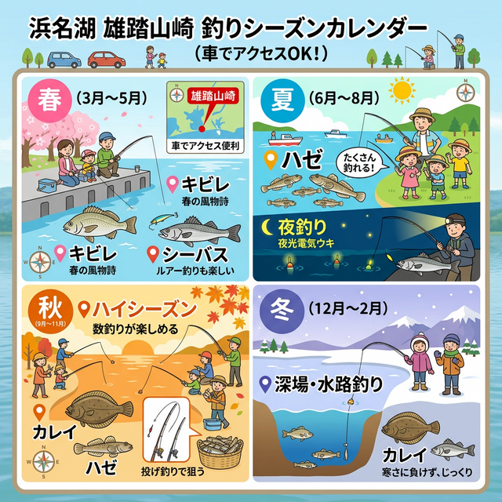

import Map from "@components/Map.astro";
import GMapButton from "@components/GMapButton.astro";
import LinkButton from "@components/LinkButton.astro";

『釣！浜名湖』をご覧いただきありがとうございます！

今回は、中浜名湖の東岸エリアから、アクセス抜群の **「雄踏町山崎（ゆうとうちょうやまざき）」** をご紹介します！

はまゆう大橋の南側に位置するこのポイントは、知る人ぞ知る「車横付け可能」な便利なスポット。コンビニも歩いて行ける距離にあり、のんびりと釣りを楽しむには最高の環境が整っています。

## 雄踏町山崎の基本情報

<Map lat={34.713289} lng={137.618941} name="雄踏町山崎" />

<GMapButton url="https://maps.app.goo.gl/hjUJZzXZHUXuibyS9" />

*   **ポイント名**：雄踏町山崎（ゆうとうちょうやまざき）
*   **所在地**：静岡県浜松市中央区雄踏町山崎
*   **駐車場**：橋のたもとに数台の駐車スペースあり（無料）。
*   **近くの釣具店**：はなぞの釣具店
*   **近くのコンビニ**：ローソン浜松雄踏町山崎店（徒歩すぐ）

### ポイントの特徴
雄踏山崎の最大のメリットは、何といっても「車からすぐに竿を出せる」その手軽さです。

*   **投げ釣りの好ポイント**
    はまゆう大橋の南側に広がる砂地は、春と秋の投げ釣りが非常に盛んです。キビレやシーバスをターゲットにしたアングラーが集まります。
*   **秋のカレイ混じり**
    秋深まる時期には、投げ釣りでキビレに混じってカレイがヒットすることも。3本針などの多点掛け仕掛けで欲張りに狙うのも面白いですよ。
*   **夏の夜の電気ウキ**
    夏場の夜、水路や岸辺をゆったり流す電気ウキ釣りもおすすめ。ハゼなどの小物を中心に、癒やしの釣行が楽しめます。

> [!IMPORTANT]
> **駐車時の配慮について**
> 橋のたもとの駐車スペースは限られています。他の人がスムーズに停められるよう、譲り合って駐車してください。また、**船着き場の作業エリアへの駐車は絶対に厳禁** です。

### 🐟️狙い目のシーズン
*   **春・秋**：**【メインシーズン】** 投げ釣りでキビレ、シーバス、ハゼを狙うならこの時期。
*   **夏**：夜の電気ウキ釣りや、チョイ投げによるハゼ釣りが楽しめます。
*   **冬**：水路の深みに残る魚を狙えますが、風を遮るものがないため防寒対策を万全に。

## シーズンごとに釣れやすい魚

**春・秋：キビレ、シーバス、ハゼ、カレイ**
投げ釣りがもっとも盛り上がる時期。地形の変化を探りながら広範囲に仕掛けを投入しましょう。

**夏：ハゼ、セイゴ（シーバス）**
夏はチョイ投げ仕掛けでハゼの数釣りを。場所が広いため、アタリがなければどんどん歩いて場所を変える（ランガン）のがコツです。

## おすすめの釣り方とタックル

*   **投げ釣り**：投げ竿（20〜25号前後）。キビレ・カレイ狙いは少し重めのオモリが有利。
*   **ウキ釣り**：5.4m前後の磯竿、または延べ竿。電気ウキで夜の岸際を攻める。

釣り具の調達は、近くの「はなぞの釣具店」さんが非常に便利です。地元の最新情報を聞いてからポイント入りすると、より釣果に近づけます。

## 周辺情報
すぐ近くに「ローソン浜松雄踏町山崎店」があるため、飲食の補給はバッチリです。長時間の釣行でも安心ですね。

### JR浜松駅からも来れるポイント
紹介したポイント（山崎）には遠鉄バスの車庫と営業所があります。なので、JR浜松駅からバス1本で来ることも可能です。……1時間ほどかかりますが。

<LinkButton 
  url="https://maps.app.goo.gl/hebT972ceUsr3zRv9" 
  label="浜松駅からのバスルートを見る" 
  icon="bus" 
/>

## まとめ：便利さと実力を兼ね備えた東岸の穴場スポット

雄踏町山崎は、有名ポイントほどの混雑はありませんが、非常に安定した釣果と抜群の利便性を誇ります。

1. 車横付け可能で、思い立ったらすぐに釣りができる。
2. コンビニが近く、ファミリーや長時間派にも優しい。
3. 投げ釣りでキビレ・カレイなど良型が期待できる。

マナーを守って、中浜名湖の静かな釣行を楽しみましょう！