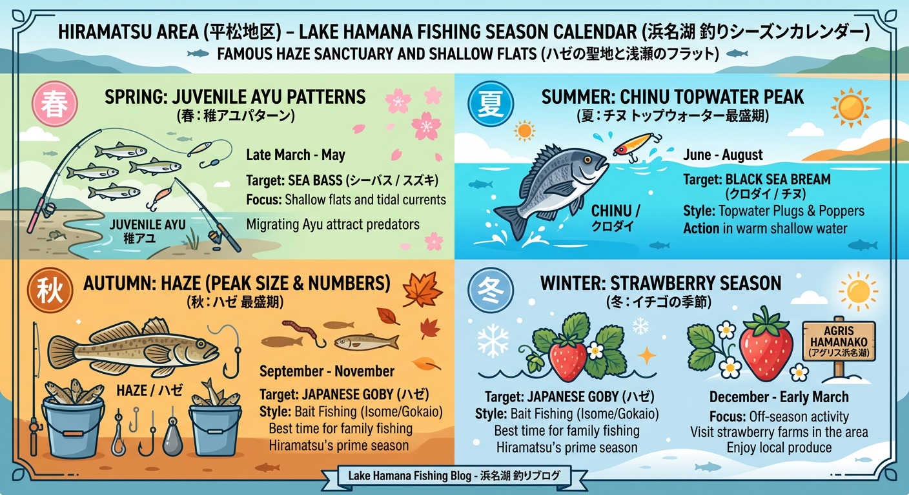

import Map from "@components/Map.astro";
import GMapButton from "@components/GMapButton.astro";

『釣！浜名湖』をご覧いただきありがとうございます！

今回は、庄内湖の北東部に位置する **「平松町付近」** をご紹介します！

平松町付近は、奥浜名湖の中でも特にハゼ釣りの実績が高いポイントとして有名です。小規模な河川の流れ込みがあり、汽水域を好む魚たちが集まってくる穏やかなシャローエリアなんですよ！

<Map lat={34.754378} lng={137.638226} name="平松町付近" />

## 平松エリアの基本情報

<GMapButton url="https://www.google.com/maps/search/?api=1&query=34.754378,137.638226" />

*   **ポイント名**：平松町付近（児童遊園地周辺）
*   **所在地**：静岡県浜松市中央区平松町
*   **駐車場**：児童公園付近に数台分のスペースがありますが、それ以外は私有地や空き地が多いため注意が必要です。
*   **近くの釣具店**：はなぞの釣具店（24時間エサ購入可能）
*   **近くのコンビニ**：ファミリーマート 浜松庄和町店

このエリアは全体的に水深が浅く、地形変化に富んでいます。道路沿いには街灯がありますが、海沿いまでは届かないため、夜釣りにはヘッドライトが必須です。

### ポイントの特徴

**🎣 ハゼ釣りの王道スポット**
春から秋にかけてハゼが非常に多くストックされています。特に秋の最盛期には、チョイ投げや、のべ竿を使った立ち込み（ウェーディング）で良型が期待できます。

**🎣 夏のチヌトップゲーム**
夏場は水温が上がりやすく、トップウォーターでクロダイやキビレ、シーバスを狙うのも面白いポイントです。ただし、猛暑が続くと水質が悪化し、一時的に魚が居なくなることもあるので注意が必要です。

**🎣 公園周辺が唯一の陸っぱり拠点**
庄内湖の沿岸は私有地が多く、陸からエントリーできる場所は限られています。児童遊園地付近の護岸が最もエントリーしやすく、ファミリーでも安心して楽しめます。

> [!TIP]
> **ボートとの相性が良い**  
> 陸からは投げられる範囲が限られるため、ボートを利用すればより広範囲のシャロー帯を効率よく攻めることができます。

### 🐟️シーズン別攻略ガイド

*   **🌸 春（4月〜6月）**：チンタ、セイゴ
    *   **【攻略】** 稚アユや稚魚を追う肉食魚たちが動き出します。小型のルアーやエサ釣りで活性の上がり始めを狙いましょう。
*   **☀️ 夏（7月〜9月）**：クロダイ、キビレ、ハゼ
    *   **【攻略】** チヌ狙いのトップゲームが全盛！ただし、庄内湖の最深部は水温が上がりやすく水質悪化には注意が必要です。
*   **🍂 秋（10月〜11月）**：ハゼ（最盛期）
    *   **【攻略】** 平松の本命シーズン！数・型ともに最も楽しめる時期です。のべ竿での立ち込みやチョイ投げがおすすめ。
*   **❄️ 冬（12月〜3月）**：オフシーズン
    *   **【攻略】** 釣りは厳しい時期。アグリス浜名湖での「いちご狩り」など、周辺観光をメインに楽しむのが庄内湖流です。

## おすすめタックルと釣り方

*   **対象魚**：ハゼ、チンタ、セイゴ
*   **釣り方**：エサ釣り（チョイ投げ・ウキ釣り）
*   **おすすめエサ**：青ジャムシ（はなぞの釣具店で入手可能）

水深が浅いため、それほど本格的なタックルは必要ありません。3.6m程度ののべ竿か、コンパクトロッドでのチョイ投げで十分楽しめます。

## 周辺の観光情報

### 1. いちご狩りの拠点：平松観光アグリス浜名湖
平松町といえばここ、と言われるほど有名な観光農園です。

**いちご狩り**：例年 **12月中旬から5月上旬** まで楽しめます。「章姫（あきひめ）」や「紅ほっぺ」など、完熟の甘いいちごが30分食べ放題です。

**ふれあい市場**：農園に併設されており、地元の新鮮な野菜や果物、切り花、無添加のいちごジャムなどが安く手に入ります。

[平松観光アグリス浜名湖](https://agris-hamanako.jp/)

### 2. 徒歩圏内の主要スポット
アグリス浜名湖から歩いて数分〜10分程度の場所に、浜松の人気スポットが隣接しています。

**[はままつフラワーパーク](https://e-flowerpark.com/)**
世界的に美しいとされる「桜とチューリップの庭園」や、大温室クリスタルパレスが有名です。3月から6月にかけては「浜名湖花フェスタ」のメイン会場になります。

**[浜松市動物園](https://www.hamazoo.net/)**
フラワーパークのすぐ隣にあり、共通券での入園も可能です。希少なゴールデンライオンタマリンや、広々とした展示が特徴です。

### 3. 周辺のグルメ・体験情報
**[三州庵 フラワーパーク店](https://tabelog.com/shizuoka/A2202/A220201/22003730/)**
平松町にあるお蕎麦・うどんのお店です。フラワーパークやアグリス浜名湖のすぐ近くにあり、観光の合間のランチに便利です。

**[秋山工房](https://akiyamakobo.jp/)**
アグリス浜名湖から徒歩約3分の場所にあるガラス工房です。吹きガラス体験やサンドブラスト体験ができ、自分だけのオリジナルグラスを作ることができます。

## まとめ：家族で楽しむ、庄内湖ののんびり釣行

平松町エリアは、浜松市内からのアクセスも良く、何よりハゼという「裏切らないターゲット」が豊富にいるのが魅力です。

水温の変化に敏感なエリアなので、気象条件を確認しながら、ぜひ庄内湖の恵みを楽しんでください！

> [!WARNING]
> **最後にお願い！**
> 
> 周辺は静かな住宅地です。深夜の騒音や不適切な駐車は厳禁。マナーを守っていつまでも釣りができる環境を守りましょう。
