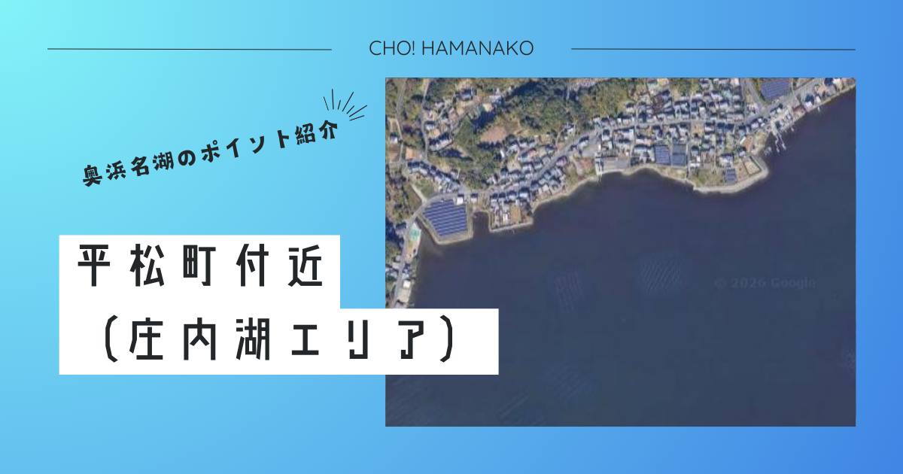

import Map from "@components/Map.astro";
import GMapButton from "@components/GMapButton.astro";
import BlogCard from "@components/BlogCard.astro";
import Callout from "@components/Callout.astro";

「釣！浜名湖」へようこそ！

今回ご紹介するのは、浜名湖の支湖である「庄内湖（しょうないこ）」の中でも、全アングラーの原風景とも言える伝説的なフィールド <strong>「平松町（ひらまつちょう）付近」</strong> です。

ここは、浜名湖で最も古くから <strong>「ハゼ釣りの聖地」</strong> として知られ、親子三代にわたってハゼを追いかけてきた地元アングラーも少なくありません。どこまでも続く穏やかな浅瀬（シャロー）、対岸に見える舘山寺の観覧車、そして水面を跳ねる小魚の波紋――。平松には、都会の喧騒を忘れさせる「豊穣の静寂」が満ちています。

しかし、近年ではこの「浅すぎる地形」を逆手に取った <strong>「チヌトップゲーム（水面でのクロダイ・キビレ狙い）」</strong> の超A級ポイントとしても、ルアーマンの間でその名を知られるようになりました。

伝統的なハゼの数釣りから、エキサイティングな最新ルアーゲームまで。浜名湖の英知が凝縮された平松エリアの攻略法を、3000文字超の圧倒的ボリュームで完全解剖します。

<Map lat={34.754378} lng={137.638226} name="平松町付近" />
<GMapButton url="https://www.google.com/maps/search/?api=1&query=34.754378,137.638226" />

---

## 🔍 ポイント概要：地域に愛される「憩いのフィッシング・ポート」

平松エリアは、浜松市中央区の北東に位置します。目印は、地元の子どもたちの遊び場である <strong>「平松児童遊園地」</strong> です。

### インフラとアクセスの心得

- <strong>拠点となる「はなぞの釣具店」</strong>：このエリアを攻めるなら、立ち寄らない選択肢はありません。店頭の <strong>24時間稼働エサ自販機</strong> は、早朝のハゼ釣りに不可欠な「赤イソメ」をいつでも新鮮な状態で提供してくれます。
- <strong>物販・駐車場</strong>： <strong>ファミリーマート 浜松庄和町店</strong> が車ですぐの距離に。駐車場は児童遊園地の隣に数台分ありますが、ここは「地域の方々のご厚意」で成り立っているスペースです。 <strong>満車時の路上駐車は即、警察への通報と釣り場閉鎖に繋がります</strong>。ルールを厳守し、無理な駐車は絶対に控えましょう。
- <strong>観光とのシナジー</strong>： <strong>「アグリス浜名湖（いちご狩り）」</strong> や <strong>「はままつフラワーパーク」</strong> が至近。午前は平松でハゼと遊び、午後は花の香りに包まれる。そんな、家族全員が笑顔になれるプランニングが可能です。

---

## 🌊 水中構造：どこまでも続く「豊穣のシャローフラット」

平松の水中は、浜名湖内でも屈指の遠浅地形が形成されています。

### ① 【超広大な泥砂底】ハゼのマンモス団地
護岸から沖へ100m以上進んでも、水深が1mに満たないようなフラットな地形が続いています。
- <strong>水中地形</strong>：周囲の田畑からの有機物が豊富に流れ込み、ハゼの主食となるプランクトンや、多毛類（ゴカイ）が密集。ハゼが繁殖し、越冬前まで成長し続けるための「最高の保育園」です。
- <strong>攻略法</strong>： 3.6m〜4.5mの <strong>のべ竿</strong> を使った <strong>ミャク釣り</strong> が最適。底を優しく「トントン」と叩くことで、砂煙を上げてハゼの好奇心を刺激するのがコツです。

### ② 【水路の流れ込み】酸素とベイトの供給源
田畑からの小規模な排水路がいくつか庄内湖に注ぎ込んでいます。
- <strong>水中地形</strong>：僅かに水深があり、常に新鮮な水（真水）が入り込んでいます。
- <strong>戦略</strong>：この「流れ出し」の先は、プランクトンを追うベイトが集まり、それを狙う <strong>シーバス（セイゴ）</strong> や <strong>クロダイ</strong> の絶好の着き場となります。

---

## 🐟️ ターゲット別・「平松マスター」への道

### 【🍁 秋：絶対的主役】ハゼ：ピリピリという鼓動を感じる
- <strong>メインメソッド</strong>：のべ竿での数釣り。 <strong>「赤イソメ」</strong> を3ミリ程度に小さく刺し、手返し良く釣ります。平松のハゼはアタリが非常に明確で、初心者でも「ピリリッ！」という心地よい振動を感じることができます。
- <strong>ハゼクランク</strong>：水深が浅い平松では、ハゼクラも非常に有効。特に朝夕の薄暗い時間帯には、ルアーへの反応が爆発的に高まることがあります。

### 【☀️ 夏 〜 🍁 初秋】チヌトップゲーム：水深30cmの攻防
- <strong>メインメソッド</strong>：ウェーディングで少し立ち込み、ポッパーやペンシルをキャスト。
- <strong>コツ</strong>：背びれが見えるほど浅い水域を、激しいポップ音で誘う。魚がルアーに襲いかかる際の <strong>「ガボッ！」</strong> という吸い込み音と、視覚的な興奮は、一度味わえば病みつきです。

### 【🌃 夜間】セイゴ・チンタ：ライトゲームの愉しみ
- <strong>メインメソッド</strong>：街灯の明暗部を狙った小型ミノーの引き。夜になると警戒心の解けた魚たちが足元まで寄ってきます。

---

## ⚠️ 【最下級警告】アカエイとマナーの「鉄則」！

平松の穏やかな景色に騙されてはいけません。ここには浜名湖最強の「刺客」が潜んでいます。

1. <strong>【すり足】アカエイの高密度地帯（レッドアラート）</strong>：砂泥底のシャローは <strong>アカエイ</strong> のパラダイスです。ウェーディングの際は絶対に足を地面から離さない <strong>「すり足歩行」</strong> を徹底してください。
   - <strong>重要</strong>：不用意な一歩は即、毒針の洗礼を意味します。エイガードの着用は、もはやマナーではなく <strong>「生存の義務」</strong> です。
2. <strong>児童遊園地の主役は「子ども」</strong>：ここは公園です。釣り人が占拠してはいけません。子どもたちが遊ぶスペースを確保し、針やラインのゴミは1ミリも残さないことを誓ってください。
3. <strong>夜間の静寂を奪うな</strong>：住宅地が隣接しています。夜間の大声での談笑、車のドアを閉める爆音。これらは全て「釣り禁止」への最短ルートです。 <strong>「忍びの釣り」</strong> を心がけましょう。

---

## 🚀 まとめ：浜名湖の原風景、平松ののんびりとした時間を次世代へ

平松町（庄内湖）は、派手な大物釣りというよりは、ハゼや小物と戯れながら、静かな湖畔の時間を楽しむのに最高の場所です。

- <strong>ハゼ釣りNO.1の聖地</strong> としての確実な釣果。
- <strong>観光・レジャー</strong> との完璧なバランス。
- <strong>湖面の穏やかさ</strong> がもたらす、心の洗濯。

ルールを厳格に守り、地元の方々への感謝を忘れずに。今年の秋は、平松ののんびりとした空気の中で、ハゼとの真剣勝負を楽しんでみませんか？この素晴らしい環境を、私たちアングラーの手で守り続けていきましょう。

---

<BlogCard slug="isajigawa" />
ハゼ釣りのライバルスポット。おとぎ話のような景観の「伊左地川河口」完全ガイド。

<BlogCard slug="points/fukabori/haze-fukabori" />
平松のシャローを遊び尽くす。ハゼ釣りの伝統メソッドから最新スタイルまで。

<BlogCard slug="kurodai-tactics" />
平松のシャローを制する。水深50cm以下の「チヌトップ」専用メソッド解説。
