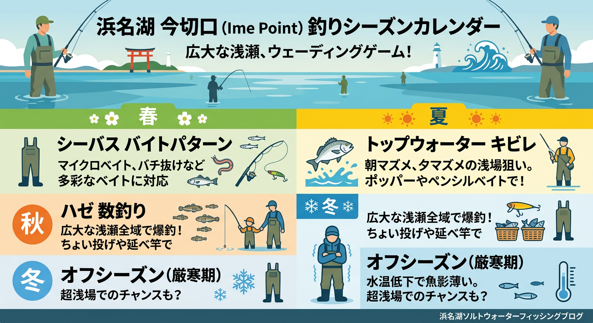

import Map from "@components/Map.astro";
import GMapButton from "@components/GMapButton.astro";
import TackleCard from "@components/TackleCard.astro";

『釣！浜名湖』をご覧いただきありがとうございます！

今回は、都田川河口の南側に広がる遠浅の超メジャースポット **「伊目（いめ）」** を徹底解説します！

「どこまで歩いても膝から腰の深さ」という全国的にも珍しいほどの広大なシャローエリア。ウェーディングの聖地として知られる一方、岸からはハゼやキビレのエサ釣りが楽しめる、のどかでポテンシャルの高いポイントです。

<Map lat={34.784795} lng={137.643050} name="伊目" />

## 伊目の基本情報

<GMapButton url="https://maps.app.goo.gl/neSF8FNb8EVhS5cW8" />

*   **ポイント名**：伊目（いめ）
*   **所在地**：静岡県浜松市浜名区細江町気賀
*   **アクセス方法**：東名「舘山寺スマートIC」から車で約5分。
*   **駐車場**：専用駐車場なし（路肩の広いスペースを利用。駐車マナーに厳重注意）
*   **トイレ**：なし（事前の済ませておくのが無難）
*   **近くの釣具店**：植むら釣具店、はなぞの釣具店
*   **近くのコンビニ**：セブンイレブン細江気賀店

### ポイントの特徴

**1. ウェーディングの聖地**
岸から100m以上出ても水深1m前後という極めて遠浅な地形です。夏から秋にかけてのトップゲームがやりやすいエリアです。アカエイが多いし透明度も悪いため、エイガードなり対策は必ずしましょう。

**2. 地形変化の少ない「のっぺり」した底**
全体的に砂地で水深が一定なため、明確な居着きポイントが分かりにくいのが難点。魚も回遊がメインになるため、足を止めて待つよりは、広く探るランガンスタイルが適しています。

**3. 都田川の恩恵と影響**
すぐ北側に都田川河口があるため、ベイト（餌となる小魚）の供給が豊富です。一方で、大雨の後は流木などのゴミが大量に溜まりやすく、水も濁りやすいため、天候に左右されやすい側面があります。

**4. ハゼ釣りの準一級ポイント**
都田川が混雑して入れない時、伊目は「逃げ場」としても重宝されますが、単体でも十分なハゼの魚影を誇ります。手軽な延べ竿での探り釣りに最適です。

### 🐟️シーズン別攻略ガイド

*   **🌸 春（4月〜6月）**：シーバス、キビレ
    *   **【攻略】** 冬眠から覚めたシーバスがベイトを追ってシャローに。バチ抜けパターンのルアー釣りが吉。
*   **☀️ 夏（7月〜9月）**：キビレ、クロダイ、ハゼ、マゴチ
    *   **【攻略】** 広大な遠浅エリアでトップゲームが最高に熱い！ウェーディングで魚の射程圏内に入りましょう。
*   **🍂 秋（10月〜11月）**：ハゼ、キビレ、シーバス
    *   **【攻略】** 一年で最も賑わうシーズン。都田川から落ちてきた大型ハゼは初心者や家族連れにも大人気。
*   **❄️ 冬（12月〜3月）**：オフシーズン
    *   **【攻略】** 非常に浅いため水温低下の影響が大きく、魚は深場へ移動。春の訪れをじっくり待ちましょう。

### ✨️攻略のポイント（エサ・ルアー）

*   **エサ釣り**：ハゼ狙いなら、岸際の石積み周辺を「延べ竿」のミャク釣りで探るのが手っ取り早くて確実です。夜のキビレ狙いは、青ジャムシをたっぷり付けたブッコミ釣りで広範囲に匂いを拡散させましょう。

<TackleCard id="haze/marukyu-power-isome-brown-m" />
<TackleCard id="haze/sasame-choi-haze-set-5go" />

*   **ルアー釣り**：なんといってもウェーディングでの「シャロー攻略」が基本。ポッパーでのトップゲーム、あるいはクランクベイトで底を叩きながら巻くスタイルが効果的です。

<TackleCard id="seabass/daiwa-silverwolf-76ml-s-w" />
<TackleCard id="seabass/little-presents-ray-guard-oa-24" />

> [!WARNING]
> **アカエイに注意！**
> 
> 伊目エリアはアカエイが非常に多いことで知られています。ウェーディングの際は必ずエイガードを装着するなどして対策しましょう。

## 周辺のグルメ情報

伊目から少し車を走らせると、浜松ならではの絶品グルメが待っています。

### 1. 浜松ぎょうざ「初代しげ」
地元でも有名な餃子の人気店。ボリューム満点の餃子定食は、釣りで冷えた体に染み渡ります。お土産用の冷凍餃子も人気です。

### 2. 回転寿し処 一慶
「初代しげ」の向かいにある、職人が握る本格派の回転寿司。鮮度の良さと丁寧な仕事ぶりはチェーン店とは一線を画し、多くのリピーターに愛されています。

## まとめ：シャローを遊び尽くす「広大な水遊び場」

伊目エリアは、その「平坦な浅さ」を理解して楽しむポイントです。

のんびりハゼと戯れるもよし、ウェーダーを履いて一発大物を求めて沖へ進むもよし。地形に変化が少ない分、自分の足を信じて歩き回る人ほど結果が出る、誠実な釣り場と言えるでしょう。

> [!WARNING]
> **最後にお願い！**
> 
> ここは住宅地が近く、専用の駐車場もありません。**路上駐車による通行の妨げや騒音**は絶対に避け、近隣住民の方への配慮を欠かさないようにしましょう。
> また、都田川からのゴミが溜まりやすい場所です。自分のゴミを持ち帰るのはもちろん、目につくゴミを一つ拾うくらいの心の余裕を持って釣りを楽しみましょう！
