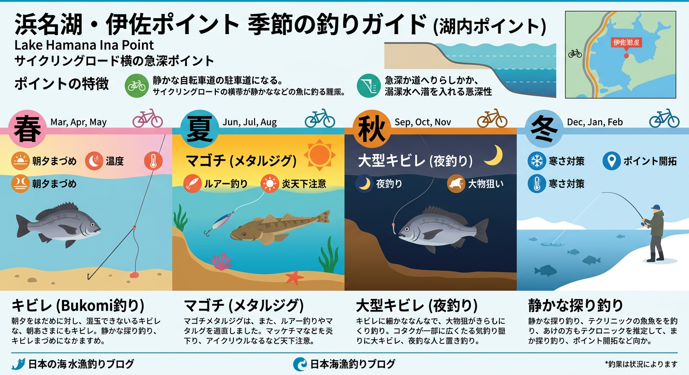

import Map from "@components/Map.astro";
import GMapButton from "@components/GMapButton.astro";

『釣！浜名湖』をご覧いただきありがとうございます！

本記事では、奥浜名湖の穴場ポイント **「伊奈（いな）」** をご紹介します。

伊奈は、有名な「マイマイ（ホトニクス下）」の北側に位置する、自転車道路沿いの静かなエリアです。

車でのアクセスが制限されているためプレッシャーが低く、良型のキビレやシーバスが狙える「知る人ぞ知る実力派」のポイントとなっています。

<Map lat={34.780101} lng={137.627914} name="伊奈（いな）" />

## 伊奈（いな）の基本情報

<GMapButton url="https://maps.app.goo.gl/Vjv2E4CbFCuNYAwXA" />

*   **所在地**：静岡県浜松市浜名区細江町気賀
*   **駐車場**：釣座付近にはほぼありません（路駐厳禁）。
*   **トイレ**：残念ながらありません。
*   **近くの釣具店**：植むら釣具店
*   **近くのコンビニ**：セブンイレブン細江気賀店

このエリアは湖畔沿いに自転車道路が整備されており、一般車両の進入は「サンセット伊奈」付近までとなります。

駐車スペースが極めて乏しいため、無理な駐車は避け、近隣施設への無断駐車も絶対にやめましょう。

### ポイントの特徴と攻略

伊奈は都田川河口から少し離れていますが、岸から50mほど投げると一気に深くなる「急深」な地形が最大の特徴です。

**1. 手つかずのポテンシャル**
マイマイほどの知名度はありませんが、それは「車で来にくいから」という物理的な理由によるものです。

人が少ない分、魚の警戒心が低く、思わぬ大物に出会えるチャンスを秘めています。

**2. 遠投が鍵となる急深ポイント**
沿岸部は浅いですが、沖に向かって鋭くカケアガリ（斜面）が形成されています。

50m以上の遠投ができれば、水深がぐっと深くなる魚の回遊ルートをダイレクトに狙い撃つことが可能です。

**3. ウェーディング時の注意点**
水深が浅い範囲までは立ち込むことができますが、航路の目印などが少ないため、急に深くなる場所の把握が困難です。

特に夜間に初めて入る場合は、地形を事前に確認し、無理な入水は控えるようにしてください。

### 🐟️シーズン別攻略ガイド

*   **🌸 春（4月〜6月）**：キビレ、シーバス
    *   **【攻略】** 乗っ込みのキビレをブッコミ釣り（投げ釣り）でじっくり。暖かくなればルアーの回遊待ちも有効です。
*   **☀️ 夏（7月〜9月）**：マゴチ、キビレ、シーバス
    *   **【攻略】** 夏のマゴチ狙いが熱い！急深なカケアガリをメタルジグやワームで斜めに広く探りましょう。
*   **🍂 秋（10月〜11月）**：大型キビレ、クロダイ、シーバス
    *   **【攻略】** 夜釣りが最も期待できるシーズン。自転車道路は街灯があり、比較的安全に大物との駆け引きを楽しめます。
*   **❄️ 冬（12月〜3月）**：オフシーズン
    *   **【攻略】** 魚影は薄くなります。次シーズンのために、自転車で地形の下見をしておくのがおすすめ。

## 周辺の観光情報：サンセット伊奈

ポイントのすぐ近くにある **「サンセット伊奈」** は、奥浜名湖の湖畔に建つ貸別荘です。

民家が少なく非常に静かな環境で、波の音を聞きながらデジタルデトックスを楽しむことができます。

都会の喧騒を離れて、プライベートな空間で奥浜名湖の自然を独り占めしたい方におすすめの宿泊施設ですよ。

https://sunset-ina.com/

## まとめ：不便さの先にある「静かなる爆釣」

伊奈は、アクセスの不便さが「魚の濃さ」という最高のメリットに繋がっているポイントです。

自転車道路を散策しながらポイントを探るという、ゆったりとした釣行スタイルがこの場所にはよく似合います。

地形変化を読み解き、静寂の中で大物との駆け引きを楽しむ、そんなストイックな釣りをぜひ体感してみてください！

> [!WARNING]
> **最後にお願い！**
> 
> ここは自転車道路がメインの場所ですので、通行する自転車や歩行者の邪魔にならないよう十分に注意してください。
> もちろん、出したゴミは必ず持ち帰り、地域の皆様に愛される釣り場を共に守っていきましょう！
