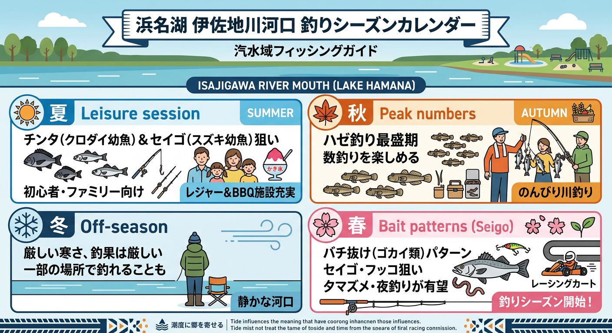

import Map from "@components/Map.astro";
import GMapButton from "@components/GMapButton.astro";
import TackleCard from "@components/TackleCard.astro";

『釣！浜名湖』をご覧いただきありがとうございます！

今回は、庄内湖の南東部に位置する隠れたハゼ釣りの名所 **「伊左地川（いさじがわ）河口」** をご紹介します！

佐浜町を流れる伊左地川の河口付近は、セブン-イレブン周辺から海へと続く穏やかな水域が広がっています。

奥浜名湖の中ではマイナーなポイントですが、その分釣り人も少なく、秋のハゼシーズンでものんびりと竿を出せる「超穴場」なんですよ！

<Map lat={34.738558} lng={137.641104} name="伊左地川河口" />

## 伊左地川河口の基本情報

<GMapButton url="https://www.google.com/maps/search/?api=1&query=34.738558,137.641104" />

*   **ポイント名**：伊左地川河口周辺
*   **所在地**：静岡県浜松市中央区佐浜町
*   **近くの駐車場**：近隣に専用駐車場はありませんが、公共マリーナ「はまゆうマリーナ」の営業時間内であれば駐車場の利用が可能です（徒歩約5分）。
*   **近くの釣具店**：はなぞの釣具店
*   **近くのコンビニ**：セブン-イレブン 浜松佐浜町店

このエリアは護岸が整備されており、足場も安定しています。河口の内側で狙えるため、初心者の方やお子様連れでも安心して釣りを楽しむことができます。

### ポイントの特徴

**1. ハゼ釣りの穴場スポット**
お盆過ぎから秋にかけて、ハゼが非常に多くストックされます。有名ポイントが混雑している日でも、ここなら場所取りに苦労することは少ないはずです。

**2. 陸っぱりからのチョイ投げで十分**
河口部は道路になっている箇所もありますが、内側の護岸からチョイ投げをするだけで十分にハゼのポイントに届きます。大型は期待薄ですが、チンタやセイゴなどの数釣りも楽しめます。

**3. 周辺レジャーとの相性抜群**
「ISK浜名湖店」でのカート体験や、夏に大人気の「沖縄cafe果報」でのかき氷など、周辺には魅力的なレジャースポットが点在しています。

### 🐟️シーズン別攻略ガイド

*   **🌸 春（4月〜6月）**：セイゴ（シーバス）
    *   **【攻略】** 小型のトップウォーターなどでマイクロベイトパターンを狙うのが面白い時期です。
*   **☀️ 夏（7月〜9月）**：チンタ、セイゴ、ハゼ
    *   **【攻略】** かき氷やカート体験のついでに、チョイ投げで短時間楽しむのが最高なファミリーフィッシング！

<TackleCard id="common/shimano-sedona-2500" />

*   **🍂 秋（10月〜11月）**：ハゼ（最盛期）
    *   **【攻略】** ハゼ釣り本命シーズン。穏やかな川面で延べ竿やチョイ投げでの数釣りが楽しめます。

<TackleCard id="haze/sasame-choi-haze-set-5go" />
<TackleCard id="haze/marukyu-power-isome-soft-red-m" />

## 周辺の観光情報

伊左地川流域は、レジャー施設が豊富です。

### 1. [ISK 浜名湖店](https://sportskart.com/hamanakoten/)
本格的なレーシングカートを体験できるスポット。釣りの後のリフレッシュに最適です！

### 2. [ぬくもりの森](https://www.nukumori.jp/)
中世ヨーロッパの村に迷い込んだような不思議な空間。こだわりの雑貨店やカフェが点在しています。

### 3. [沖縄cafe果報（カフー）](https://okinawacafe-kafu.com/)
特に夏場のかき氷は絶品。伊左地川釣行の際はぜひ立ち寄りたい名店です。

## まとめ：レジャーと釣りをセットで楽しむ庄内湖の休日

伊左地川河口は、ゆったりとした時間が流れる庄内湖らしいポイントです。
家族や友人と「ちょっとお魚に遊んでもらう」感覚で訪れるのがこの場所の正しい楽しみ方。周辺の魅力的なレジャースポットと合わせて、充実した休日を過ごしてみてはいかがでしょうか！

> [!WARNING]
> **最後にお願い！**
> 
> 周辺には「はまゆうマリーナ」や住宅地があります。迷惑駐車やゴミの放置は厳禁です。マナーを守って楽しみましょう。
