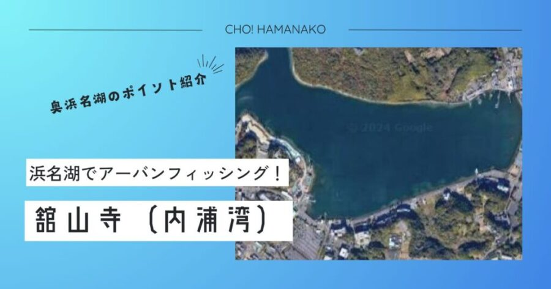

import Map from "@components/Map.astro";
import GMapButton from "@components/GMapButton.astro";
import BlogCard from "@components/BlogCard.astro";
import Callout from "@components/Callout.astro";

「釣！浜名湖」へようこそ！

今回ご紹介する <strong>「舘山寺（かんざんじ・内浦湾）」</strong> エリアは、奥浜名湖を代表するリゾート地であり、アングラーにとっても「至高の癒やしスポット」として古くから愛されてきました。

浜名湖パルパルの観覧車がゆっくりと回り、上空をロープウェイが行き交い、温泉街からは湯気が立ち上がる――。そんな非日常的な景色のすぐ目の前で竿を出せるのが、舘山寺釣りの最大の魅力。波一つない穏やかな内浦湾は、まさに「天然の釣り堀」のような安心感に満ちています。足場は完璧に整備され、夜間は街灯が湖面を明るく照らすため、小さなお子様の <strong>「夜釣りデビュー」</strong> にもこれ以上ない最高の舞台が整っています。

しかし、その穏やかさに油断してはいけません。水面下には遊覧船が通る「深い航路（澪筋）」という牙城が隠されており、そこには奥浜名湖のヌシとも言える <strong>「年無しクロダイ」</strong> や <strong>「ランカーシーバス」</strong> が虎視眈々とベイトを狙っています。

観光地の華やかさと、本格フィッシングのスリリングな裏の顔。この二面性を持つ舘山寺の攻略法を、3000文字超の圧倒的ボリュームで徹底解説します。

<Map lat={34.763757} lng={137.623776} name="舘山寺（内浦湾）" />
<GMapButton url="https://maps.app.goo.gl/Jpyv2SL8UUHyHBFR7" />

---

## 🔍 ポイント概要：観光地の利便性をフル活用した「スマート・フィッシング」

舘山寺エリアは、東名高速道路 <strong>「舘山寺スマートIC」</strong> から車で約5分という、浜名湖屈指のアクセサビリティを誇ります。

### 駐車場と周辺施設：ストレスゼロの釣行環境

- <strong>拠点となる「舘山寺公共駐車場」</strong>：非常に広大な公共駐車場が利用可能です。釣り場までのアプローチが完璧に舗装されており、荷物が多いファミリーや、キャリーワゴンを使用するアングラーには涙が出るほどありがたい環境です。
- <strong>補給と情報「はなぞの釣具店」</strong>：エリア内に位置する <strong>「はなぞの釣具店」</strong> は、このエリアの情報の心臓部。舘山寺特有の「ギマ専用仕掛け」や、夜釣りの強い味方「ジャムシ（ゴールド）」の在庫も豊富です。
- <strong>物販・トイレの安心感</strong>： <strong>セブン−イレブン 浜松舘山寺町店</strong> が徒歩圏内にあり、24時間いつでも温かい食事が手に入ります。公衆トイレも温泉街の中に点在しており、女性や子供連れの釣行でも「トイレの心配」は無用です。

---

## 🌊 水中地形：シャローフラットと「遊覧船航路」の二層構造

内浦湾の攻略は、足元の浅瀬と沖の深みの「境界」を意識することから始まります。

### ① 【超シャロー護岸】癒やしと数釣りの「表舞台」
護岸から数メートルは、水深1m〜1.5m程度の非常に浅い砂泥底が広がっています。
- <strong>水中状況</strong>：波がほとんど立たないため、のべ竿（ウキ釣り）でも繊細なアタリが明確に出ます。
- <strong>ターゲット</strong>：ハゼ、チンタ（クロダイ幼魚）、そして初夏の人気者 <strong>「ギマ」</strong> 。
- <strong>攻略</strong>：夏の「赤イソメ」を使ったチョイ投げで、広範囲をゆっくり探るのが正解。根掛かりも少なく、初心者でも快適です。

### ② 【遊覧船航路（澪筋）】大型魚が潜む「裏のメインステージ」
湾の中央部には、大型の回遊遊覧船が安全に航行できるよう、深く浚渫（しゅんせつ）された <strong>「航路」</strong> が一直線に走っています。
- <strong>水中状況</strong>：周囲の浅瀬から一気に水深が3m〜5mへと落ち込みます。この「カケ上がり（斜面）」はエサが溜まりやすく、大型魚の回遊路になっています。
- <strong>攻略</strong>：夜間の <strong>「電気ウキ釣り」</strong> が最強。ウキを航路のカケ上がりの真上に乗せるように流すと、エサを求めて深場から上がってきた大型 <strong>クロダイ</strong> や <strong>キビレ</strong> の強烈な引きを体験できます。

---

## 🐟️ ターゲット別・「舘山寺流」必勝タクティクス

### 【☀️ 初夏〜夏】ギマ：舘山寺のユニークな夏のアイドル
金属的な光沢と不思議な角（棘）を持つギマ。このエリアは浜名湖でも有数のギマ寄港地です。
- <strong>タクティクス</strong>：チョイ投げ仕掛けで、ボトムを叩くように小さく誘います。
- <strong>重要ポイント</strong>：ギマはヌメリが非常に強いため、滑り止めのメッシュやタオルを必ず用意しましょう。角は鋭いので注意が必要ですが、肝パンの身は <strong>煮付けや刺身</strong> で絶品です。

### 【🌃 夜間】クロダイ・キビレ（電気ウキ・ブッコミ）
温泉街や遊歩道の明かりは、アングラーの視認性を高めるだけでなく、魚を引き寄せる「巨大な常夜灯」の役割も果たします。
- <strong>タクティクス</strong>： <strong>電気ウキ釣り</strong> 。エサは「青ジャムシ」をたっぷり刺しましょう。暗闇の中で赤いウキが静かにススス...と水中に消えていく瞬間の快感は、舘山寺でしか味わえない至福の時です。

### 【🍂 秋】ハゼ：数釣りの原点
- <strong>タクティクス</strong>：内国（うちくに）と呼ばれる砂地のシャローで、のべ竿脈釣り。サイズは小ぶりながら、その数には驚かされます。

---

## ⚠️ 【最重要】観光地におけるアングラーの品格とルール

舘山寺は、年間を通して多くの観光客が訪れる「浜松の顔」です。釣り場の存続は、私たちアングラーの振る舞い一つにかかっています。

1. <strong>後方確認の徹底（絶対遵守）</strong>：遊歩道は観光客やカップルが普通に歩いています。キャスト時は必ず <strong>「後ろに人がいないか」</strong> を100%目視確認してください。オーバーヘッドキャストは極力避け、アンダーハンドキャストでの投入を強く推奨します。
2. <strong>遊覧船優先のルール（航路の鉄則）</strong>：内浦湾は遊覧船が頻繁に往来します。 <strong>「船舶の航路を妨げない」「接近してきたら速やかに仕掛けを回収する」</strong> ことを徹底してください。
3. <strong>清掃の徹底（釣りをした形跡を消す）</strong>：エサの付着やこぼしたコマセ、血痕などは景観を著しく損ない、悪臭の原因になります。帰る前には必ずバケツで湖水を汲み、汚れを完璧に洗い流してください。
4. <strong>アカエイへの「すり足」</strong>：浅瀬の泥底には <strong>アカエイ</strong> が潜んでいます。ウェーディングは非推奨ですが、水辺に近づく際は絶対に <strong>「すり足」</strong> を厳守してください。

---

## 🚀 まとめ：アフターフィッシングまで楽しむ「舘山寺フィッシングライフ」

舘山寺（内浦湾）は、単に魚を釣るだけの場所ではありません。美しい夕日を眺め、温泉に浸かり、美味しい食事を楽しむ。そんな <strong>「豊かな旅としての釣り」</strong> を体現できる場所です。

- <strong>至れり尽くせりのインフラ</strong> で楽しむファミリーフィッシング。
- <strong>遊覧船航路の深み</strong> に夢を見る、本格派のナイトゲーム。
- <strong>温泉とうなぎ</strong> で締めくくる、自分へのご褒美休日。

そんな贅沢な体験を、ぜひ舘山寺で。ルールを厳守し、この素晴らしい環境を私たちアングラーの手で未来へ繋いでいきましょう！

---

<BlogCard slug="sunza" />
舘山寺のすぐ隣。劇的な急深地形に大型が潜む、中〜上級者向けスポット「寸座」の完全解説。

<BlogCard slug="guide/method/night-float-fishing" />
舘山寺の夜。電気ウキでキビレを仕留めるためのタナ取りと仕掛けの極意。
