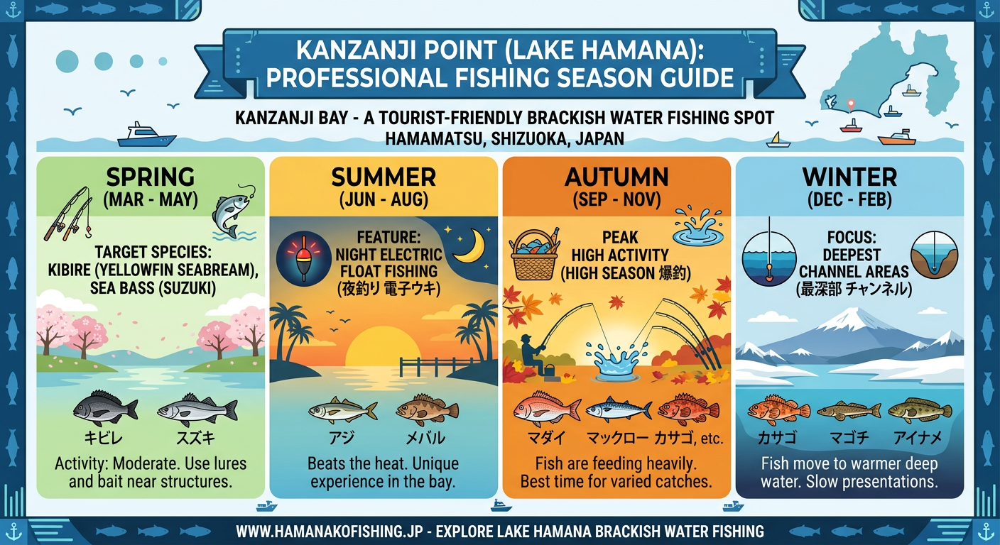

import Map from "@components/Map.astro";
import GMapButton from "@components/GMapButton.astro";

『釣！浜名湖』をご覧いただきありがとうございます！

今回は、奥浜名湖エリアを代表する大人気スポット **「舘山寺（かんざんじ・内浦湾）」** を徹底解説します！

遊園地（浜名湖パルパル）や温泉街に隣接しており、足場の良さとアクセスの利便性は浜名湖トップクラス。初心者からベテランまで、誰もが楽しめる「釣り人のオアシス」的なポイントです。

<Map lat={34.763757} lng={137.623776} name="舘山寺（内浦湾）" />

## 舘山寺（内浦湾）の基本情報

<GMapButton url="https://maps.app.goo.gl/Jpyv2SL8UUHyHBFR7" />

*   **ポイント名**：内浦湾（うちうらわん）／舘山寺エリア
*   **所在地**：静岡県浜松市中央区舘山寺町
*   **アクセス方法**：東名「舘山寺スマートIC」から車で約5分。浜松西ICからも15分程度。
*   **駐車場**：有料・無料駐車場が点在（動物園駐車場が広くて便利。※夜間閉鎖あり）
*   **トイレ**：内浦駐車場、動物園側の遊覧船のりばに公衆トイレあり
*   **近くの釣具店**：はなぞの釣具店
*   **近くのコンビニ**：セブンイレブン浜松舘山寺町店、ファミリーマート舘山寺温泉店

### ポイントの特徴

**1. 観光と釣りのハイブリッドエリア**
遊園地やホテルが立ち並ぶ風景の中で釣りが楽しめます。夜間は街灯も多く、初心者やファミリーでも安心して竿を出せる環境です。

**2. 地形のメリハリ（浅場と航路）**
全体的に浅い場所が多いですが、遊覧船が通る「航路」周辺は水深がガクンと深くなっています。この水深の変化に魚が着いています。

**3. 山側のエキスパートエリア**
「舘山寺山」や「大草山」の麓には、歩いてしか入れない磯場が存在します。アクセスは大変ですが、スレていない大型のキビレやシーバスの実績が抜群です。

**4. 徹底した利便性**
徒歩圏内に複数のコンビニやトイレ、駐車場があり、長時間の釣行でもストレスなく過ごせます。

### 🐟️シーズン別攻略ガイド

*   **🌸 春（4月〜6月）**：キビレ、シーバス
    *   **【攻略】** 4月頃から活性UP。不安定な時期は、湾入口の深み（航路付近）を狙うのがセオリーです。
*   **☀️ 夏（7月〜9月）**：キビレ、クロダイ、ハゼ、ギマ
    *   **【攻略】** 夜の「電気ウキ釣り」が舘山寺の風物詩。青ジャムシを漂わせれば、数・型共に期待大！
*   **🍂 秋（10月〜11月）**：キビレ、クロダイ、シーバス、サヨリ
    *   **【攻略】** 年間で最も賑わう季節。サヨリの回遊があればチャンス！表層から底まで幅広く探りましょう。
*   **❄️ 冬（12月〜3月）**：シーバス、クロダイ
    *   **【攻略】** 厳しい寒さの中、大草山側のディープエリアでじっくり「一発大物」を待つストイックな釣りが熱い。

### ✨️攻略のポイント（エサ・ルアー）

*   **エサ釣り**：夏の夜、自立タイプの電気ウキに「青ジャムシ」をセットするのが最強。オモリを最小限にして自然に漂わせるのが、警戒心の強いキビレを食わせるコツです。
*   **ルアー釣り**：MLクラスのシーバスロッドでPE0.8号前後が標準。底狙いのチニング（ジグヘッド＋ワーム）や、初夏〜秋にかけてのポッパーでのトップゲームが特に面白いエリアです。

## 周辺の観光情報

釣りの合間や帰りに立ち寄りたい観光スポットが目白押しです。

### 1. 浜名湖パルパル＆かんざんじロープウェイ
ファミリーなら遊園地は外せません。ロープウェイで登る「大草山展望台」からの360度パノラマは、釣り場から見るのとはまた違う絶景を楽しめます。

### 2. 舘山寺温泉＆門前通りのグルメ
釣行後の疲れを癒す日帰り温泉や、老舗のうなぎ店、オシャレなカフェが揃っています。ただし、夜間は閉まるのが早いお店が多いので、夕飯は早めの計画が吉です。

## まとめ：観光ついでに本気で狙える「釣り人のオアシス」

舘山寺（内浦湾）は、利便性の高さと魚影の濃さが両立した、浜名湖でも稀有なポイントです。

「家族で旅行に来たついでに少しだけ」という遊び方も、本気で大型を狙うストイックな釣行も、どちらも受け入れてくれる懐の深さがあります。ぜひ、自分なりのスタイルで奥浜名湖の魅力を満喫してください！

> [!WARNING]
> **最後にお願い！**
> 
> 観光地ゆえに歩行者や観光客が非常に多い場所です。キャスト時は**必ず後方の安全確認**を徹底しましょう。
> また、ゴミの持ち帰りはもちろん、来た時よりも綺麗な釣り場を心がけ、いつまでもここで釣りができるようマナーを守って楽しみましょう！
