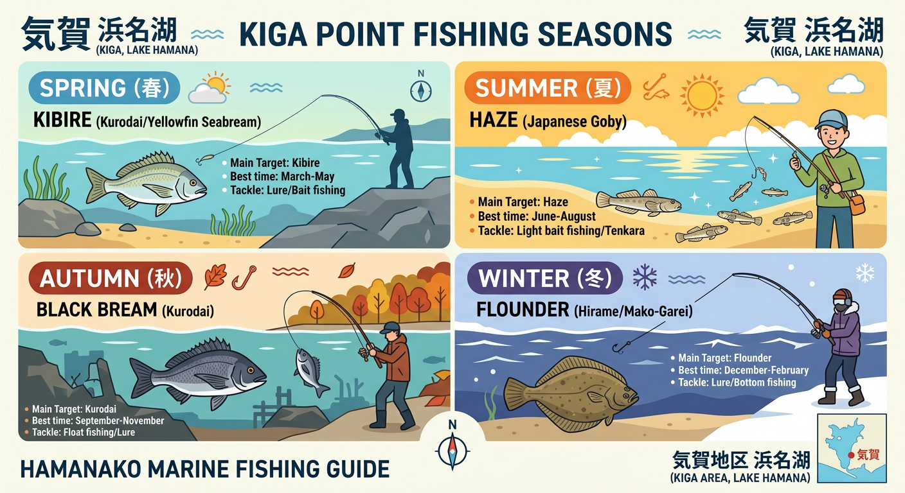

import Map from "@components/Map.astro";
import GMapButton from "@components/GMapButton.astro";

『釣！浜名湖』をご覧いただきありがとうございます！

今回は、奥浜名湖の穏やかな入江に突き出た **「気賀・プリンス岬（五味半島）」** を徹底解説します！

沿岸部は非常に浅く、夏から秋にかけてハゼやキビレの数釣りが楽しめるファミリーフィッシングの聖地。一方で、沖の深場にはカレイや大型のシーバスが潜む、初心者からベテランまで懐の深いポイントです。

<Map lat={34.799207} lng={137.623744} name="気賀（プリンス岬周辺）" />

## 気賀（プリンス岬）の基本情報

<GMapButton url="https://maps.app.goo.gl/3Lf1xgxd24r3i8ot8" />

*   **ポイント名**：気賀（きが）／プリンス岬（五味半島）
*   **所在地**：静岡県浜松市浜名区細江町気賀
*   **アクセス方法**：東名「三ヶ日IC」または「舘山寺スマートIC」から車で約15分。
*   **駐車場**：西気賀駅周辺のスペースを利用（沿岸部の路上駐車は厳禁）
*   **トイレ**：西気賀駅、または周辺の公園にあり
*   **近くの釣具店**：植むら釣具店
*   **近くのコンビニ**：セブン-イレブン 細江気賀店、ファミリーマート 細江気賀店

### ポイントの特徴

**1. ファミリーフィッシングの聖地**
足場が非常に良く、波も穏やか。夏場は水遊びついでにハゼ釣りが楽しめるため、お子様連れの釣りデビューに最適な環境が整っています。

**2. 沖を狙えば大物のチャンス**
手前は浅いですが、フルキャストで届く範囲には深場（航路）が隣接しています。冬場はカレイ、夜間はブッコミ釣りで良型のキビレやシーバスの実績が高いポイントです。

**3. 夜釣りの「癒やし」スポット**
街灯は少ないものの、周囲が静かなため夜の電気ウキ釣りに最適です。チンタ（小黒鯛）やセイゴが頻繁にウキを沈めてくれるため、退屈せずに楽しめます。

**4. 駐車ルールに注意**
人気のポイントですが、沿岸部に専用駐車場はありません。西気賀駅の駐車スペースを利用し、近隣住民の迷惑になる路上駐車は絶対に避けましょう。

### 🐟️シーズン別攻略ガイド

**【春】キビレ、シーバス**
水温が上がるにつれ、深場から浅場へと大型のキビレやシーバスが差し込んできます。少し沖をブッコミ釣りで狙うのがセオリーです。

**【夏】ハゼ、チンタ、ギマ、セイゴ**
1年で最も賑わう季節。日中はハゼの数釣り、夜は電気ウキでチンタやセイゴと遊ぶのがおすすめ。ギマ（独特な形の魚）もよく混じります。

**【秋】ハゼ、クロダイ、シーバス**
ハゼ釣りの最盛期！8月後半から10月にかけては、どこでもアタリがあるお祭り状態になります。夜はルアーでのチニングも面白い時期です。

**【冬】カレイ、キビレ**
基本的にはオフシーズンに近いですが、投げ釣りで「戻りカレイ」を狙うファンも。ボートがあれば沖の深場で粘る価値があります。

### ✨️攻略のポイント（エサ・ルアー）

*   **エサ釣り**：夏のハゼ狙いなら、延べ竿に赤ムシや青ジャムシの「ミャク釣り」が一番。夜の数釣りなら「飛ばし電気ウキ」を使い、ウキ下を1m前後に設定して広範囲を漂わせましょう。
*   **ルアー釣り**：岸が浅いのでウェーディングが有利。7g前後のジグヘッド＋ワームでのチニングが基本。底の砂地を丁寧にズル引くと、キビレや思わぬ良型クロダイがヒットします。

## 周辺の観光情報

### プリンス岬（五味半島）とは？
**歴史・由来**：正式名称は「五味半島」ですが、上皇御一家（当時は皇太子）が半島の別荘で何度も静養されたことから「プリンス岬」と呼ばれるようになりました。現在の天皇陛下も、幼少期にこの地で地域住民と温かな交流をされたというエピソードが残っています。

**散策**：1周約15分ほどで回れる小さな半島です。湖岸には整備された散策路があり、奥浜名湖特有の穏やかで美しい風景を間近に楽しめます。

**ロケ地**：NHKの連続テレビ小説「とと姉ちゃん」の撮影地としても使われました。懐かしい風景を求めてファンが訪れることもあります。

## まとめ：奥浜名湖の穏やかさを象徴する「癒やし」の岬

気賀エリアは、派手な大物釣りよりも「誰でも、のんびりと、アタリを楽しめる」場所です。

大物狙いをするならボートが必須レベルですが、100m以上遠投する自信があるなら、陸からでも不可能じゃありません。むしろ小物狙いの最中に来た時こそ、スリリングなファイトが楽しめます。

皇室ゆかりの歴史を感じながら、穏やかな湖面を眺めて竿を出す時間は、他では味わえない贅沢なひととき。ルールとマナーを守って、奥浜名湖の魅力を存分に味わってください！

> [!WARNING]
> **最後にお願い！**
> 
> 沿岸部の生活道路への路上駐車は、地域の方々にとって非常に大きな迷惑となります。必ず指定の駐車スペースを利用しましょう。
> また、ゴミの持ち帰りはもちろん、来た時よりも綺麗な釣り場を心がけ、いつまでもここで釣りができるようマナーを守って楽しみましょう！
