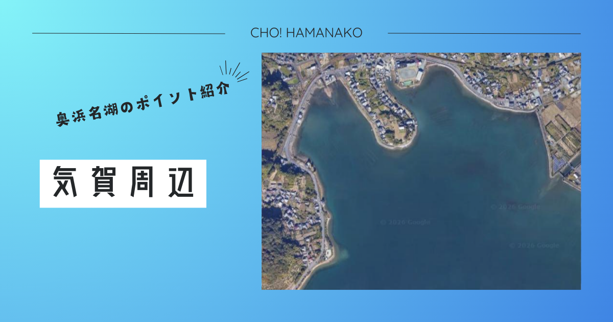

import Map from "@components/Map.astro";
import GMapButton from "@components/GMapButton.astro";
import BlogCard from "@components/BlogCard.astro";
import Callout from "@components/Callout.astro";

「釣！浜名湖」へようこそ！

今回ご紹介するのは、奥浜名湖の穏やかな入江に優雅に突き出た、歴史とロマンが交差する聖地 <strong>「気賀（きが）・プリンス岬（五味半島）」</strong> です。

この場所は、かつて上皇ご夫妻（当時は皇太子ご夫妻）が何度も静養に訪れたことから「プリンス岬」という愛称で親しまれるようになりました。NHK連続テレビ小説『とと姉ちゃん』のロケ地にも選ばれたほど、その景観は美しく、どこか気品が漂います。しかし、多くのアングラーにとってここは、 <strong>「奥浜名湖で最も確実なハゼ釣りの避難港」</strong> であり、夏の <strong>「チヌトップゲーム」</strong> の熱い戦場でもあります。

まるで時間が止まったかのような静寂の中で、鏡のような湖面に糸を垂らす。そんな贅沢な大人から、歓声を上げる子供たちまでを優しく包み込んでくれる、プリンス岬の魅力を3000文字超の圧倒的ボリュームで解き明かします。

<Map lat={34.799207} lng={137.623744} name="気賀（プリンス岬周辺）" />
<GMapButton url="https://maps.app.goo.gl/r6L6PZqZ9Z9Z9Z9Z9" />

---

## 🔍 ポイント概要：歴史と自然が織りなす「箱庭」のような釣り場

プリンス岬（正式名称：五味半島）は、浜松市浜名区細江町気賀の最深部、細江引佐（ほそえいなさ）エリアにあります。

### 設備と利便性の基本情報
- <strong>駐車場</strong>：五味半島の付け根付近、向山（むかいやま）周辺にわずかな駐車スペースがありますが、 <strong>台数は極めて限定的</strong> です。周辺は道が狭く、農作業車両や近隣住民の生活道路となっているため、 <strong>路上駐車は絶対に厳禁</strong> です。満車の場合は潔く諦め、都田川河口や伊奈（いな）方面へ移動するのがマナーです。
- <strong>補給拠点</strong>：国道257号沿いの <strong>セブン−イレブン 細江気賀店</strong> が便利。ここが「気賀エリアの最終補給地点」となります。
- <strong>釣具店</strong>：このエリアの情報通といえば <strong>「植むら釣具店」</strong> 。奥浜名湖特有の「水温上昇時の魚の動き」や「ハゼのサイズ感」などは、釣行前にここでお聞きするのが一番の近道です。
- <strong>アフターフィッシング</strong>：車で5分の <strong>「気賀関所」や「細江神社」</strong> での歴史散策、あるいはご当地グルメの「うな重」を堪能するプランも、プリンス岬ならではの優雅な過ごし方です。

---

## 🌊 水中構造とポイント：天然の「マザー・レイク」

プリンス岬が西側にグイッと突き出しているおかげで、その内側の「気賀湾」は、外海や本湖がどれほど荒れていても常に穏やかな <strong>「超静水域」</strong> となっています。

### ① 鏡のような水面と広大な砂泥底
- <strong>水中地形</strong>：底質は非常にきめ細かい「シルト（泥）」と「砂」が混じり合っています。波が立ちにくいため、繊細なウキの動きを読み取る <strong>「ウキ釣り」</strong> には最高、かつ必須の条件が整っています。
- <strong>エサの宝庫</strong>：泥底には <strong>「テッポウエビ」や「ボケ」</strong> 、さらにはハゼの大好物である多毛類が豊富。まさに魚たちの巨大なレストランです。

### ② 水際の「アシ原」とブレイク（かけ上がり）
岸辺には豊かな「アシ（ヨシ）」が群生しており、その複雑な根元は小魚やテナガエビのシェルター（隠れ家）になっています。
- <strong>攻略の鍵</strong>：足元から数メートル先には、目に見えないものの確実な <strong>ブレイクライン</strong> が存在します。ハゼはこの「わずかな深み」に沿って回遊するため、チョイ投げで遠投するよりも、足元から5〜10m付近を丁寧に探る方が釣果が伸びます。

---

## 🐟️ ターゲット別・必勝攻略タクティクス

### 【☀️ 夏 〜 🍁 秋】ハゼ釣り：プリンス岬の「真骨頂」
10cmから、晩秋には15cmを超える立派な「落ちハゼ」まで狙えるポイントです。
- <strong>のべ竿（ウキ釣り）</strong>： <strong>3.6〜4.5mののべ竿</strong> が最適。仕掛けは「玉ウキ」よりも「立ちウキ」の方がアタリが見やすく、感度も高まります。
- <strong>エサの選択</strong>： <strong>「赤イソメ（ゴールドイソメ）」</strong> が圧倒的に強いです。5mm〜1cm程度に切り、ハリ先を少し出すのが「気賀流」の掛け方。
- <strong>関連記事</strong>： <BlogCard slug="haze" />

### 【🌙 夜間】セイゴ・キビレ：街灯の下での駆け引き
夜になると、岸沿いの街灯に誘われて <strong>「セイゴ（マダカ）」や「キビレ」</strong> がシャローへ差してきます。
- <strong>電気ウキ釣り</strong>：青イソメの一本掛けで、ゆっくりと仕掛けを漂わせます。水面に引き込まれる赤い光の余韻は、夜釣り最大の醍醐味。
- <strong>ルアーゲーム</strong>：3〜5gのジグヘッドにピンテールワームをセット。表層をスローにリトリーブすると、セイゴの鋭いバイトが伝わります。

### 【🌸 夏】チヌトップゲーム：静寂を切り裂く水しぶき
湖面が鏡のように凪（なぎ）になる朝マズメは、 <strong>「チヌトップ」</strong> の黄金タイム。
- <strong>タクティクス</strong>：他人の足音やキャスト音に非常に敏感なエリアです。静かにアプローチし、小型のポッパー（ <strong>RAポップ</strong> 等）で「チャプッ」と優しいポップ音を立てた後、長めのポーズを入れると、下からキビレが突き上げてきます。

---

## ⚠️ 【最重要】命を守る「すり足」と格式高いマナー

プリンス岬は素晴らしい場所ですが、アングラーに課せられた義務も重いです。

1. <strong>【超危険】アカエイの産卵・生息密度MAX</strong>：砂泥底の浅瀬は <strong>アカエイ</strong> の宝庫です。
   - <strong>絶対厳守</strong>：原則としてウェーディング（立ち込み）は推奨しませんが、どうしても水に入る場合は、絶対に足を地面から離さない <strong>「すり足（シャッフル歩行）」</strong> を徹底してください。不用意な一歩が、猛毒のトゲによる大事故を招きます。
2. <strong>沈み込む「底なし沼」のような泥</strong>：一部、足が15cm以上ズブズブと沈み込む非常に柔らかい泥地があります。足を取られて倒れると非常に危険ですので、必ず足元の硬さを確認しながら移動してください。
3. <strong>路上駐車の厳禁</strong>：このポイントは、地域の皆様の生活圏内です。路上駐車は即座に通報・トラブルの原因となり、 <strong>「ポイントそのものの閉鎖」</strong> を引き起こします。
4. <strong>ゴミの完全回収</strong>：歴史的な景勝地としての品位を損なわないよう、一切のゴミを残さない「完全撤退」を心がけましょう。

---

## 🚀 まとめ：優雅に、そして真剣に。奥浜名湖の深淵を釣る

気賀・プリンス岬での釣りは、ただ魚を獲るだけではない、特別な体験です。

- <strong>ハゼ釣り</strong> の純粋な楽しさと、確かな釣果。
- <strong>鏡の湖面</strong> がもたらす、時空が歪んだような静寂。
- <strong>歴史の重み</strong> を感じながら過ごす、上質な休日。

ルールを守り、地元の皆様へのリスペクトを忘れずに。穏やかな水面に癒やされながら、今年のフィッシングライフを飾る最高の「一匹」に出会ってください。

---

<BlogCard slug="miyakodagawa" />
すぐ隣、都田川河口のダイナミックな釣り場の解説はこちら。

<BlogCard slug="ina" />
自転車で行く、不便ゆえの爆釣ポイント「伊奈」へのガイド。
