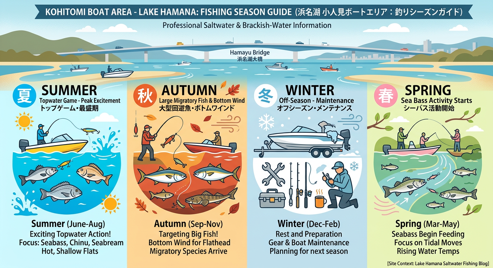

import Map from "@components/Map.astro";
import GMapButton from "@components/GMapButton.astro";
import TackleCard from "@components/TackleCard.astro";

『釣！浜名湖』をご覧いただきありがとうございます！

今回は、はまゆう大橋の北東側に広がる広大な浅瀬 **「古人見（こひとみ）ボートエリア」** をご紹介します！

古人見エリアは、一面に広がる明るい砂地と、非常に浅い水深が特徴的なシャローエリアです。夏の太陽の下、水面を猛烈に追ってくるチヌの姿を目視しながら釣るスタイルは、浜名湖ボートゲームの真骨頂！

<Map lat={34.732697} lng={137.634688} name="古人見ボートエリア" />

## 古人見エリアの基本情報

<GMapButton url="https://www.google.com/maps/search/?api=1&query=34.732697,137.634688" />

*   **ポイント名**：古人見ボートエリア
*   **所在地**：静岡県浜松市中央区古人見町
*   **駐車場**：ボートの場合は各マリーナへ。陸からの場合は公共マリーナ「はまゆうマリーナ」から徒歩でランガンが可能です。
*   **近くの釣具店**：はなぞの釣具店
*   **近くのコンビニ**：セブン-イレブン 浜松佐浜町店

### ポイントの特徴

**1. 夏のシャロートップの王道**
砂地で身を隠す場所が少ないため、魚は回遊を頻繁に行います。水面を割って出るチヌやシーバスのバイトシーンは圧巻！

**2. サイトフィッシングの聖地**
透明度の高い時期は、泳いでいるクロダイやキビレを直接狙う「サイトフィッシング」が可能です。プロペラを傷めないよう浅瀬の操船には注意しましょう。

### 🐟️シーズン別攻略ガイド

*   **🌸 春（4月〜6月）**：シーバス、キビレ
    *   **【攻略】** 活性の上がり始めた魚たちがシャローに差してきます。

<TackleCard id="seabass/shimano-exsence-silent-assassin-99f" />

*   **☀️ 夏（7月〜9月）**：クロダイ、キビレ（トップ全盛期）
    *   **【攻略】** 古人見の真骨頂！明るい砂地のシャローで、水面を割るエキサイティングなトップゲームを。

<TackleCard id="kibire/ima-chappy-80" />
<TackleCard id="kurodai/shimano-bremia-risewalk-65f" />

*   **🍂 秋（10月〜11月）**：キビレ、マゴチ、シーバス
    *   **【攻略】** ボトムワインドが火を吹く季節。フラットな地形の底を丁寧に叩き、良型を引き出します。

<TackleCard id="kibire/keitech-crazy-flapper-2-8" />
<TackleCard id="flatfish/keitech-easy-shiner-4-gold-flash-minnow" />

## おすすめタックルと釣り方

*   **対象魚**：クロダイ、キビレ、シーバス
*   **釣り方**：ボートルアー（トップウォーター中心）

精密なキャストとアクションが求められるため、7ft前後のチニングロッドやシーバスロッドが扱いやすいです。

<TackleCard id="kibire/shimano-bremia-bb-s78ml" />
<TackleCard id="kurodai/daiwa-silver-wolf-air-76ml-s-q" />

## 周辺の観光情報

### 浜名湖ガーデンパーク
古人見の南側（村櫛方面）に位置する広大な都市公園です。展望塔からの絶景や季節の花々が楽しめます。

<TackleCard id="travel/rakuten-travel-stay" />

## まとめ：砂地のシャローで出会う感動の一撃

古人見エリアは、澄んだ水と砂地のコントラストが美しく、まさに「リゾートフィッシング」気分を味わえるポイントです。マナーを守り、エキサイティングなシャローゲームを楽しんでください！

> [!WARNING]
> **最後にお願い！**
> 
> 陸から釣りをする場合は、周辺の住宅やマリーナ利用者の迷惑にならないよう駐車には十分注意しましょう。「はまゆうマリーナ」からのランガンがお勧めです。
