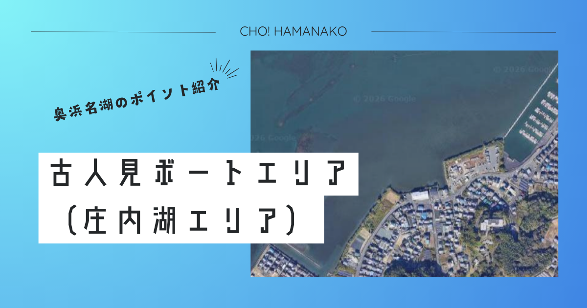

import Map from "@components/Map.astro";
import GMapButton from "@components/GMapButton.astro";
import BlogCard from "@components/BlogCard.astro";
import Callout from "@components/Callout.astro";

「釣！浜名湖」へようこそ！

今回ご紹介する <strong>「古人見（こひとみ）ボートエリア」</strong> は、浜名湖東岸「はまゆう大橋」の北東に広がる、庄内湖（しょうないこ）屈指の巨大なシャローエリアです。

釣り人たちの間でここは、敬意を込めて <strong>「浜名湖のカリブ海」</strong> と呼ばれています。その理由は、一面に広がるホワイトサンド（白い砂地）と、底まで見通せる抜群の透明度。夏の太陽が真上から照りつける時、砂地の上を悠々と泳ぐクロダイの群れを肉眼で確認しながら一対一の勝負を挑む <strong>「サイトフィッシング」</strong>。その興奮と快感は、他のどのポイントでも味わえない古人見だけの特権です。

3000文字超の特大ボリュームで、この美しくもスリリングな「砂の戦場」の攻略法を詳解します。

---

## 🧭 ポイント概要：広大な「砂の砂漠」の歩き方

古人見エリアを攻略するための第一歩は、この場所の「広大さ」と「浅さ」を理解することです。

### ① ボート・ウェーディングの独壇場
古人見の沿岸部は <strong>浜名湖ガーデンパーク</strong> や住宅地に接しており、陸っぱりからのエントリーは非常に限定されます。
- <strong>アクセス</strong>： <strong>「はまゆうマリーナ」</strong> を利用するのが最短ですが、村櫛や舘山寺からも至近距離。ボートを出せば、わずか数分で「無人のシャロー」へ辿り着けます。
- <strong>環境の特殊性</strong>：水深が常に <strong>50cm〜1m前後</strong> という超浅瀬が数百メートルにわたって続くため、大型船が近寄れず、エンジン音のプレッシャーが極めて低いのが強みです。

### ② 潮通しと透明度の相関
庄内湖の入り口に位置するため、和地などの最奥部に比べると潮の入れ替えがスムーズです。
- <strong>攻略のヒント</strong>：下げ潮のタイミングでは、庄内湖奥部の濁った水が流れてくることがありますが、上げ潮のタイミングでは澄んだ水が入り込み、 <strong>「サイトフィッシング」</strong> の絶好のチャンスが訪れます。

---

## 🌊 水中構造と「古人見」攻略の黄金比

単調な砂地に見えて、実は戦略的な「変化」が各所に潜んでいます。

### A. アマモ（海草）パッチの重要性
砂地の所々に、 <strong>アマモ（リュウグウノオトヒメノモトユイノキリハズシ）</strong> がポツポツと群生している場所があります。
- <strong>特徴</strong>：何もない砂地は、魚にとって「丸見え」の危険地帯。彼らはアマモのパッチを拠点にし、そこをストラクチャーとして移動します。
- <strong>狙い所</strong>：アマモの「切れ目」や「濃くなっている場所」を偏光グラスで見つけ、その周囲にルアーを送り込むのが古人見の基本戦略です。

### B. 「はまゆう大橋」が作る澪筋（みおすじ）
橋の周辺は、船が通るために人工的に掘られた「澪筋」があり、急激に水深が落ち込みます。
- <strong>タクティクス</strong>：シャローに生命感がない時は、このブレイク（かけ上がり）に魚が落ちていることが多いです。 <strong>バイブレーション</strong> 等で一段深い層を探ってみましょう。

---

## 🎣 ターゲット別・必勝タクティクス

### 【☀️ 夏：6月〜8月】クロダイ・キビレ：沈黙を破るトップウォーター
古人見が「聖地」である最大の理由。
- <strong>サイトフィッシングの極意</strong>：魚を見つけたら、ルアーを直接魚に投げないこと。魚の進行方向の3〜5m先に <strong>「静かに」</strong> 着水させ、魚がルアーに気づくまで待つ、あるいは僅かな波紋で気づかせる。
- <strong>興奮の瞬間</strong>：ルアーに気づいたチヌが、背びれを水面から出して猛追（チェイス）してくる瞬間。焦ってアクションを早めず、一定のリズムを保つことがヒットへの近道です。

### 【🍂 秋：9月〜10月】マゴチ・大型ハゼ：砂地の忍者
- <strong>マゴチ</strong>：砂に擬態して潜んでいます。 <strong>「ボトムワインド」</strong> で砂を巻き上げ、リアクションで食わせる釣りが最高に面白いエリアです。
- <strong>大型ハゼ</strong>：20cmを超える通称 <strong>「メガハゼ」</strong> が、秋の深まりとともに砂地に群れます。ボートから繊細なタックルで狙う「ハゼクラ」も近年大人気です。

---

## ⚠️ 【最重要警告】古人見エリアの「死の罠」とマナー

天国のような景色とは裏腹に、生命の危険と隣り合わせのルールが存在します。

> [!CAUTION]
> <strong>【命に関わる】「アカエイ」の超・密集地帯！エイガードは必須</strong>
> 古人見の砂地は、 <strong>浜名湖で最もアカエイの遭遇率が高い「ワースト10」入りの危険地帯</strong> です。
> - 砂に同化して隠れているエイを踏むと、尾にある猛毒の棘が足首やふくらはぎを貫通します。
> - <strong>「すり足（シャッフル歩行）」</strong> を1cmたりとも忘れないでください。
> - アンカリングして水中に降りる際は、 <strong>「エイガード」</strong> を着用しないのは「自殺行為」に等しいと心得てください。

> [!WARNING]
> <strong>【座礁の恐怖】刻々と変わる砂州（さす）の形</strong>
> 古人見のシャローは台風や大雨のたびに「砂州」の形が変わります。
> - 昨日まで通れた場所が今日は「陸」になっていることも珍しくありません。
> - <strong>エンジン保護</strong>：船外機のプロペラを砂で研磨し、破損させる事故が絶えません。水深が30cmを切る場所ではチルトアップし、エレキモーターや手漕ぎに切り替えましょう。

> [!IMPORTANT]
> <strong>【航路のルール】はまゆう大橋の交通を妨げない</strong>
> 橋の下はボートの重要航路です。
> - 橋周辺でアンカリングして釣りをすると、他船の航行の邪魔になり、衝突事故の危険があります。
> - 橋脚や航路標識からは十分な距離を保ち、安全な位置でロッドを振ってください。

---

## 🚀 まとめ：白い砂のステージで、自分だけの「答え」を

古人見ボートエリアでの釣りは、ただ魚を釣るという行為を超えた、 <strong>「視覚・知略・技術」</strong> の全てを動員する最高の知恵比べです。

- <strong>圧倒的な透明度</strong> が生む、魚とのダイレクトな対峙。
- <strong>サイトフィッシング</strong> でしか得られない、脳を揺らす快感。
- <strong>広大な砂地</strong> で一匹を探し出す、探検のようなワクワク。

マナーを遵守し、エイの脅威を正しく恐れ、自然への畏敬の念を忘れずに。今年の夏、古人見の「白いステージ」で、あなたのアングラーとしての歴史に刻まれる最高のドラマを完結させてください！

---

<BlogCard slug="murakushi-fishing-port" />
ここ古人見への最短アクセス拠点。マリーナ利用の際はこちらも要チェック。

<BlogCard slug="shiras-boat" />
近隣の「白洲エリア」と古人見をランガンするのが、庄内湖攻略の必勝リレーです。
