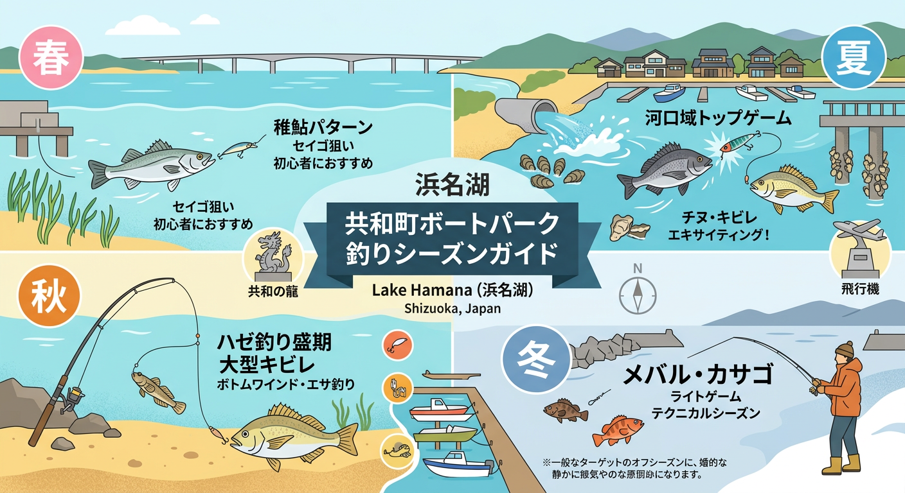

import Map from "@components/Map.astro";
import GMapButton from "@components/GMapButton.astro";
import TackleCard from "@components/TackleCard.astro";

『釣！浜名湖』をご覧いただきありがとうございます！

今回は、はまゆう大橋の西側に位置する **「協和町（きょうわちょう）ボートエリア」** をご紹介します！

複数の小川が流れ込む汽水域で、全体的に水深が浅くフラットな地形が続くポイントです。ボートからの機動力があれば、年間を通して安定した釣果が期待できる実力派のエリアです。

<Map lat={34.735418} lng={137.612734} name="協和町ボートエリア" />

## 協和エリアの基本情報

<GMapButton url="https://www.google.com/maps/search/?api=1&query=34.735418,137.612734" />

*   **ポイント名**：協和町ボートエリア（はまゆう大橋西側）
*   **所在地**：静岡県浜松市中央区協和町
*   **近くの釣具店**：はなぞの釣具店
*   **近くのコンビニ**：ファミリーマート 浜松庄和町店

### ポイントの特徴

**1. 夏から秋のチヌ・シーバスゲーム**
広大なシャロー帯でのトップゲームが非常に盛んです。沿岸近くではトップでチヌを狙い、水深のある養殖棚付近ではシーバスを狙うといった使い分けが効果的です。

**2. 陸からもチャンスあり（投げ釣り・ハゼ）**
ボートが有利なエリアですが、各小川の河口付近ではハゼ釣り、また一部の護岸からは投げ釣りも可能です。

### 🐟️シーズン別攻略ガイド

*   **🌸 春（4月〜6月）**：セイゴ、キビレ
    *   **【攻略】** 稚アユの動きに合わせ、シーバスの幼魚が活性化します。
*   **☀️ 夏（7月〜9月）**：クロダイ、キビレ
    *   **【攻略】** トップゲームがメイン！

<TackleCard id="kibire/ima-chappy-80" />
<TackleCard id="kurodai/shimano-bremia-risewalk-65f" />

*   **🍂 秋（10月〜11月）**：キビレ、マゴチ、ハゼ
    *   **【攻略】** ボトムワインドでキビレを、エサ釣りでは良型のハゼを狙える季節です。

<TackleCard id="kibire/keitech-crazy-flapper-2-8" />
<TackleCard id="haze/sasame-choi-haze-set-5go" />

## 周辺の観光情報

### 浜名湖ガーデンパーク
協和町から南側（村櫛方面）へ車を走らせるとすぐに到着します。花と緑に囲まれた広大な公園です。

<TackleCard id="travel/rakuten-travel-stay" />

## まとめ：奥浜名湖の不思議なランドマークと大物を狙う

協和町エリアは、独特なオブジェの景観を楽しみながら、庄内湖の豊かなポテンシャルを満喫できる場所です。自分なりの「黄金パターン」を見つけ出してください！

> [!WARNING]
> **最後にお願い！**
> 
> 養殖棚の近くを通る際は、波を立てないようスロー走行を心がけましょう。マナーを守って、スマートなボートゲームを楽しんでください！
