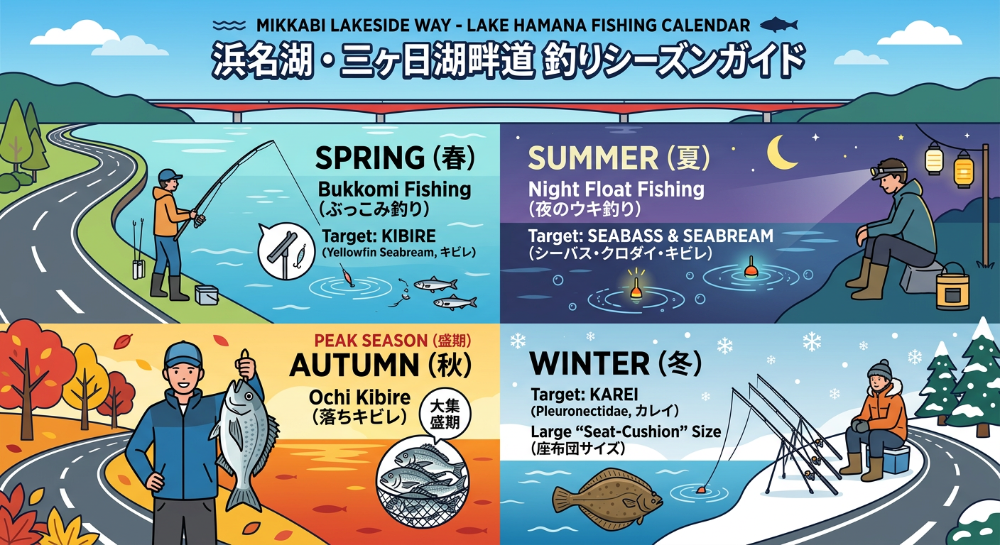

import Map from "@components/Map.astro";
import GMapButton from "@components/GMapButton.astro";
import TackleCard from "@components/TackleCard.astro";

『釣！浜名湖』をご覧いただきありがとうございます！

今回ご紹介するのは、三ヶ日ICから猪鼻湖の東側沿いを走る絶景ロード **「浜名湖レークサイドウェイ」** 周辺のポイントです！

抜群のアクセスと、投げ釣りが思い切り楽しめることで非常に人気の高いスポットです。秋から冬にかけては、浜名湖名物の「座布団カレイ」や大型キビレを狙う投げ釣り師が集まります。

<Map lat={34.772695} lng={137.561088} name="レークサイドウェイ周辺" />

## レークサイドウェイ周辺の基本情報

<GMapButton url="https://maps.app.goo.gl/YLae2L9zW5rEYTZF6" />

*   **ポイント名**：浜名湖レークサイドウェイ周辺（猪鼻湖東側）
*   **所在地**：静岡県浜松市浜名区三ヶ日町大崎
*   **アクセス方法**：東名高速「三ヶ日IC」から車で約3分。
*   **駐車場**：レークサイドウェイ沿いに数台停められるスペースが点在しています。
*   **近くの釣具店**：えさや小寺、フィッシングジョイ

### ポイントの特徴

**1. 投げ釣りの大人気スポット**
広々と投げることができるため、カレイやキビレ狙いの投げ釣り師に非常に愛されています。80mも投げれば水深5m超になる急深な地形が魅力です。

**2. 落ちキビレとカレイの好ポイント**
秋（10月頃）から冬にかけて、深場へ移動していく「落ちキビレ」の通り道になっており、同時にカレイシーズンも楽しめる熱い時期を迎えます！

### 🐟️シーズン別攻略ガイド

*   **🌸 春（4月〜6月）**：冬眠明けのキビレ
    *   **【攻略】** 動き出したキビレを投げ釣りで。
*   **☀️ 夏（7月〜9月）**：キビレ、チンタ
    *   **【攻略】** 夜の電気ウキ釣りが楽しい時期。

<TackleCard id="kibire/ima-chappy-80" />

*   **🍂 秋（10月〜11月）**：落ちキビレ、カレイ、サヨリ
    *   **【攻略】** レークサイドウェイのメインシーズン！投げ釣り（ブッコミ）で大物を狙いましょう。

<TackleCard id="karei/daiwa-prime-surf-t25-405-w" />

*   **❄️ 冬（12月〜3月）**：座布団カレイ
    *   **【攻略】** 肉厚なカレイを待つ投げ釣り師の聖地。

<TackleCard id="karei/sasame-canon-ball-karei" />

## おすすめタックルと釣り方

*   **対象魚**：カレイ、キビレ、クロダイ、シーバス
*   **釣り方**：エサ釣り（投げ釣り・ブッコミ釣り）

オモリ負荷20号程度の投げ竿と天秤仕掛けを使用して、深場の泥底をじっくり探るのがコツです。

<TackleCard id="karei/daiwa-prime-surf-t25-405-w" />

## 周辺の観光情報

### 長坂養蜂場
瀬戸からすぐの場所にある超人気のはちみつ専門店。はちみつソフトクリームは絶品です。

<TackleCard id="travel/rakuten-travel-stay" />

## まとめ：投げ釣り師の聖地、レークサイドウェイ

レークサイドウェイ周辺は、三ヶ日ICからの近さと、奥浜名湖の深場を効率よく狙えるポイントとして非常に優秀です。特に冬場のカレイ狙いは、浜名湖の中でも屈指の実績ポイントです。

> [!WARNING]
> **最後にお願い！**
> 
> ゴミの放置は厳禁。また、交通量もそれなりにある道路ですので、駐車場所や歩行には十分注意して楽しみましょう！
