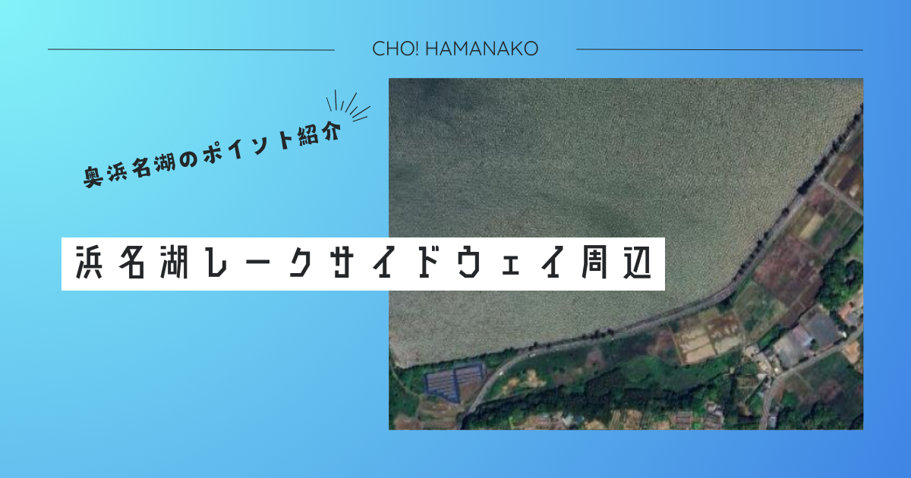

import Map from "@components/Map.astro";
import GMapButton from "@components/GMapButton.astro";
import BlogCard from "@components/BlogCard.astro";
import Callout from "@components/Callout.astro";

「釣！浜名湖」へようこそ！

今回ご紹介する <strong>「浜名湖レークサイドウェイ周辺」</strong> は、奥浜名湖・三ヶ日エリアを愛するアングラーにとって、まさに <strong>「特等席」</strong> とも呼べるポイントです。

猪鼻湖（いのはなこ）の東岸を南北に貫くこのルート沿いは、水深の変化に富み、 <strong>「投げ釣りの聖地」</strong> として長年親しまれてきました。舗装されたきれいな歩道から、猪鼻湖の穏やかな水面に向かって仕掛けをキャストする開放感。そして、冬には <strong>40cmを超える「座布団級」のカレイ</strong> が、秋には <strong>30cmに迫る「ジャンボサヨリ」</strong> が回遊してくるという、見た目の穏やかさからは想像もつかない実力派フィールドです。

「三ヶ日IC」からすぐという抜群の利便性と、家族連れでも楽しめる足場の良さ。この「レークサイドウェイ周辺」の魅力を、3000文字超の圧倒的ボリュームで余すところなく徹底解説します！

---

## 🧭 ポイント概要：絶景ドライブコースが「巨大な釣り桟橋」に

レークサイドウェイ沿いが釣り場として優れている理由は、その <strong>「アクセスの簡便さ」</strong> と <strong>「魚道の近さ」</strong> に集約されます。

### ① インター至近の「クイック・エントリー」
東名高速道路 <strong>「三ヶ日IC」</strong> から車でわずか数分。遠方からの遠征組にとっても、地元の朝練アングラーにとっても、これほどストレスなく到着できるポイントは珍しいでしょう。
- <strong>補給拠点</strong>： <strong>「ファミリーマート 三ヶ日インター店」</strong> や、地元釣具の重鎮 <strong>「えさや小寺」</strong> がすぐ近くにあり、エサの調達から食料の確保まで隙がありません。

### ② 駐車場と「釣り座」のパッケージング
レークサイドウェイ沿いには、小規模ながら車を停められる待避スペースや駐車スペースが点在しています。
- <strong>特徴</strong>：車を停めてから、数メートルで護岸（歩道）に出られるため、重いクーラーボックスや複数の投げ竿を持参するベテランアングラーにはたまらない環境です。

### ③ 穏やかな「猪鼻湖」の恩恵
猪鼻湖は、浜名湖の中でも特に閉鎖的で波が立ちにくい水域です。
- <strong>メリット</strong>：強風の日でも、レークサイドウェイ周辺は釣りが成立することが多く、 <strong>「せっかく来たのに釣りができない」</strong> というリスクを最小限に抑えられます。

---

## 🌊 水中構造とポイントの特徴：カケ上がりの「段差」を撃て

見た目は単調な護岸に見えるレークサイドウェイ周辺ですが、水中には魚を引き寄せる明確な構造が存在します。

### 攻略の鍵：30m〜50mラインの「深み」
足元から数メートルは極めて浅いですが、フルキャストせずとも届く30m〜50mの範囲に、水深が一段階深くなる <strong>「ブレイクライン（カケ上がり）」</strong> があります。
- <strong>ターゲットの溜まり場</strong>：冬のカレイや秋のキビレは、この段差に沿って移動します。仕掛けを常に「斜面の底」へ落ち着かせることが、釣果を倍増させる最大のコツです。

### 潮通しの良い「首根っこ」
レークサイドウェイは、猪鼻湖の中でも「瀬戸（せと）」に近い南側から、奥まった北側まで広がっています。
- <strong>南側（瀬戸寄り）</strong>：潮の流れが速く、 <strong>シーバス（セイゴ）や良型クロダイ</strong> の回遊が活発。
- <strong>北側（奥地寄り）</strong>：さらに潮が穏やかになり、 <strong>ハゼやサヨリ</strong> が溜まりやすい溜まり場となります。

---

## 🎣 ターゲット別・必勝攻略ガイド

### 【❄️ 冬：11月〜2月】カレイ：奥浜名湖の真の醍醐味
レークサイドウェイを「聖地」たらしめているターゲットです。
- <strong>タクティクス</strong>： <strong>「ブッコミ釣り」</strong> で狙います。竿を3本ほど出し、エサは <strong>アオイソメの房掛け</strong> か、高級エサの <strong>イワイソメ（岩デコ）</strong> を混ぜるのが必勝法。40cmを超える「座布団サイズ」が掛かった時の、あの重戦車のような引きは一度味わうと病みつきになります。

### 【🍂 秋：9月〜11月】サヨリ：銀色の弾丸を追う
秋のレークサイドウェイを彩るのがサヨリの群れです。
- <strong>タクティクス</strong>： <strong>「サヨリ専用シモリ浮き仕掛け」</strong> を使い、水面直下を狙います。寄せエサ（コマセ）を少しずつ撒き、群れを足留めするのがコツ。30cm級の「ジャンボサヨリ」は刺し身でも天ぷらでも絶品です。

---

## ⚠️ 【重要】歩行者の安全確認と「エイ」への厳戒態勢

ここは「道路」であり「散歩道」でもあります。釣り場を守るためのルールを徹底しましょう。

> [!CAUTION]
> <strong>【キャスト時の警告】後方確認は「1キャスト1確認」</strong>
> レークサイドウェイの歩道は、 <strong>サイクリングやウォーキングを楽しむ一般の方</strong> が頻繁に通ります。
> - <strong>「投げ釣りの振りかぶり」</strong> は、後ろを通る人にとって非常に危険です。投げる前には必ず後ろを振り返り、完全に安全であることを確認してください。釣り竿の長さや仕掛けの軌道を考えた十分なスペース確保をお願いします。

> [!IMPORTANT]
> <strong>【生命の安全】アカエイの「すり足」歩行</strong>
> 砂泥底が続くこのエリアは、 <strong>アカエイの生息密度が極めて高い</strong> 場所です。
> - もし水際へ降りる、あるいはアンカリングをする際は、絶対に足を上げずに底を這わせて歩く <strong>「すり足」</strong> を徹底してください。トゲに刺されると激痛とともに重症化する恐れがあります。

---

## 🚀 まとめ：猪鼻湖の「開放感」を味方に、最高の釣行を

浜名湖レークサイドウェイ周辺は、日常の忙しさを忘れ、猪鼻湖の絶景を眺めながらゆったりと竿を出せる、アングラーにとっての <strong>「心の拠り所」</strong> です。

- <strong>「座布団カレイ」</strong> への夢。
- <strong>「ジャンボサヨリ」</strong> との知恵比べ。
- <strong>「抜群の足場」</strong> がもたらすリラックス。

マナーを重んじ、安全装備を固め、周囲の観光客やウォーキングを楽しむ方々への配慮を忘れずに。奥浜名湖・三ヶ日の穏やかな風に吹かれながら、あなた自身の「最高の一匹」をこのレークサイドウェイで手にしてください！

---

<BlogCard slug="setosuidou" />
レークサイドウェイの南端。猪鼻湖の入り口「瀬戸」の強烈な潮流を活かした戦略を比較。

<BlogCard slug="mikkabi-eki" />
ここから車で数分。より地域密着型の「三ヶ日駅前」ポイントでのんびり釣るならこちら。
