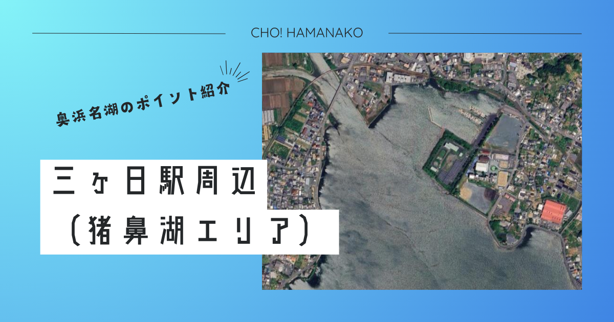

import Map from "@components/Map.astro";
import GMapButton from "@components/GMapButton.astro";
import BlogCard from "@components/BlogCard.astro";
import Callout from "@components/Callout.astro";

「釣！浜名湖」へようこそ！

今回ご紹介するのは、猪鼻湖（いのはなこ）の最北端に位置し、奥浜名湖ののどかな風景を象徴する癒やし度NO.1のポイント <strong>「三ヶ日（みっかび）駅周辺」</strong> です。

登録有形文化財にも指定されているノスタルジックな駅舎「三ヶ日駅」。そのすぐ裏手には、波一つない鏡のような猪鼻湖の湖面が広がっています。ここは水深が非常に浅く、外海や本湖の荒れとは無縁の「天然のサンクチュアリ」。お子様連れのファミリーや、のんびりと釣りを楽しみたいビギナーにとって、これ以上に心休まるフィールドは他にありません。

ガタンゴトンと走る天竜浜名湖鉄道の音を背に、静かに糸を垂らす――。そんな、忙しい日常を忘れさせてくれる三ヶ日ならではの <strong>「スローフィッシング」</strong> の魅力を、3000文字超の圧倒的ボリュームで余すことなくお伝えします。

<Map lat={34.801027} lng={137.550939} name="三ヶ日駅周辺" />
<GMapButton url="https://maps.app.goo.gl/6Bq1gkvDQPQnmp7Z7" />

---

## 🔍 ポイント概要：鉄道文化と釣りが交差する「駅近」フィッシング

三ヶ日駅周辺は、全国的にも有名な「三ヶ日みかん」の産地として知られるエリアの中心部にあります。

### 電車釣行（電車釣行）という贅沢な選択

- <strong>天竜浜名湖鉄道（天ハマ線）</strong>：掛川から新所原を結ぶローカル線。車窓から眺める浜名湖の景色は、それ自体が一つの旅の目的になります。三ヶ日駅で下車し、コンパクトな振出竿（テレスコピックロッド）を手に数分歩けば、そこにはもう魚たちの楽園が待っています。
- <strong>駅舎グルメ「グラニーズ」</strong>：三ヶ日駅の駅舎内には、本格的なアメリカンスタイルのハンバーガーショップ <strong>「グラニーズ」</strong> があります。釣り上げたハゼをリリースした後に、ジューシーな「三ヶ日牛バーガー」を頬張る。これが三ヶ日スタイルの正解です。
- <strong>補給拠点</strong>： <strong>セブン−イレブン 三ヶ日西天王町店</strong> （車で3分）や、地元密着の <strong>「えさや小寺」</strong> が至近。特に「えさや小寺」は、猪鼻湖北部の最新釣果を把握する上で欠かせないチェックポイントです。

---

## 🌊 水中地形：猪鼻湖の「最奥」が生み出す穏やかな揺りかご

猪鼻湖の最北端に位置するため、塩分濃度が少し低い「汽水域（きすいき）」となります。

### ① 【超シャロー護岸】ハゼとチンタのマンモス団地
駅裏から続く護岸堤防のすぐ先は、水深わずか30cm〜1m程度の広大な砂泥地です。
- <strong>水中地形</strong>：底質が非常に柔らかく、有機物を求めて無数のハゼや、小さなカニ、テナガエビが集まります。急な深場や強い潮流がないため、初心者でも「底を取る」感覚を掴みやすいのが特徴です。
- <strong>戦略</strong>：のべ竿での <strong>脉釣り（ミャク釣り）</strong> が最も手軽で効果的。エサの青イソメを小さく（1cm以下）切って底を這わせれば、プルプルッとしたハゼ特有のアタリが連発します。

### ② 【北東側の流れ込み】酸素とベイトの供給ライン
周辺には目立たないものの、田畑や山からの小さな流れ込みがいくつか存在します。
- <strong>水中状況</strong>：常に新鮮な真水が供給されるため、夏場の高水温時でもプランクトンが豊富。それを追う <strong>セイゴ（マダカ）</strong> や <strong>キビレ</strong> が回遊してきます。
- <strong>夜間の戦略</strong>：街灯がある場所では、電気ウキ釣りが一押し。流れに乗せてゆっくりと仕掛けを漂わせると、水面に引き込まれる赤い光の余韻を楽しめます。

---

## 🐟️ ターゲット別・三ヶ日エリアの必勝タクティクス

### 【☀️ 夏 〜 🍁 秋】ハゼ：数釣りの原点と「ハゼクラ」の楽しみ
三ヶ日のメインイベントと言えば、ハゼ釣りです。
- <strong>エサ釣り</strong>：のべ竿一本で挑むのが粋。ハゼ針4〜5号に赤イソメ。護岸の石積みの隙間を探るだけで、驚くほど簡単にハゼが顔を出してくれます。
- <strong>ハゼクランク（ルアー）</strong>：水深が浅い三ヶ日駅裏は、 <strong>ハゼクラ</strong> の好ポイント。底を叩きながらゆっくり巻いてくると、好奇心旺盛なハゼが果敢にアタックしてきます。
- <strong>関連記事</strong>： <BlogCard slug="haze" />

### 【🌙 夜間】セイゴ・キビレ：街灯が映し出すドラマ
駅周辺の街灯が水面に落ちる夜間は、魚たちのフィーディングタイムです。
- <strong>ルアーゲーム</strong>：5cm〜7cmの小型ミノーやシンキングペンシルを使用。街灯の明暗の境目を狙ってキャストし、スローに引くだけ。
- <strong>ターゲット</strong>：30cm前後のセイゴが中心ですが、時折50cmを超える <strong>年無しのクロダイ</strong> やキビレが混ざることもあり、油断は禁物です。

### 【🌸 初夏】テナガエビ：石積みの中の宝探し
- <strong>タクティクス</strong>：日中、護岸の石積みの隙間に赤虫（アカムシ）やイソメの切れ端を送り込みます。小さな玉ウキが横に動く瞬間は、大人でも夢中になる面白さです。

---

## ⚠️ 【最重要】三ヶ日で安全に楽しむための2つの約束

穏やかな三ヶ日の海ですが、潜んでいる危険には毅然とした態度で臨む必要があります。

1. <strong>【すり足】アカエイの高密度地帯（厳戒注意）</strong>：猪鼻湖北部は、浜名湖周辺でも <strong>アカエイ</strong> の生息密度が非常に高いエリアです。
   - <strong>絶対厳守</strong>：砂浜や浅瀬を歩く際は、絶対に足を地面から離さないでください。砂をズルズルと擦るように歩く <strong>「すり足（シャッフル歩行）」</strong> を徹底すれば、エイが振動に驚いて逃げてくれます。踏んでしまったら最後、猛毒のトゲが待ち構えています。
2. <strong>鉄道施設への敬意と安全</strong>：駅の裏手は線路が近いです。 <strong>「線路内への立ち入り」</strong> や <strong>「柵を乗り越える」</strong> 行為は絶対厳禁です。鉄道ファンの撮影スポットでもあるため、お互いに譲り合って美しい景観を守りましょう。

---

## 🚀 まとめ：三ヶ日駅周辺で「心の洗濯」を

三ヶ日駅周辺での釣りは、決して「戦い」ではありません。それは、奥浜名湖の静かな時間の一部に溶け込むような、心穏やかな体験です。

- <strong>ハゼ釣りNO.1</strong> の手軽さと、確かな釣果。
- <strong>電車で行ける</strong> という非日常のワクワク感。
- <strong>三ヶ日バーガー</strong> で締めくくる、最高の休日プラン。

釣果が欲しければ朝マズメからストイックに。家族の思い出を作りたければお昼過ぎからゆっくりと。どんなスタイルも優しく包み込んでくれる三ヶ日の海で、あなただけの一匹に出会ってください。

---

<BlogCard slug="isajigawa" />
ハゼ釣りのもう一つの聖地。地形と攻略法の違いをチェック！

<BlogCard slug="points/fukabori/haze-fukabori" />
猪鼻湖・三ヶ日駅裏のシャローを完全攻略。ハゼ釣りの聖地を制するための全知識。

<BlogCard slug="haze-cooking" />
釣ったハゼを最高に美味しく食べる「天ぷら・唐揚げ」のさばき方。
