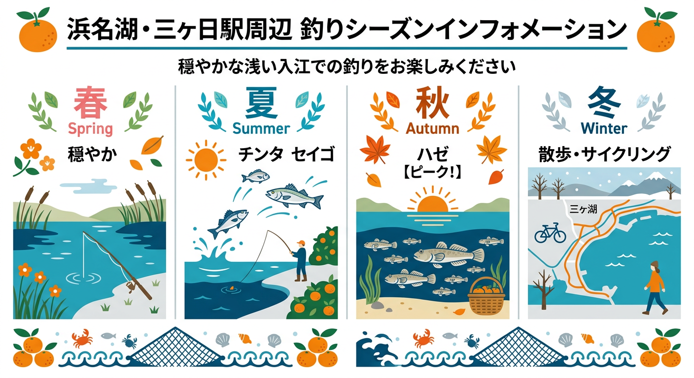

import Map from "@components/Map.astro";
import GMapButton from "@components/GMapButton.astro";
import TackleCard from "@components/TackleCard.astro";

『釣！浜名湖』をご覧いただきありがとうございます！

今回は、猪鼻湖の最北部に位置する **「三ヶ日駅周辺」** エリアをご紹介します！

三ヶ日駅のすぐ南側は、比較的浅い（シャロー）水域が広がっており、小河川の流れ込みもあって非常に穏やかな湾内になっています。

夏から秋にかけては、のんびりとハゼやキビレを狙う釣り人で賑わう、ファミリー向けの好ポイントです！

<Map lat={34.801027} lng={137.550939} name="三ヶ日駅周辺" />

## 三ヶ日駅周辺の基本情報

<GMapButton url="https://maps.app.goo.gl/6Bq1gkvDQPQnmp7Z7" />

*   **ポイント名**：三ヶ日駅周辺（猪鼻湖北側）
*   **所在地**：静岡県浜松市浜名区三ヶ日町三ヶ日
*   **アクセス方法**：東名高速「三ヶ日IC」から車で約5分。天竜浜名湖鉄道「三ヶ日駅」から徒歩圏内。
*   **トイレ**：三ヶ日駅のトイレが利用可能です。
*   **近くの釣具店**：フィッシングジョイ、えさや小寺
*   **近くのコンビニ**：セブン-イレブン 三ヶ日西天王町店

このエリアは、駅からすぐの護岸堤防がメインステージとなります。足場が良く、波も穏やかなため、初心者の方でも安心して竿を出すことができます。

### ポイントの特徴
猪鼻湖の奥に位置するこのエリアは、いくつかの小河川が流れ込む汽水域。ハゼに期待しつつ、それを狙って集まるシーバスなどのフィッシュイーターも期待できます。

**🎣 穏やかな浅瀬（シャローエリア）**
湖の奥まっているため、風の影響を受けにくく、常に水面が静かなのが特徴です。ハゼやチンタ（小チヌ）、セイゴなどがふらっと集まってくるので、のんびりとした釣りを楽しむのに最適です。

**🎣 河口付近はハゼの好ポイント**
三ヶ日駅の近くには小さな河川の流れ込みがあります。ここはお盆を過ぎた辺りからハゼの絶好のポイントになります。

**🎣 護岸堤防からの夜釣り**
夜になると、街灯の明かりに誘われてセイゴなどが寄ってきます。電気ウキを浮かべて、静かな湖面でのんびりアタリを待つのも奥浜名湖らしい贅沢な時間です。

<TackleCard id="common/fuji-toki-denki-uki-ff-1" />

西岸は市街地と道路が沿岸になるため、釣りをするなら駅近くがおすすめです。短い竿を持ちながら、散歩がてらに魚を探してみるといいでしょう。

### 🐟️シーズン別攻略ガイド

*   **🌸 春（4月〜6月）**：シーバス（セイゴ）
    *   **【攻略】** 小規模な流れ込みにベイトが寄り始めます。静かな湖面を丁寧に探りましょう。
*   **☀️ 夏（7月〜9月）**：チンタ、セイゴ
    *   **【攻略】** シャローエリアでの数狙いが楽しい季節。暑い日は駅前のバーガーを食べながらのんびり！
*   **🍂 秋（10月〜11月）**：ハゼ、セイゴ、チンタ
    *   **【攻略】** 三ヶ日のメインシーズン. 特にハゼは河口付近で鈴なりに釣れることも珍しくありません。
*   **❄️ 冬（12月〜3月）**：オフシーズン
    *   **【攻略】** 釣りは厳しい時期ですが、三ヶ日みかんの直売所巡りやサイクリングに最適なシーズンです。

## エサで釣れる魚とおすすめタックル

*   **対象魚**：ハゼ、チンタ、セイゴ
*   **おすすめエサ**：青ジャムシ
*   **おすすめタックル**：3.6m～4.5mののべ竿、またはコンパクトロッドでのチョイ投げ

浅いエリアなので、ウキ釣りでも十分に楽しめます。水温が高い時期は魚の活性が高く、浅いタナでも元気にエサを追ってくれます。ハゼなら川にかかる橋より北側で、それ以外なら南側が無難です。

<TackleCard id="haze/sasame-choi-haze-set-5go" />
<TackleCard id="haze/marukyu-power-isome-soft-red-m" />

ルアーもトップでシーバスやキビレに期待できますが、陸からよりもボートからが無難です。

## 周辺の観光情報

天竜浜名湖鉄道の **三ヶ日駅** は、国の登録有形文化財に指定された趣のある木造駅舎が特徴です。駅周辺は「三ヶ日みかん」の本場であり、歴史的な寺院や地元グルメが徒歩圏内に集まっています。

### 1. レトロな駅舎と絶品バーガー
駅舎内にはハンバーガーショップ **「[グラニーズ](https://tabelog.com/shizuoka/A2202/A220201/22003013/)」** があり、三ヶ日牛を使ったボリューム満点のバーガーを味わえます。釣りの合間でも立ち寄りやすいですよ。

<TackleCard id="travel/rakuten-travel-stay" />

### 2. 三ヶ日の歴史を巡る散策
駅から歩いて行ける距離に、由緒ある名所が点在しています。
*   **[摩訶耶寺（まかやじ）](https://makayaji.web.fc2.com/)**：平安・鎌倉時代の重要文化財の仏像を拝観できる古刹です。
*   **三ヶ日神明宮**：地名の由来とも関わりが深い神社です。

## まとめ：三ヶ日の中心で楽しむファミリーフィッシング

三ヶ日駅周辺は、アクセスの良さと足場の良さが最大の魅力です。
巨大魚を狙うような場所ではありませんが、お魚との出会いを大切にしたいファミリーや、これから釣りを始めたい方にはぴったりの場所ですよ。

> [!WARNING]
> **最後にお願い！**
> 
> ゴミの持ち帰りはアングラーとして当然のマナーです。
> 駅周辺や近隣の迷惑にならないよう、マナーを守って楽しい釣り体験をしてくださいね。
