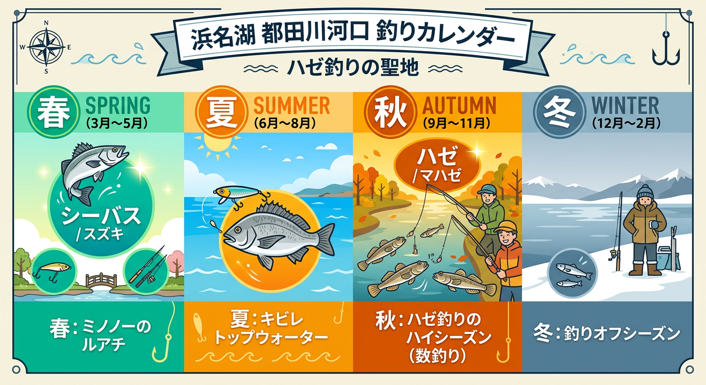

import Map from "@components/Map.astro";
import GMapButton from "@components/GMapButton.astro";
import BlogCard from "@components/BlogCard.astro";
import { Image } from 'astro:assets';

『釣！浜名湖』をご覧いただきありがとうございます！

今回は、奥浜名湖エリアの超メジャースポット ** 「都田川（みやこだがわ）河口」 ** をご紹介します！

ここはなんといっても、浜名湖全体を見渡してもダントツで有名な「ハゼ釣り」と「キビレ」の大人気ポイントです。

シーズンになると川の土手にズラリと釣り人が並ぶ景色は、奥浜名湖の秋の風物詩とも言えますよ。

初心者やファミリーフィッシングの定番であるエサ釣りはもちろん、ルアーを使ったウェーディングゲームまで幅広く楽しめる、懐の本当に深いエリアなんです。

<Map lat={34.795350} lng={137.644295} name="都田川河口" />

## 都田川河口の基本情報

<GMapButton url="https://maps.app.goo.gl/ApUT86BDWanKWrpP7" />

*   **ポイント名** : 都田川（みやこだがわ）河口
*   **所在地** : 静岡県浜松市浜名区細江町気賀
*   **アクセス方法** : 東名高速「舘山寺スマートIC」から車で約5分程度と超スムーズです！
*   **駐車場** : 整備された明確な駐車場はありません。
*   **トイレ** : 近くに公衆トイレがあるので、ファミリーや女性でも安心です。
*   **近くの釣具店** : 植むら釣具店
*   **近くのコンビニ** : セブンイレブン細江気賀店

都田川河口は「ハゼ釣り」の聖地として、浜名湖でも圧倒的な知名度を誇るスポットです。

早ければ8月中旬から開幕し、SNSなどで釣果情報が流れると、一気に多くの釣り人が集結します。河口の両岸に釣り人がズラリと並ぶ光景は、もはやこのエリアの風物詩と言えるでしょう。

>[!CAUTION]
> 注意したいのは、付近に**公式駐車場がない**という点です。
> 
> 車を停める際は、周辺の迷惑にならないよう自己責任での判断が求められます。特に地元の方や、農作業の車の通行を妨げないようマナーを徹底してください。

また、もう一つの主役であるキビレも、春から秋にかけて河川内まで広く狙える大人気ターゲットですよ。

### ポイントの特徴

おすすめのポイントは**「3箇所」**です。

**1. 護岸された河口付近（ファミリー・エサ釣り向き）**
足場がきれいなコンクリートで護岸（整備）されている河口付近は、のべ竿やチョイ投げの「エサ釣り」がメインの舞台になります。
安全で平らなので、初心者や子供と一緒にハゼとキビレをのんびり狙うのに最高のおすすめポイントですね。

**2. マリーナ側（ウェーダー必須・ルアー向き）**
河口を下って南側にあるマリーナ周辺は、水底が浅い「遠浅（シャロー）」の地形になっています。
岸から投げるよりも、ウェーダー（胴長）を着込んでザブザブと水の中に入っていった（ウェーディングした）ほうが圧倒的に魚に近づけて有利です。

**3. 自転車道路側（投げ釣り・シーバス狙い）**
河口部から細江帰帆（ほそえきはん）までの広い範囲は、足場がよく遠投する釣りとの相性が良い。思い切りルアーをかっ飛ばしたり、重いオモリでエサの投げ釣りがおすすめです。

ポイントの選別は、「エサで釣りたいか」「ルアーを投げたいか」という目的によって、快適な場所が分かれるといった感じです。

## 都田川河口のシーズン別ターゲットと釣果目安

### 🐟️シーズン別攻略ガイド

*   **🌸 春（4月〜6月）**：シーバス、キビレ
    *   **【攻略】** 3月下旬からシーズンイン。ルアーでのリアクション狙いやバチ抜けパターンが有効です。
*   **☀️ 夏（7月〜9月）**：キビレ、シーバス、ハゼ
    *   **【攻略】** キビレのトップゲームが熱い時期。夜は電気ウキでのハゼ・キビレ狙いも楽しめます。
*   **🍂 秋（10月〜11月）**：ハゼ、キビレ、シーバス、サヨリ
    *   **【攻略】** ハゼ釣りの最盛期。ハゼを追って大型シーバスも接岸する、都田川が最も賑わう季節です。
*   **❄️ 冬（12月〜3月）**：オフシーズン
    *   **【攻略】** 北西の強風が厳しいため、基本的にはオフシーズン。温かいうどんでも食べて春を待ちましょう！

### ✨️ポイントの補足

*   **タナ設定** : ハゼ狙いでは「底」を正確に取るのがコツ。ウキ仕掛けならウキ下1m前後から微調整しましょう。
*   **エイ対策** : 底生魚を狙うブッコミ釣りやウェーディングでは、アカエイ対策が必須です。
*   **混雑回避** : 週末は激戦区となります。声を掛け合い、マナーを守って楽しみましょう。

全体的に水深が非常に浅いため、潮位の変動に敏感なポイントです。
満潮前後の潮が動くタイミングを狙うのが、釣果を伸ばす最大の近道ですよ。

## 都田川河口でエサ釣り！ハゼの数釣り攻略とおすすめタックル

*   **対象魚** : ハゼ（メイン）、キビレ
*   **おすすめエサ** : 青ジャムシ（青イソメ）、石ゴカイ
*   **おすすめタックル** : 2.7m〜4.5m 程度ののべ竿、またはチョイ投げ用のコンパクトロッド

ハゼをたくさん釣るコツは、とにかくエサを **「底（ボトム）」** にしっかり付けること。これに尽きます。

虫エサが苦手な方は、スーパーで売っている「カマボコ」や「ホタテ」を小さく切ったものでも代用可能ですよ。

## 都田川河口でルアー釣り！シーバス・キビレ攻略とおすすめタックル

*   **対象魚** : キビレ、シーバス
*   **おすすめルアー** : ペンシルベイト（夏のトップ）、バイブレーション（レンジ探り）
*   **おすすめタックル** : 8ft前後のL〜MLクラスのシーバスロッド

ルアーで本格的に楽しむなら、河口の南側に広がるマリーナ側の遠浅エリアで「ウェーディング」をするのが一番の近道です。

本格的なランカーサイズを狙うアングラーは、水温の変化が大きい「春」や「秋」に狙いを定めてみてください。

河川内の深みや、北側の護岸沿いを歩きながらキャストを繰り返すランガンスタイルが有効です。

特に夏場のトップゲームは、都田川の代名詞とも言える興奮の釣り。

バシャバシャとルアーを追う姿は、一度経験すると病みつきになります。

> [!CAUTION]
> 河口部はアカエイが多いので、ウェーディングの際は必ずエイガードを装着してください。

## 都田川河口周辺の観光・グルメ情報（気賀関所・龍潭寺）

都田川の河口付近は、歴史ロマンあふれるスポットが目白押しです。

江戸時代の交通の要所であった **「気賀関所」** は、当時の雰囲気を今に伝える貴重な場所。また、大河ドラマでも注目を集めた「井伊直虎」ゆかりの **「龍潭寺」** も車ですぐの距離にあります。

グルメに関しても、気賀駅周辺には行列のできる **「うなぎ料理店」** が点在しています。また、地元の新鮮な野菜を扱う直売所もあり、お土産選びにも困りません。

週末のドライブがてら、釣りと観光をセットで楽しんでみてはいかがでしょうか。

<BlogCard slug="points/oku/kiga" />

## まとめ：都田川河口はハゼ釣りの聖地！初心者からベテランまで楽しめる万能ポイント

都田川河口は、特にハゼ釣りに関しては揺るぎない聖地です。

初心者でも簡単に釣果を得られる懐の深さと、ベテランをも熱くさせるキビレ・シーバスのポテンシャル。この両立こそが、都田川が長く愛され続ける理由なのだと思います。

混雑を避けて「自分だけのポイント」を見つけたいなら、ウェーディング装備で沖へ踏み出すのも素晴らしい選択肢になります。

> [!CAUTION]
> **釣り場の環境を守るためのお願い**
> 
> 釣り場で出したゴミは、必ず全て持ち帰りましょう。放置されたゴミを見かけた際は、少しでも良いので一緒に拾っていただけると幸いです。
> 
> 駐車マナーや地域のルールを遵守し、いつまでも素晴らしい釣り場が存続できるよう、一人一人が意識を持って楽しみましょう！
