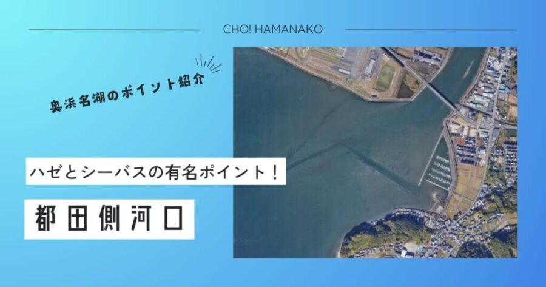

import Map from "@components/Map.astro";
import GMapButton from "@components/GMapButton.astro";
import BlogCard from "@components/BlogCard.astro";
import Callout from "@components/Callout.astro";

「釣！浜名湖」へようこそ！

今回ご紹介するのは、奥浜名湖エリアにおいて盤石の知名度を誇り、浜名湖を代表するハゼ釣りの名所 <strong>「都田川（みやこだがわ）河口」</strong> です。

「浜名湖の釣りはハゼに始まり、ハゼに終わる」
そんな言葉がぴったりなこの場所は、夏から秋にかけて県内外から多くのアングラーが訪れる <strong>「ハゼ釣りの聖地」</strong> です。穏やかな川の流れ、天竜浜名湖鉄道のガタンゴトンという音、そして子供たちの「釣れた！」という歓喜の声。都田川河口は、まさに浜名湖の釣りの原風景が残る特別なフィールドです。

しかし、ビギナー向けの顔を持つ一方で、汽水域特有の「豊かなベイト」を追って、メーター級のシーバスや年無しクロダイが遡上してくる <strong>「隠れた大物スポット」</strong> という玄人向けの側面も併せ持っています。

本記事では、この聖地を完全攻略するための最新スタイル「ハゼクラ」から、夜のシーバス・タクティクス、そして絶対に避けられない「安全上の注意」まで、3000文字超の圧倒的ボリュームで徹底解説します。

<Map lat={34.795350} lng={137.644295} name="都田川河口" />
<GMapButton url="https://maps.app.goo.gl/ApUT86BDWanKWrpP7" />

---

## 🔍 ポイント概要：歴史と自然が交差する「気賀」の拠点

都田川河口は、浜松市浜名区細江町気賀に位置します。歴史的な「気賀関所」や「姫街道」に隣接し、観光と釣りが高レベルで融合した稀有なエリアです。

### 聖地を支える周辺インフラ

- <strong>拠点となる「気賀駅」</strong>：天竜浜名湖鉄道 <strong>「気賀駅」</strong> から徒歩圏内。電車に揺られてのんびりとハゼ釣りに向かう、そんな贅沢な釣行も可能です。
- <strong>駐車場問題の解決策</strong>：堤防沿いには専用駐車場はありません。 <strong>気賀関所周辺の公共駐車場やコインパーキング</strong> を利用し、マナーを守って徒歩でエントリーしましょう。 <strong>【厳禁】</strong> 路上駐車は地元の方々の生活や農耕の妨げになり、釣り場閉鎖の最大の原因となります。
- <strong>補給と情報「植むら釣具店」</strong>：気賀の街中にある老舗 <strong>「植むら釣具店」</strong> は、ハゼ釣りに欠かせない「赤イソメ」の鮮度が抜群です。また、その日のハゼがどのへんの深さに溜まっているか、最新の「生き字引」スポットを教えてもらえます。

---

## 🌊 水中構造と「都田川」の二大利権エリア

都田川河口は、広大な汽水域特有の地形をしています。

### ① 【泥砂地のシャローフラット】ハゼの揺りかご
河口の両岸に広がる、水深1mに満たない広大な浅瀬。
- <strong>水中状況</strong>：都田川から運ばれる栄養豊富なプランクトンを求めて、無数のハゼが定着しています。底質は柔らかい泥混じりの砂地で、ハゼが巣穴を作りやすく餌も豊富な「ハゼの超一等地」です。
- <strong>攻略</strong>：チョイ投げで広範囲をズル引き、あるいは延べ竿での「脈釣り」で護岸の際を丹念に探ります。

### ② 【中央の澪筋（みおすじ）】大型魚の回遊路
川の中央部には、船が通るために一段深くなっている「澪筋」が走っています。
- <strong>水中状況</strong>：日中の強い日差しを嫌ったハゼが一時的に避難したり、それを追って <strong>シーバス（マダカ）</strong> や <strong>クロダイ</strong> が回遊したりする「深場」です。
- <strong>攻略</strong>：対岸まで届く勢いでフルキャストし、この澪筋のカケアガリ（斜面）をルアーや仕掛けが通るようにコントロールするのが、釣果を伸ばす最大のコツです。

---

## 🐟️ ターゲット別・都田川河口の必勝タクティクス

### 【☀️ 夏 〜 🍂 秋】ハゼ：伝統と最新スタイルの融合
- <strong>伝統の「エサ釣り」</strong>： <strong>赤イソメ</strong> を1cm程度に短く刺し、3号程度の軽いテン秤（てんびん）仕掛けで。 <strong>「えさや小寺」や「植むら釣具店」</strong> で購入した鮮度の良いエサなら、入れ食いも夢ではありません。
- <strong>最新の「ハゼクラ（クランクベイト）」</strong>：ルアーでハゼを狙う新定番。クランクを底に当てて砂煙を上げる「ボトムノック」に、ハゼが反射的に食らいつく。数釣りだけでなく、ゲーム性の高さにハマる大人が続出しています。

### 【🌙 通年】シーバス：汽水域の「回遊モンスター」
- <strong>タクティクス</strong>：ナイトゲームが主戦場。都田川と浜名湖を繋ぐ「みをつくし橋」や「落合橋」の明暗部、あるいは下げ潮に乗せてルアーを流す「ドリフト釣法」が効果的です。汽水域特有の大きなサイズが見込めるのも、都田川の魅力です。

### 【🌸 初夏】テナガエビ：護岸の「影」を狙う
- <strong>タクティクス</strong>：梅雨前後、護岸の石積みの隙間やテトラの陰に <strong>テナガエビ</strong> が現れます。小さな玉ウキを使い、赤虫（アカムシ）を餌に隙間に送り込む繊細な遊び。釣れたエサをその場で素揚げにすれば、最高の酒の肴になります。

---

## ⚠️ 【超厳戒警告】アカエイ対策を怠るな！

都田川河口を語る上で、絶対に避けて通れないのが <strong>「アカエイ」</strong> の存在です。ここの生息密度は浜名湖でも指折りです。

1. <strong>擬態の達人</strong>：砂の中に完璧に同化して潜んでいます。見つけるのは不可能です。
2. <strong>【対策】すり足（シャッフル歩行）の絶対遵守</strong>：ウェーディングで立ち込む際は、足を地面から離さず、砂の上を滑らせて歩いてください。振動でエイが逃げてくれます。不用意な一歩は <strong>即、激痛と入院</strong> を意味します。
3. <strong>アカエイは釣具も壊す</strong>：シーバス狙いのルアーに直径1m近いエイが掛かることがよくあります。無理に寄せるとロッドが折れます。危険を感じたら、ラインを切って安全を優先してください。

---

## 🚀 まとめ：浜名湖の原風景と、確かな実力の都田川

都田川河口は、一見するとのんびりしたファミリー向けのポイントです。しかし、そこには豊かな汽水が育む、浜名湖屈指の生態系が凝縮されています。

- <strong>ハゼ釣りNO.1の聖地</strong> としての圧倒的な信頼感。
- <strong>ハゼクラやシーバス</strong> など、スキルアップを目指せる奥深さ。
- <strong>観光と歴史</strong> を楽しみながら、家族全員が笑顔になれる多様性。

都田川の緩やかな流れに身を任せ、魚の鼓動を感じながら糸を垂らす。そんな「釣りの原点」に立ち返れる時間を、ぜひこの場所で過ごしてみてください。ルールを守り、ゴミを持ち帰る。あなたのその一つの行動が、この聖地を未来へ繋ぎます。

---

<BlogCard slug="isajigawa" />
ハゼ釣りのもう一つの聖地、伊佐地川。都田川とはまた違った河川ゲームが楽しめます。

<BlogCard slug="points/fukabori/haze-fukabori" />
ハゼ釣りの聖地、都田川を制するための最新テクニックと「ハゼクラ」攻略法。

<BlogCard slug="bachinuke-fukabori" />
都田川の春の風物詩。シーバスが狂喜乱舞する「バチ抜け」のXデーと攻略ポイント。

<BlogCard slug="points/fukabori/chining-fukabori" />
汽水の恩恵、都田川のクロダイ・キビレ攻略。濁りに強いワーム選択と、橋脚・石積みのピン撃ちメソッド。

<BlogCard slug="haze-tactics" />
最新スタイル「ハゼクラ」でハゼを仕留めるためのカラーローテーション解説。
