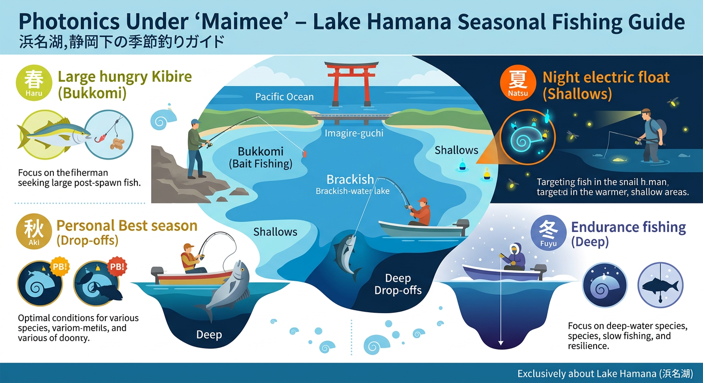

import Map from "@components/Map.astro";
import GMapButton from "@components/GMapButton.astro";

「釣！浜名湖」をご覧いただきありがとうございます！

本記事では、奥浜名湖エリアにある **「ホトニクス下（通称：マイマイ）」** をご紹介します！

名前の通り、呉松町にある「浜松ホトニクス産業開発研究所」の東側に位置する小さな湾のことです。ぽっかり空いた湾の形がカタツムリっぽいからなのか、地元のアングラーからは昔から「マイマイ」という愛称で親しまれています。

パッと見は浅くてのどかな湾にしか見えません。

でも実は、中央部に向けて一気に水深6mまで落ち込んでいく、驚きの「急深スポット」で、春と秋の夜釣りで、大型のキビレを狙い撃つ「ブッコミ釣り」が最強です。

<Map lat={34.776214} lng={137.626361} name="ホトニクス下（マイマイ）" />

## マイマイ（ホトニクス下）の基本情報

<GMapButton url="https://maps.app.goo.gl/eoZGSpsfsj9ctjMt5" />

*   **ポイント名**：マイマイ（ホトニクス下）
*   **所在地**：静岡県浜松市中央区呉松町
*   **アクセス方法**：東名高速「舘山寺スマートIC」から車でたったの2分ほどです。
*   **駐車場**：数台なら停められるスペースがあります。
*   **トイレ**：残念ながらありません。
*   **近くの釣具店**：はなぞの釣具店さん
*   **近くのコンビニ**：セブンイレブン細江町気賀店、セブンイレブン浜松舘山寺町店

ホトニクス下への入り口は、大草山ルートか舘山寺スマートIC近くからのルートの2通りがあります。

初めて行く人は道路から曲がる位置がわかりにくいと思います。ナビの目的地設定「浜松ホトニクス産業開発研究所」にして、機械の案内に頼るほうが無難です。

ちなみに、どちらのルートも道は狭め。大草山から入るルートは更に狭いので、車の運転に自信がない人は、ホトニクス側からのルートを選択しましょう。

### ポイントの特徴
マイマイは大型キビレの実績が多いポイントです。

サイズ狙いは3月と10月の乗っ込みシーズン限定。キビレのシーズン的には3~11月まで該当しますが、大型の食い気が特に大きくなる乗っ込みは、年に数回しかないチャンスです。

**1. 浜名湖屈指の大型キビレ実績**
古くから「デカいキビレを狙うならマイマイ」と言われるほどの超有名ポイントです。

**2. 驚異の「急深」カケアガリ**
湾の出口付近は、岸からわずかな距離で水深7m近くまで一気に落ち込んでいます。この極端な斜面が魚の着き場になっています。

**3. ブッコミ釣りが最強の攻略法**
タナ（深さ）を合わせにくい急斜面を攻めるには、重いオモリでエサを底に送り届ける「ブッコミ釣り」が最も効率的で確実です。

**4. 湾奥はマイルドな浅場**
駐車場に近い湾の奥側は水深2m前後と浅いため、チョイ投げや夜の電気ウキ釣りでマッタリ楽しむことも可能です。

### 🐟️シーズン別攻略ガイド

*   **🌸 春（3月〜6月）**：大型キビレ、シーバス、サヨリ
    *   **【攻略】** 越冬から戻った「腹ペコな大型」が動き出します。釣れればサイズに期待できる、一発大物のチャンスシーズン。
*   **☀️ 夏（7月〜9月）**：キビレ、ハゼ、マゴチ、シーバス
    *   **【攻略】** 閉鎖的な湾のため水温が上がりやすい時期。夜間に湾奥で電気ウキを使ってハゼやチンタと遊ぶのがおすすめ。
*   **🍂 秋（10月〜11月）**：大型キビレ、クロダイ、シーバス
    *   **【攻略】** 自己ベストを狙うならこの時期！湾入り口の急なカケアガリを、夜のブッコミ釣りでじっくり攻めましょう。
*   **❄️ 冬（12月〜2月）**：キビレ、シーバス
    *   **【攻略】** 深場にオモリを投げ込んでひたすら待つ忍耐の釣り。潮が動く一瞬の「時合」にすべてを賭ける勝負になります。

## 攻略の鍵は「カケアガリ」を射抜く遠投

*   **対象魚**：キビレ（大型実績あり）
*   **おすすめエサ**：青ジャムシ、ユムシ（エサ取り対策）
*   **タックル**：10～20号のオモリを使用したブッコミ仕掛け

ホトニクス下の攻略は、**「急深な斜面（カケアガリ）の途中にエサを置く」** こと。

岸から50m以上遠投できれば、水深4mラインの「お魚の通り道」へダイレクトに仕掛けを送り込めます。飛距離が出ない場合は、重めの飛ばしウキを使った電気ウキ釣りで広範囲を探るのも有効です。

ここはキャスティングの練習にも最適な場所なので、のんびり飛距離を伸ばしながら大物を待ちましょう！

## 周辺の観光情報

釣りのお土産話だけでなく、立ち寄りスポットとして以下の2箇所が特におすすめです！

### 1. 大草山 昇竜しだれ梅園（2月〜3月）
竜が天に昇るような「昇竜仕立て」のしだれ梅が約350本。特に「梅のトンネル」は圧巻で、早春の時期に釣りに来たなら外せません。入園料は最盛期で700円、無料駐車場も完備されています。

### 2. かんざんじロープウェイ ＆ 大草山展望台
日本で唯一、湖の上を渡るロープウェイで山頂へ。屋上展望台からは浜名湖を360度見渡せる絶景が広がっており、晴れた日には富士山まで望めます。毎時00分にはオルゴールミュージアムのカリヨンが鳴り響き、旅の情緒をぐっと高めてくれますよ。

## まとめ：急深なカケアガリを制して大型を狙う

フォトニクス下（マイマイ）は、独特の急深な地形を持つ、奥浜名湖でも指折りの実力派ポイントです。

攻略には地形の把握が不可欠ですが、その先には他ではなかなか出会えない「大型キビレ」という最高のご褒美が待っています。地形を読み、狙いのポイントを射抜く楽しさを、ぜひこの「聖地」で体感してみてください！

> [!WARNING]
> **最後にお願い！**
> 
> 釣り場をいつまでも綺麗に保つために、出したゴミは必ず持ち帰りましょう。地域のルールとマナーを守り、周囲のアングラーと譲り合いながら、最高に楽しいフィッシングライフを楽しんでくださいね！
