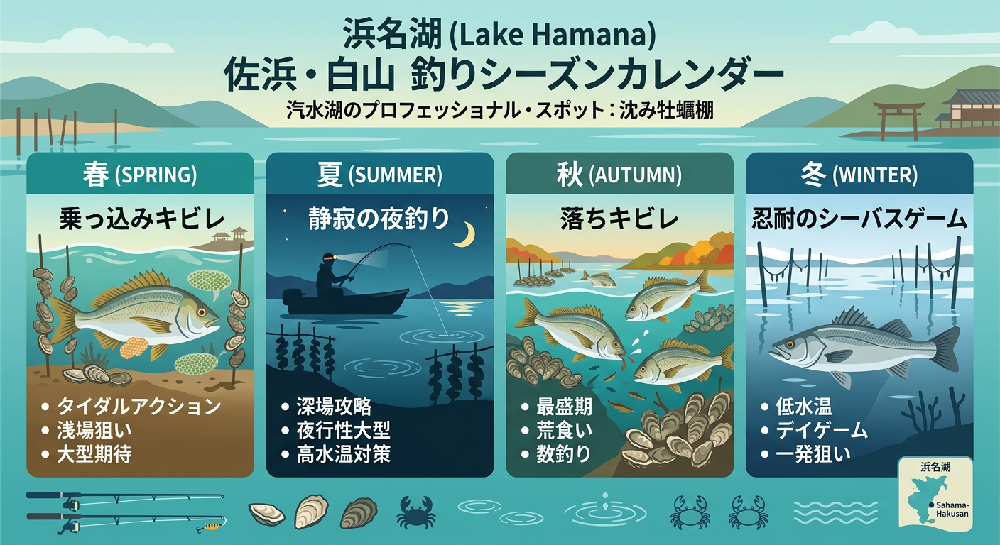

import Map from "@components/Map.astro";
import GMapButton from "@components/GMapButton.astro";

『釣！浜名湖』をご覧いただきありがとうございます！

今回は、庄内湖エリアの中でも特にディープな魅力を持つ **「佐浜（さはま）・白山（はくさん）周辺」** をご紹介します！

オイスカ高校の南側を抜け、花川の河口から岬の先端へと向かうこのエリアは、庄内湖の中央に向かって突き出した「白山鼻（はくさんはな）」と呼ばれる岬を中心に、非常に豊かな生態系を形成しているポイントなんんですよ！

<Map lat={34.747526} lng={137.639386} name="佐浜・白山周辺（白山鼻）" />

## 佐浜・白山エリアの基本情報

<GMapButton url="https://www.google.com/maps/search/?api=1&query=34.747526,137.639386" />

*   **ポイント名**：佐浜・白山周辺（白山鼻）
*   **所在地**：静岡県浜松市中央区佐浜町・白山町
*   **アクセス**：花川河口から岬の先端まで一本道がありますが、途中は未舗装で道幅も非常に狭いため、運転には十分な注意が必要です。
*   **駐車場**：専用の駐車場はありません。花川河口付近のスペースを利用するか、周囲の交通の邪魔にならないよう十分配慮して駐車してください。
*   **近くの釣具店**：はなぞの釣具店
*   **近くのコンビニ**：セブン-イレブン 浜松佐浜町店

このエリアは、奥浜名湖の中でも特に水温変化が激しく、水の循環が悪くなりやすい「閉鎖的な水域」でもあります。だからこそ、タイミングが合った時の魚の爆発力はかなりのものがあります！

### ポイントの特徴

**🎣 秋のブッコミ釣りでのキビレ狙い**
知る人ぞ知る、秋の「大型キビレ」の実績ポイントです。水中に牡蠣の養殖棚が沈んでいる場所があり、そこがキビレやシーバスの格好の居着き場所になっています。

**🎣 ハゼ釣りの穴場**
夏から秋にかけては、のんびりとチョイ投げでハゼ釣りを楽しむこともできます。家族連れよりも、静かに一人で釣りを楽しみたいアングラーに最適な場所です。

**🎣 岬の先端「白山鼻」のポテンシャル**
岬の先端付近は潮通しが比較的良く、回遊してきた魚が一度足を止めるポイント。マヅメ時や潮の動くタイミングを狙い撃つのが攻略の鍵となります。

> [!CAUTION]
> **アクセス時の注意点**  
> 白山鼻へと向かう道は未舗装区間もあり、雨後はぬかるみやすいです。また、夜間は街灯が一切ないため、ライト類の準備と足元の確認を徹底しましょう。

### 🐟️シーズン別攻略ガイド

*   **🌸 春（4月〜6月）**：キビレ、シーバス
    *   **【攻略】** 乗っ込み（産卵）を意識して接岸する個体がターゲット。夜のブッコミ釣りで静かに待ちましょう。
*   **☀️ 夏（7月〜9月）**：クロダイ、セイゴ、ハゼ
    *   **【攻略】** 日中は極めて浅いため、夜釣りがメイン。ハゼの成長に合わせ、エサ取り対策も必要です。
*   **🍂 秋（10月〜11月）**：落ちキビレ
    *   **【攻略】** 白山鼻の真骨頂！深場へ移動する前の「落ちキビレ」を、牡蠣棚周辺へのブッコミ釣りで狙い撃ちます。
*   **❄️ 冬（12月〜3月）**：シーバス
    *   **【攻略】** 数は期待できませんが、時折大型のシーバスが回遊。忍耐の釣りになりますが、夢がある時期です。

## おすすめタックルと釣り方

*   **対象魚**：キビレ、クロダイ、ハゼ、シーバス
*   **釣り方**：エサ釣り（ブッコミ釣り・投げ釣り）
*   **おすすめエサ**：ボリュームのある青ジャムシ（キビレ狙いなら房掛けが有効）

ブッコミ釣りでは、沈み根や牡蠣棚への根掛かりを防ぐため、あまり重すぎるオモリは避け、感度の良いロッドでアタリを捉えるのがコツです。

## 周辺の観光情報

周辺に飲食店などは少ないですが、歴史的に非常に重要な絶景・文化スポットがあります。

### ナウマンゾウ発見の地

佐浜町は、日本における **「ナウマンゾウ」** 研究の原点となった非常に珍しい場所です。

1921年（大正10年）に浜名湖畔で化石が見つかり、近隣の **「正福寺」** 周辺が出土地として知られています。

より詳しく知りたい方は、車で20分ほどの距離にある **「浜松市博物館」** で全身骨格模型を見るのもおすすめですよ。

<GMapButton url="https://maps.app.goo.gl/xa8XSmBtzqNjNSe49" />

## まとめ：奥庄内湖の隠れ家で大物を待つ

佐浜・白山エリアは、決して足場が良いわけではありませんが、その分「自分だけのポイント」を見つける楽しさに溢れています。

雨後の濁りや水温の変化に左右されやすい気難しいエリアですが、牡蠣棚の陰に潜む巨大なキビレやシーバスとの出会いを求めて、ぜひ一度足を運んでみてください！

> [!WARNING]
> **マナー厳守のお願い！**
> 
> 駐車スペースが非常に限られています。地元の方や工事車両、他の利用者の迷惑にならないよう、駐車マナーには細心の注意を払いましょう。
