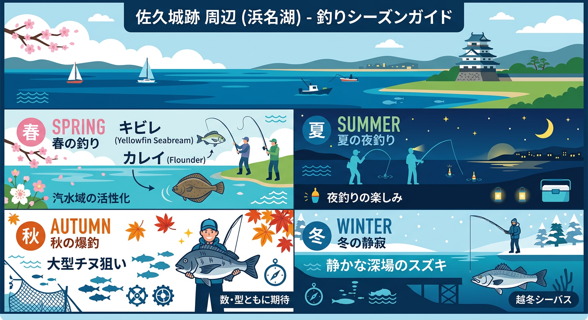

import Map from "@components/Map.astro";
import GMapButton from "@components/GMapButton.astro";

『釣！浜名湖』をご覧いただきありがとうございます！

今回は、猪鼻湖の東側にある急深ポイントの **「佐久城跡（さくじょうあと）・佐久城公園」** をご紹介します！

佐久城公園周辺は、奥浜名湖エリアでも隠れたルアーと投げ釣りの超お宝スポット。

何と言っても特徴的なのは、沿岸からすぐ近くで「海の色が濃いブルー（深場）」に変わっていること。30mも投げればストンと落ちるように深くなっているんです！

静かな公園の雰囲気とは裏腹に、水中のポテンシャルは極めて高く、特に投げ釣り（ブッコミ）をメインに楽しむアングラーにはたまらない場所です。

<Map lat={34.774404} lng={137.575635} name="佐久城跡付近" />

## 佐久城跡・佐久城公園の基本情報

<GMapButton url="https://www.google.com/maps/search/?api=1&query=34.774404,137.575635" />

*   **ポイント名**：佐久城跡（さくじょうあと）
*   **所在地**：静岡県浜松市浜名区三ヶ日町佐久
*   **アクセス方法**：東名高速「三ヶ日IC」から車で約5分。三ヶ日ICからのアクセスも抜群です。
*   **駐車場**：佐久城跡への分岐付近など、極めて少ないながら車を停められるスペースがあります。
*   **トイレ**：天竜浜名湖鉄道「佐久米駅」が比較的近いです。
*   **近くの釣具店**：えさや小寺、フィッシングジョイ
*   **近くのコンビニ**：ファミリーマート 三ヶ日インター店

佐久城公園はかつての山城の跡地で、現在も静かな雰囲気の場所ですが、その西側に広がる護岸からは投げ釣りが盛んに行われます。

### ポイントの特徴

**沿岸からの急深エリア**
航空写真で見ると、岸のすぐ近くから水深が深くなっているのがわかります。特に公園から西側の湖面は、投げ釣り（ブッコミ釣り）に最適な深場へ容易に仕掛けを送り込むことができます。

**投げ釣り（ブッコミ釣り）の好ポイント**
重いオモリを使ったブッコミ仕掛けで、カレイやキビレを狙いたいならこのエリアがおすすめ。深場を好む大型魚たちの回遊ルートをピンポイントで狙えるのが最大の利点です。

**静かで集中できる環境**
周りが住宅地やリゾートホテルから少し離れているため、非常に静かな環境で釣りに没頭できます。夜釣りでは、わずかな電気ウキの光を頼りにお魚を待つのものんびりとした贅沢な時間です。

> [!TIP]
> **夜のウキ釣りもお勧め**  
> まったり釣果を待ちたい方は、少し水深の浅い北側エリアで電気ウキ釣りが吉。

### 🐟️シーズン別攻略ガイド

*   **🌸 春（4月〜6月）**：冬眠明けのキビレ、カレイ
    *   **【攻略】** 冬眠から冷めたキビレが動き出します。深場を好む大型底生魚の回遊ルートを狙い撃ちしましょう。
*   **☀️ 夏（7月〜9月）**：キビレ、クロダイ
    *   **【攻略】** 夜の電気ウキ釣りがハイシーズン。足元からの急深地形を活かし、広範囲を探るのがコツ。
*   **🍂 秋（10月〜11月）**：大型クロダイ、カレイ、ハゼ
    *   **【攻略】** 越冬を意識した大物が深場に溜まります。投げ釣り（ブッコミ）でじっくり待つのが王道のスタイル。
*   **❄️ 冬（12月〜3月）**：カレイ、大型シーバス
    *   **【攻略】** 寒さは厳しいですが、回遊してくる旬の座布団カレイやランカーシーバスに出会えるロマンあふれる時期。

## エサで釣れる魚とおすすめタックル

*   **対象魚**：カレイ、キビレ、クロダイ、ハゼ
*   **おすすめエサ**：ボリュームのある青ジャムシ
*   **おすすめタックル**：オモリ負荷20号程度の投げ竿、天秤仕掛け

投げ釣り（ブッコミ釣り）では、天秤仕掛けを使用して深場の泥底をじっくり探るのがコツ。秋の終わり頃にはハゼも良型が期待できますよ！

## 周辺の観光情報

### 佐久城跡・佐久城公園の基本情報
猪鼻湖に突き出した半島に築かれた「水城」で、かつては浜名氏の本拠地でした。

現在は「三ヶ日佐久城公園」として整備されており、主郭、馬出、空堀、土橋などの遺構が良好に残っています。城内には井戸跡もあり、歴史ファンにはたまらないスポットです。

### 浜名湖佐久米駅
車で5~10分ほど東にいくと、ユリカモメが舞う駅として有名な佐久米駅があります。アニメの舞台になったことで有名になり、一斉に飛び立つ光景を撮影しようと、多くのファンが集まります。

## まとめ：奥浜名湖の歴史が眠る、静かなる爆釣スポット

佐久城跡周辺は、アクセスの良さと地形の面白さが見事に合致した、猪鼻湖東側を代表する投げ釣りポイントです。

マナーを守って、静寂に包まれた猪鼻湖でのドラマチックな一匹との出会いをぜひ楽しんでください！

> [!WARNING]
> **最後にお願い！**
> 
> 周辺には民家もあります。夜間に騒いだり、路上駐車で迷惑をかけたりすることのないよう、アングラーとしての分別を持って、いつまでも釣りができる環境を大切に守っていきましょう！
